# Chapter 7: OTA Update Firmware

It is important to frequently update the firmware of our IoT:bit because the updates may add new features, supply more sensors and actuators, or fix software bugs. In this chapter, you will learn how to update the IoT:bit firmware using OTA and develop a corresponding program. OTA (Over-the-air) is a technology that allows devices to obtain firmware or operating system updates via Wi-Fi or mobile broadband. Through OTA, you do not need to connect the IoT:bit to a computer over USB to perform updates. 

## How to judge if the current IoT:bit supports OTA?

OTA functionality is only available in firmware version 4.0 or above. You can download this [<u>makecode program</u>](https://makecode.microbit.org/_b0g5hV61K4H8) to your micro:bit, the version number will be displayed on start. If the version is lower than 4.0, you need to use USB TTL to update firmware ([<u>section 10.6</u>](#wired-firmware-update)). 

If you prefer not to update the firmware yourself, you can: 1) purchase a new iot:bit, which comes with the latest firmware pre-installed. 2) contact us for assistance with updating the firmware. Please note that you'll need to ship the device to us, and a shipping fee will apply. 

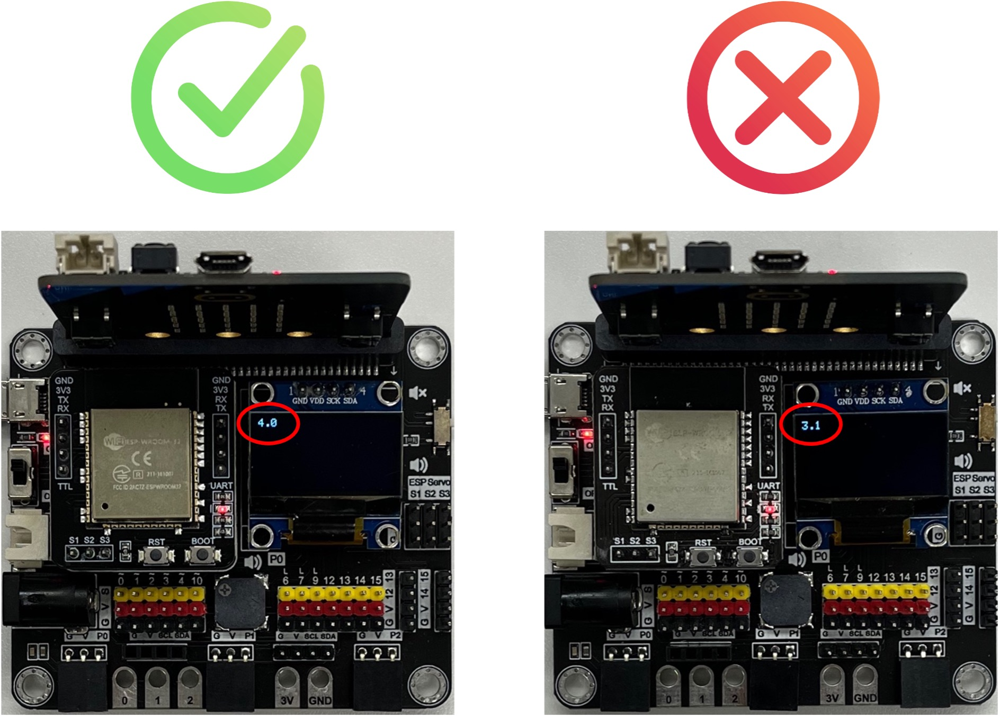

## Programming (Makecode)

Goal:

Develop a program to obtain updates via OTA.

Step 1:Connect WiFi

Before we download the updates via OTA, we need to connect to the network. We have already know how to connect to the WiFi in the first chapter. 

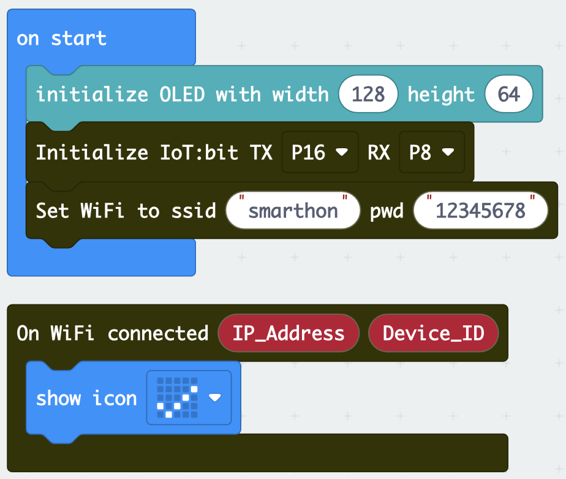

Step 2: Setup a function to show the current version

* Snap a `on button A pressed` to stage
* Go to IoT:bit -> ESP and find `firmware version`
* Draw the firmware version variable to a `show string`

Step 3: Setup a function to start the OTA update

* Snap a `on button B pressed` to stage
* Show a message on the OLED to indicate that the OTA update has started  
* Go to IoT:bit -> ESP and snap the `Update Firmware to Latest Version`
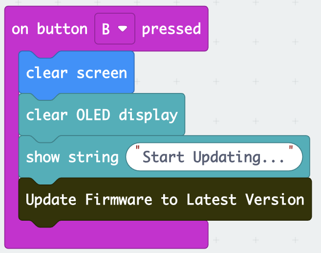

Step 4: Setup a OTA update progressing listener

* Snap the listener `OTA Progress` from IoT:bit -> ESP to stage
* Draw the `PercentageValue` from `OTA Progress` to the `show string` to display the process percentage

Step 5: Setup a OTA update finish listener

* Snap the listener `On OTA Update Finished` from IoT:bit -> ESP to stage
* Show an icon and a message on the OLED to indicate that the OTA update has finished.
* Show another message to remind you to reboot
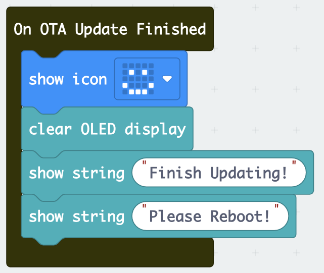

Step 6: Setup a OTA update failed listener

* Snap the listener `On OTA Update Failed` from IoT:bit -> ESP to stage
* Draw the `Message` from `On OTA Update Failed` to the `show string` to show the error message
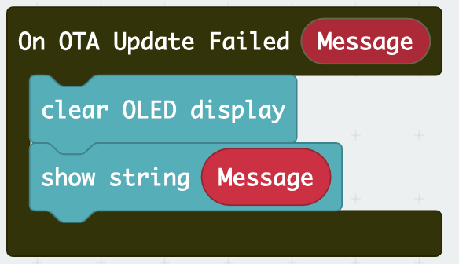

Full Solution 

MakeCode: [https://makecode.microbit.org/_EFiAdMEmvFqD](https://makecode.microbit.org/_EFiAdMEmvFqD)  

You could also download the program from the following website: 
<iframe src="https://makecode.microbit.org/#pub:_EFiAdMEmvFqD" width="100%" height="500" frameborder="0"></iframe>

## OTA Update

Goal:

Update the firmware using the program above.

Step 1: Before start

* Download the [<u>program</u>](https://makecode.microbit.org/_EFiAdMEmvFqD) into Micro:bit
* Find a place with a strong and stable WiFi connection
* Turn on IoT:bit and wait for the icon “tick” showing (Wifi connected)
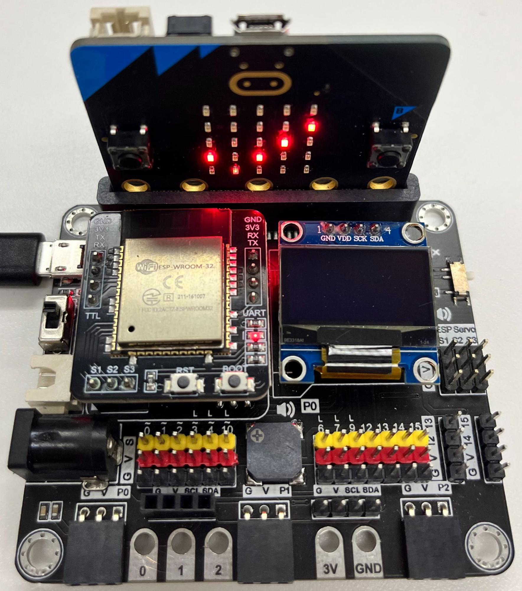

Step 2: Check current version

* Press A to display the current firmware version
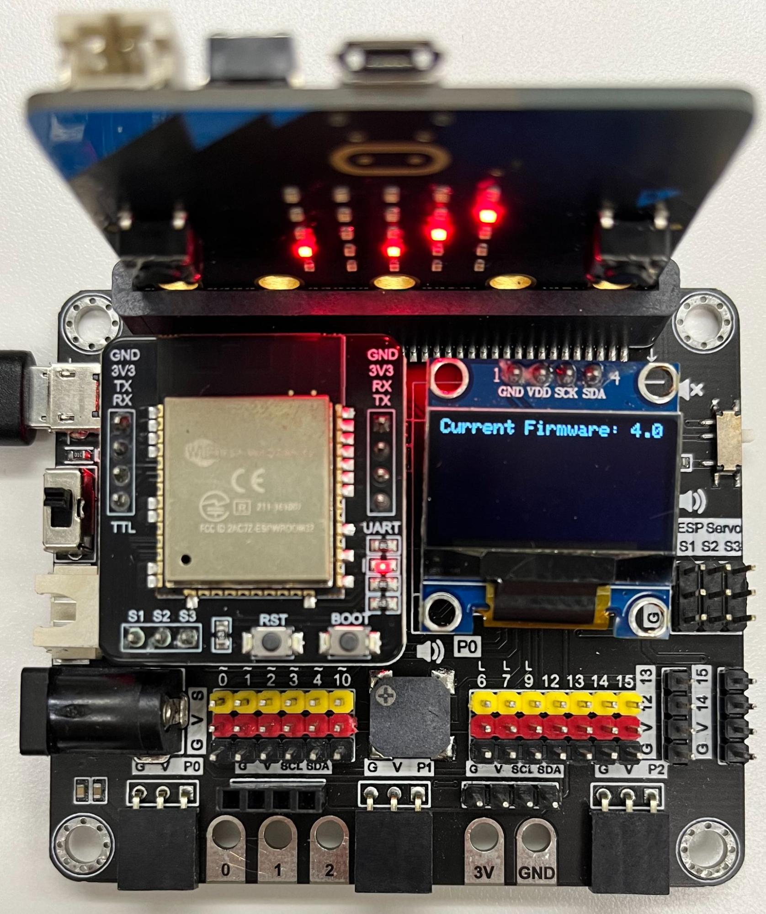

Step 3: Start OTA update

* Press B to start OTA update
* Check if the update is ongoing (Percentage from 0 to 100)
* Do not disconnect from power / Wifi during the update process unless necessary
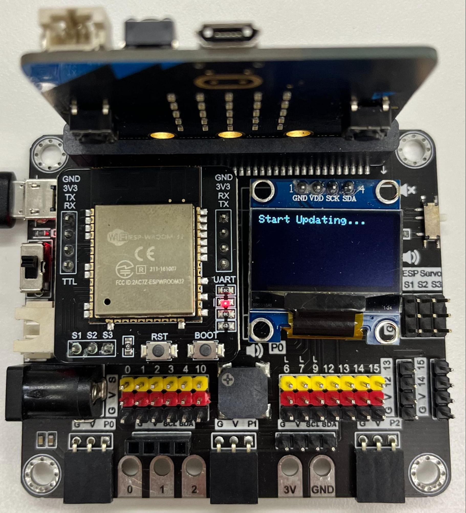

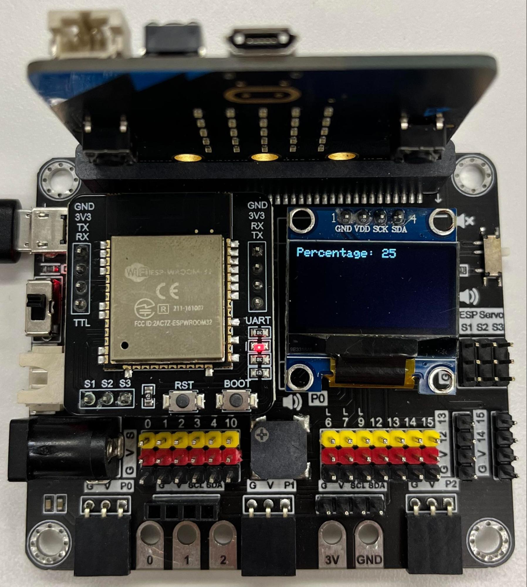

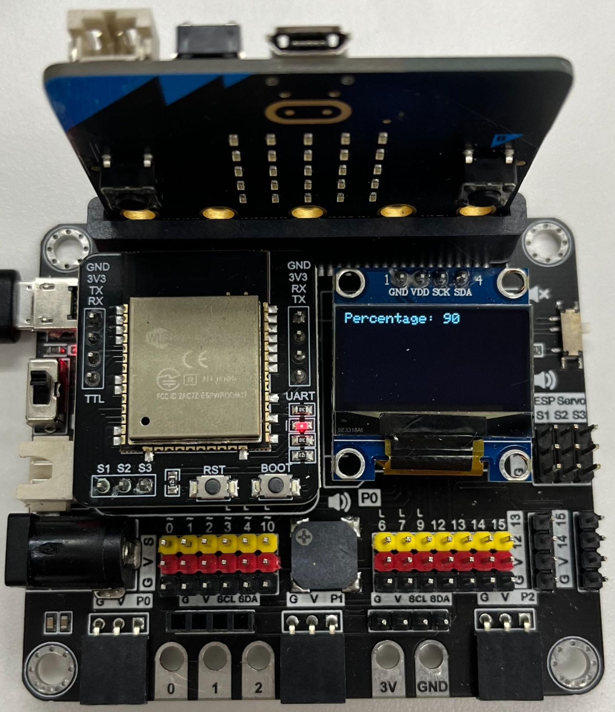

Step 4: Update completed

* The micro:bit LED shows a smiley face, which means the OTA update is complete
* Reboot the IoT:bit by turning off and on the power

Step 5: Check latest current firmware version

* Press A again to check the current firmware version
* Finished!
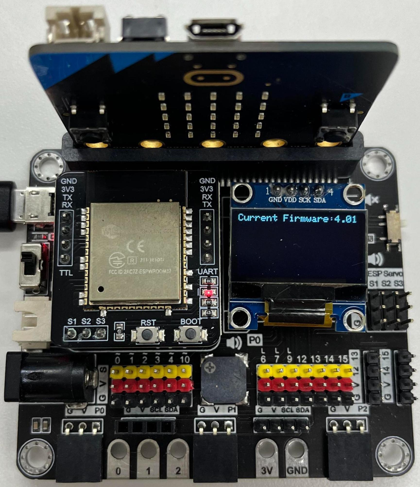

## Troubleshooting on OTA Update

If any error message appears, please follow the instructions below and ***DO NOT turn off*** the power.

* NETWORK_NOT_STABLE — Press B to retry. If this error message persists, please connect a more stable WiFi and try again.
* FILE_NOT_EXIST – Please contact Smarthon

When updating firmware, please note:

1. Do not turn off IoT:bit and micro:bit when updating
2. If the update is not progressing for more than 10 minutes, you can reboot IoT:bit and try again
3. Make sure the WiFi network signal is stable and in good condition
4. Once the firmware update has started, do not execute the update function again ( do not press the button B again) unless any error message is display on the OLED

## Firmware Release Notes

Available for ESP32

**Version 4.2 — 30 AUG 2024 (Latest version)**

Features:‍
* Add the IFTTT webhooks equivalent function

Download: [<u>firmware_v4.2</u>](https://control.smarthon.cc/UpdateFW/4.2/firmware_v4_2.bin) 

**Version 4.01 — 12 Jun 2023**

Features:‍
* Add the ledc module back

Fixes:
* Fix the issue that cannot control servo

Download: [<u>firmware_v4.01</u>](https://control.smarthon.cc/UpdateFW/4.0/firmware_v4_01.bin) 

**Version 4.0 — 5 Mar 2023**

Features:‍
* Add OTA function API to allow user download the latest/specific version of firmware

**Version 3.2**

Features:‍
* Add HTTP function API to allow the HTTP GET request

**Version 3.1 — 17 Dec 2020**

Features:‍
* Add NTP function API to allow user set the Time Zone

Fixes:
* Fix HTTP connection (include HTTP, IFTTT, Thingspeak, WAN/Channel Control) crash issue when received ERROR Code

**Version 3.0**

Features:‍
* Massive modified of the Serial Table return
* Compatible to latest version PXT (v0.5+)

**Version 2.3**

General:‍
* Update the http result wording
* Update the Wifi connection wording

**Version 2.2**

Features:‍
* Update the ESP Servo AT command, now allow to control the three Servo ports by one command

**Version 2.1**

Features:‍
* Add network status flag
* Add NTP function

Fixes:
* Fix the Wifi AP/hotspot mode for esp32
* Fix the bug when using esp32 to perform pwm and servo control

General:
* Renew the wordings
* Change the pubnub connection URL to smarthon domain address

**Version 2.0**

Features:‍
* Introduce network connection status
* Update to compatible with esp32

## Wired Firmware Update

For IoT:bit firmware versions lower than 4.0, please update according to this tutorial.

Things you need

* A computer with Windows OS
* 4 jumpers wires (female-to-female)
* USB TTL (You can buy it [<u>here</u>](https://detail.tmall.com/item.htm?id=14525708851) or other Taobao stores)
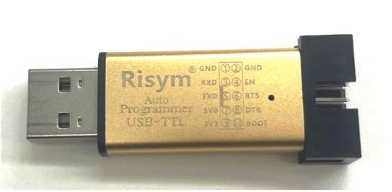

Step 1: Install CP210x driver

* Download and extract “CP210x Windows Drivers” from [<u>Silicon Labs website</u>](https://www.silabs.com/developers/usb-to-uart-bridge-vcp-drivers?tab=downloads)
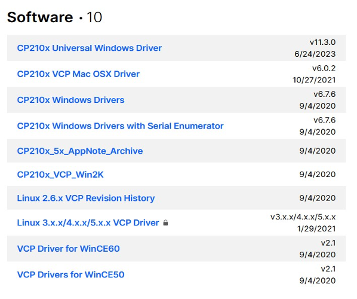

* In the extracted folder, execute “CP210xVCPInstaller_x64.exe” to install the CP210x driver
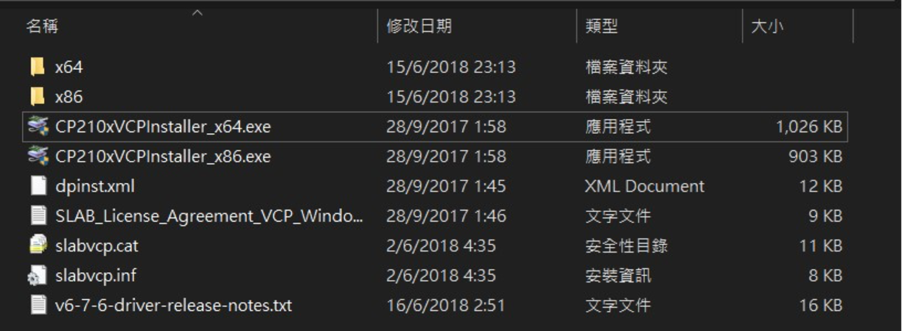

Step 2: Obtain Flash Download Tools

* Download and extract “Flash Download Tools” from [<u>ESP website</u>](https://www.espressif.com/en/support/download/other-tools?keys=&&&order=field_release_date&sort=asc)

* Execute Flash Download Tools
* Change the settings to ESP32 and Factory, then press OK
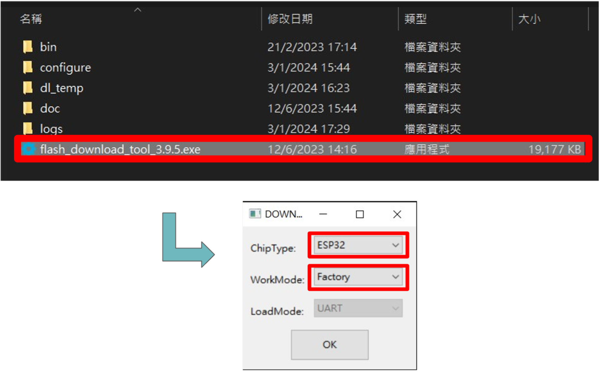

* Uncheck “LockSettings” on SPIFlashConfig and click OK
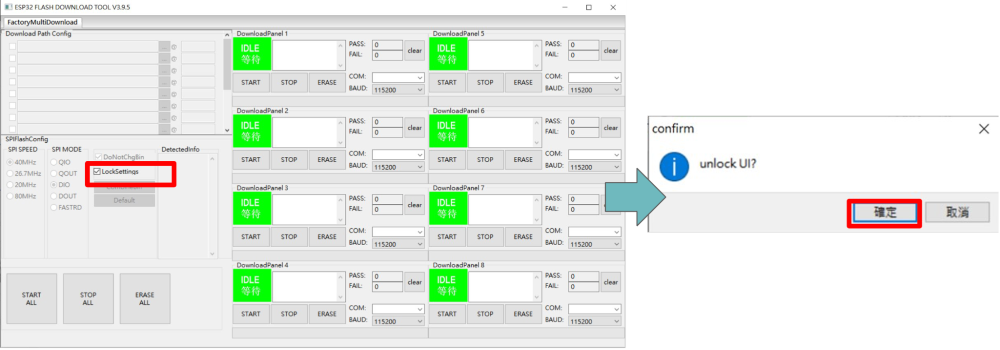

Step 3: Connect ESP32 to computer

* Follow the pictures and mapping table below to connect ESP32 and USB TTL

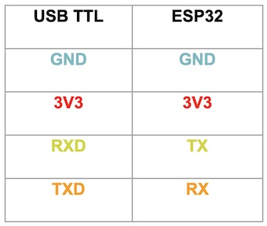

* Plug the USB TTL into computer USB port
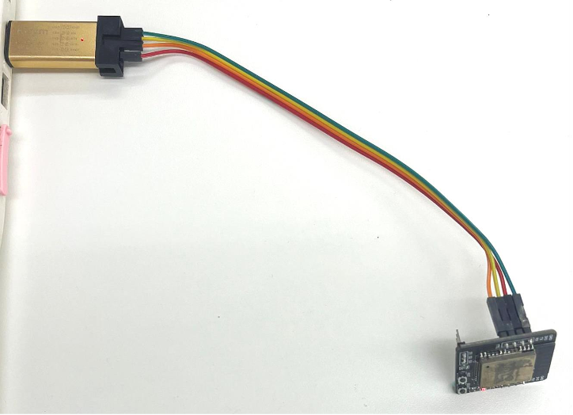

Step 4: Flash Download Tools burn setting

1. Select the serial port at COM
2. Select 921600 at BAUD
3. Select the IoT:bit [<u>firmware Bin file</u>](https://control.smarthon.cc/UpdateFW/4.2/firmware_v4_2.bin) and check the nearby box
4. Enter the burning address 0x0000
5. Uncheck DoNotChgBin
6. Do not change other settings, click START to start burning
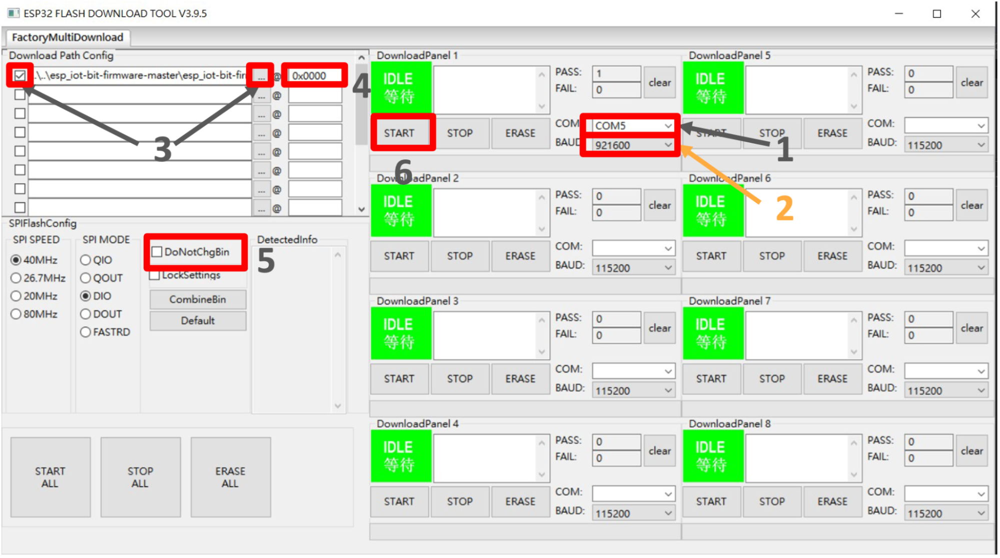

Step 5: After pressing START, put ESP32 into burning mode

1. Hold the BOOT button
2. Press and release the RST button
3. Release the BOOT button

Step 6: Wait for the burning to complete

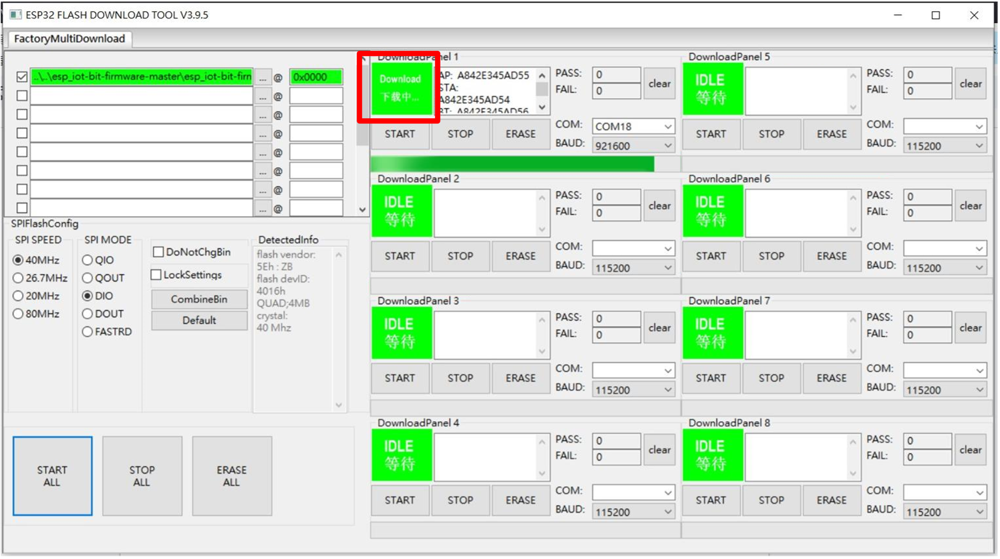

Step 7: Burning completed

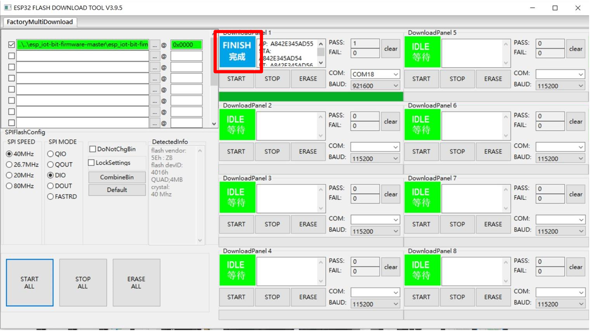

