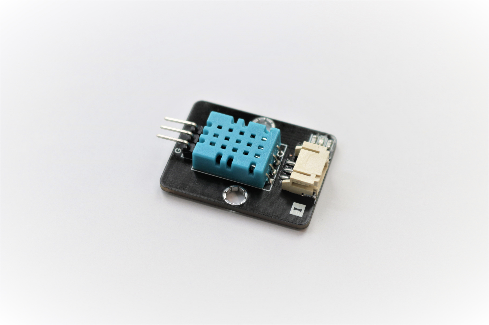
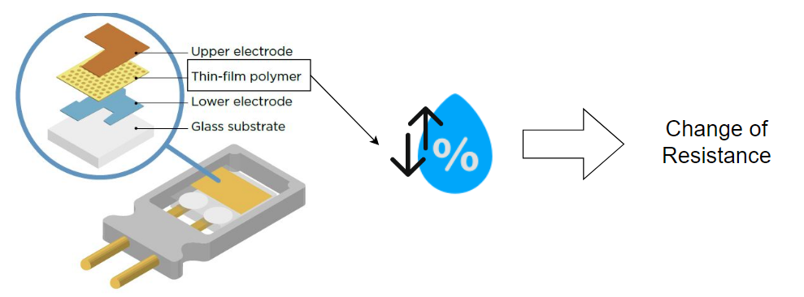
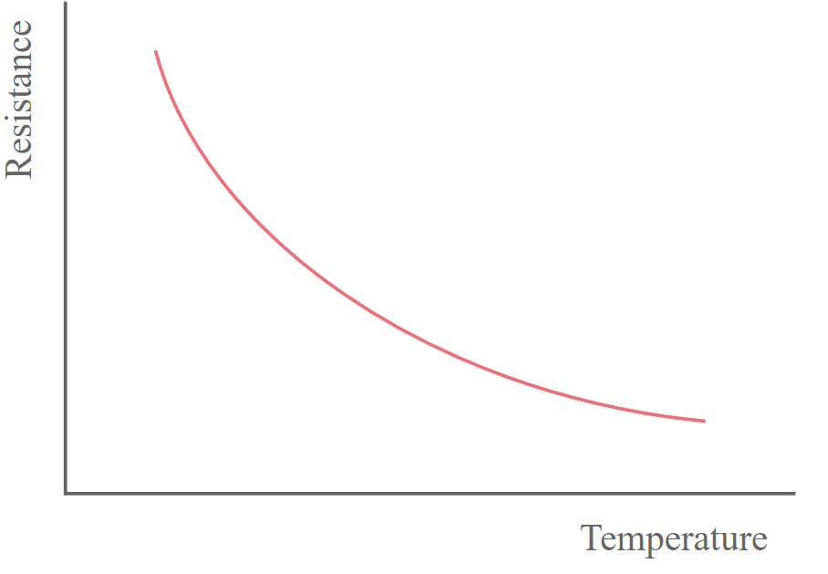
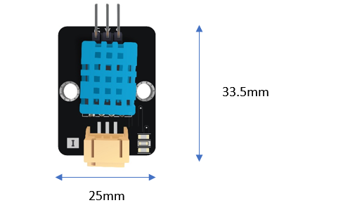
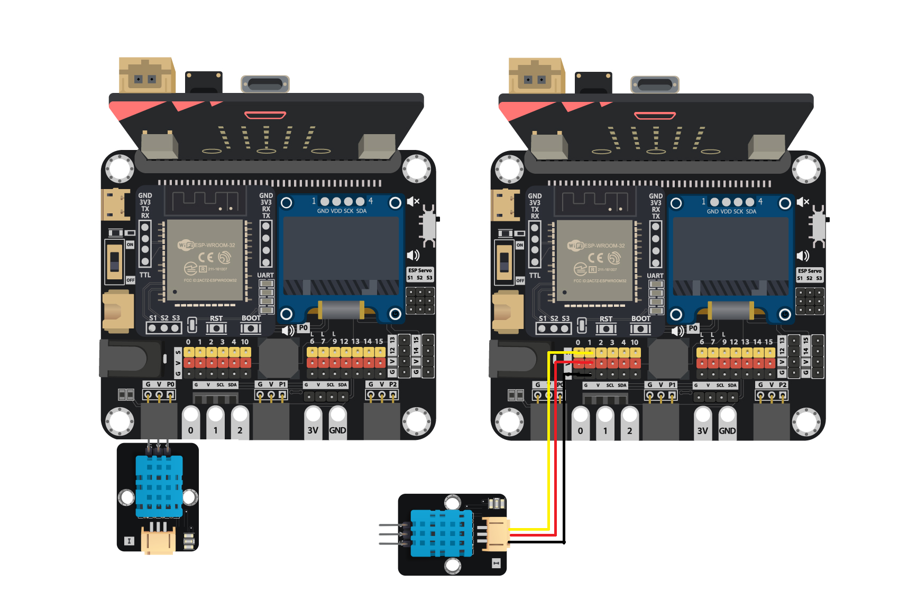
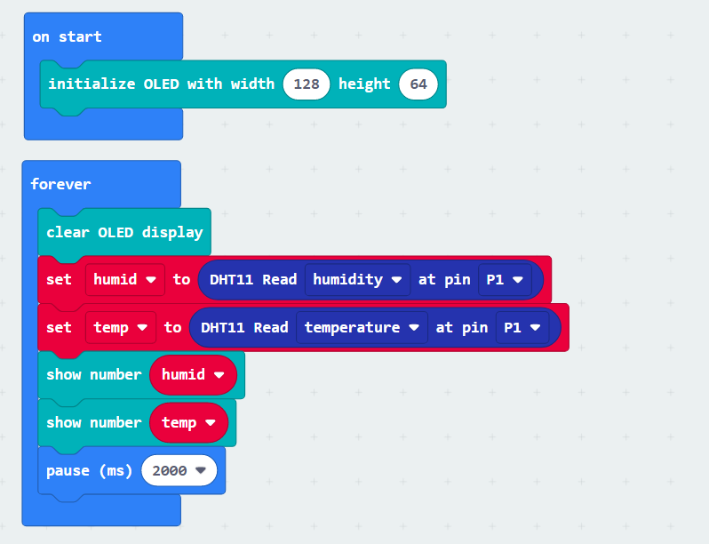
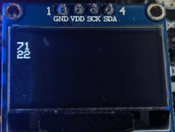

# DHT11

## Introduction
DHT11 is a commonly used sensor to detect the humidity and temperature in a lot of STEM project, it contain different advantage such low cost, easy to use and digital output. 

## The principle
The DHT11 contain two major components to detect humidity and temperature respectively. 

The first component is using the Conductivity to measure the environment humidity. When humidity is changing, the polymer between two electrodes will change the conductivity, causing the resistance between electrodes drop or rise. The chip on DHT11 will use it to determine correct humidity. 

For the second component on DHT11, it is a Negative Temperature Coefficient(NTC) thermistor, when the temperature is rising, the resistance will decrease as follow. The chip will use that to determine the environment temperature.

## Specification 
* Supply Voltage: 3.3V to 5V
* Range of Temperature reading: 0-50°C with +- 2°C accuracy
* Range of Humidity reading: 20%~80% with +- 5% accuracy
* Sampling Rate: 1Hz

## Pinout Diagram

|Pin|Function|
|--|--|
|G|Ground|
|V|Voltage Supply|
|S|Signal Output(Digital)|

## Outlook and Dimension

Size: 33.5mm X 25mm

## Quick to Start/Sample

<H3><u>Best practice</u></H3>
* Connect the DHT11 to development board (direct plugin or using wire)

* Open Makecode, using the https://github.com/smarthon/pxt-smartcity PXT 

* After Initial the OLED, setup two variables to store the reading value, then load the value from the DHT11 function to variable

* The DHT11 function have internal 1s delay for enough sampling time to ensure DHT11 working properly.

* Show the temperature and humidity variable on the OLED

## Result

The Room Temperature and Humidity showing on the OLED screen

## FAQ

Q: Why the termperature and humidity reaction on DHT11 have delay? 
A: The DHT11 sensor required some time to reach the accuracy value, form the official datasheet, the minimum response time of the Temperature and Humidity is 10 second and 6 second respectively.

## Datasheet

[DHT11_Datasheet](https://www.mouser.com/datasheet/2/758/DHT11-Technical-Data-Sheet-Translated-Version-1143054.pdf)
