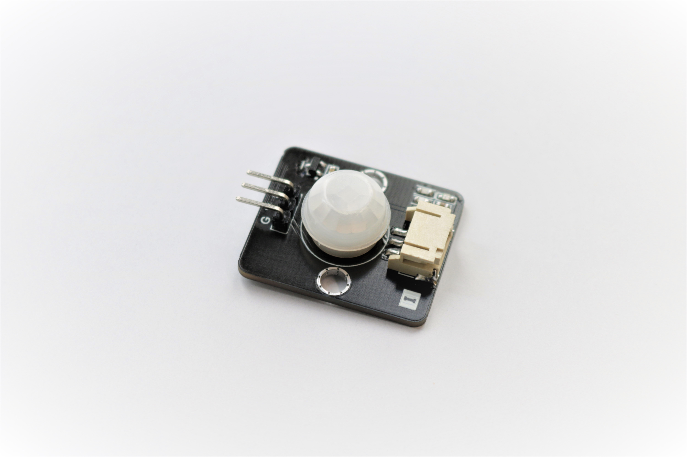
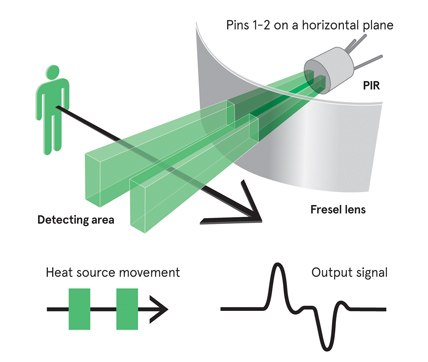
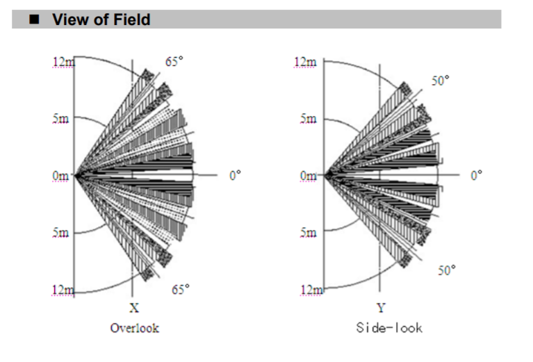
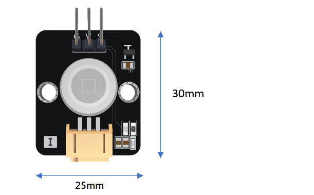
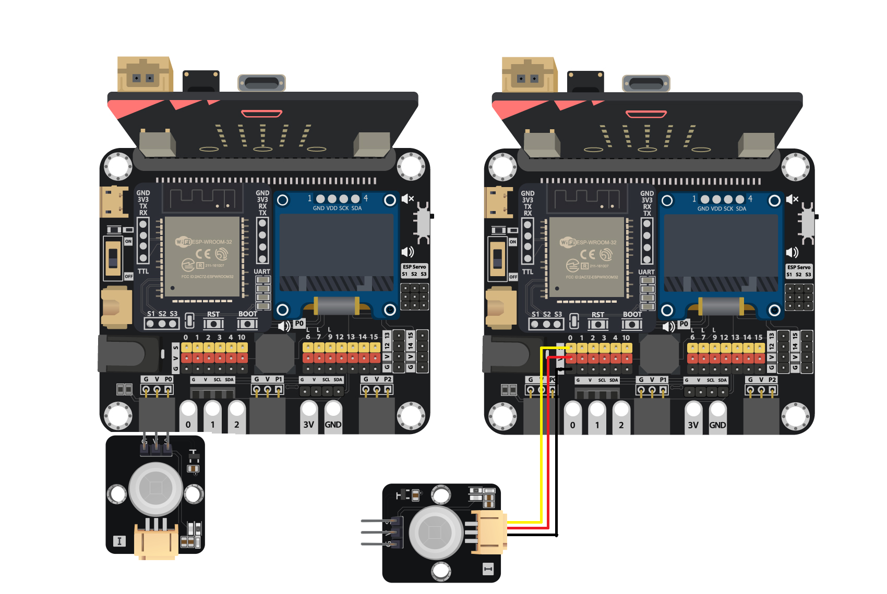
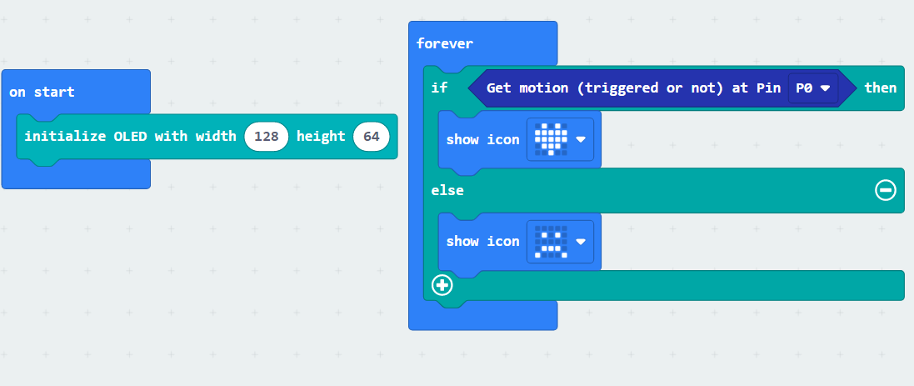
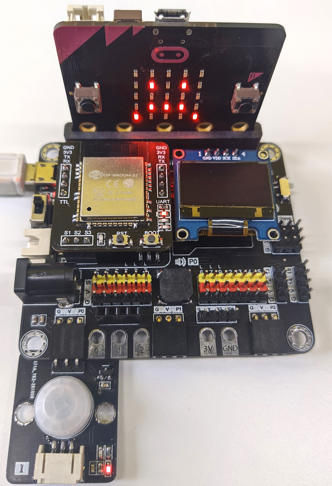

# PIR Motion Sensor

## Introduction
The PIR Motion Sensor use a pyroelectric infrared sensor to detect any moving object at front.When the infrared signal have rapid change, the sensor will return high to user, otherwise, return low.

## The principle
The pyroelectric infrared sensor will keeping record the infrared signal inside target area. Human will emit the infrared light cause by the body temperature, when they pass thought the detection area, the signal received by sensor will have fluctuation which can determine the movement of object. 

Generally, the maximum range of the detection is 5 to 12 meters , create a spherical sector with 65 degree from normal line. 

## Specification 
* Supply Voltage: 3.3V
* Interface: Analog
* Operation Temperature: -20 ~ 85°C
* Angle of detection: <65° from normal of center 

## Pinout Diagram

|Pin|Function|
|--|--|
|G|Ground|
|V|Voltage Supply|
|S|Moving detected signal Output|

## Outlook and Dimension

Size: 25mm X 30mm

## Quick to Start/Sample

* Connect the module to the development board (direct plugin or using wire)

* Open Makecode, using the https://github.com/smarthon/pxt-smartcity PXT 

* Use to PXT library to read the detection result, and make the LEDs change according the result

## Result

The LEDs on the micro:bit will change when hand is over the sensor

## Datasheet

[PIR-am312-datasheet](http://www.image.micros.com.pl/_dane_techniczne_auto/cz%20am312.pdf)
