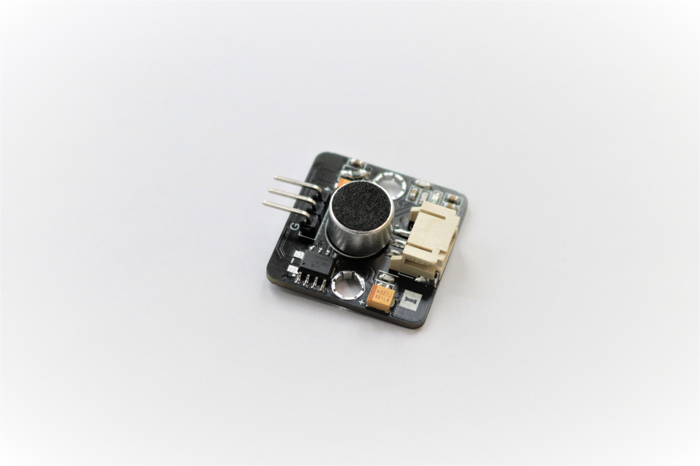
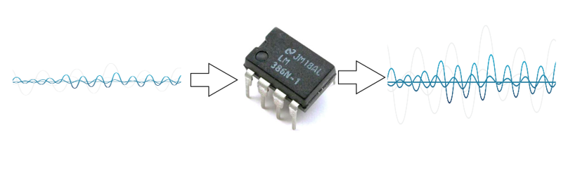
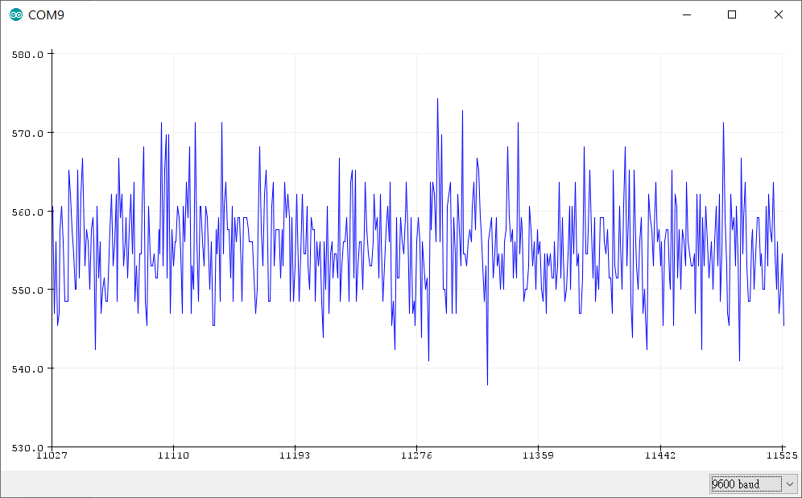
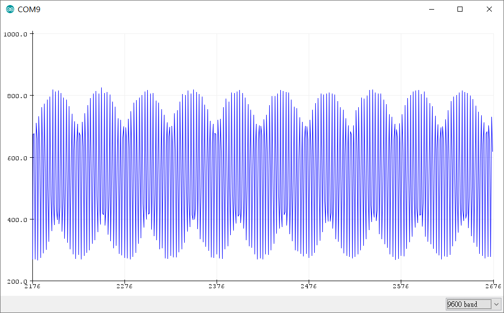
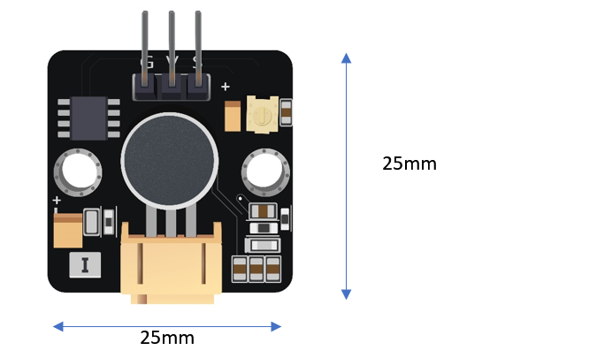
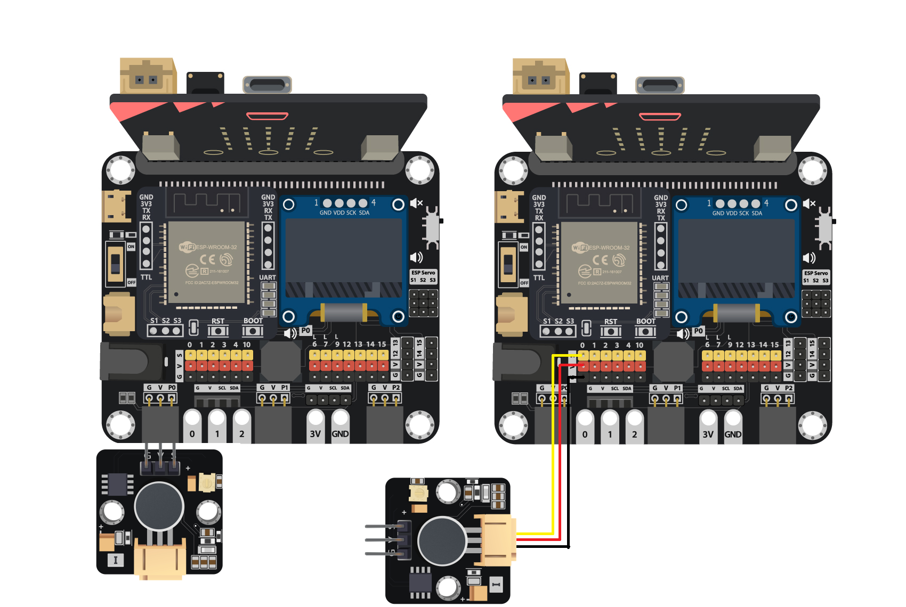
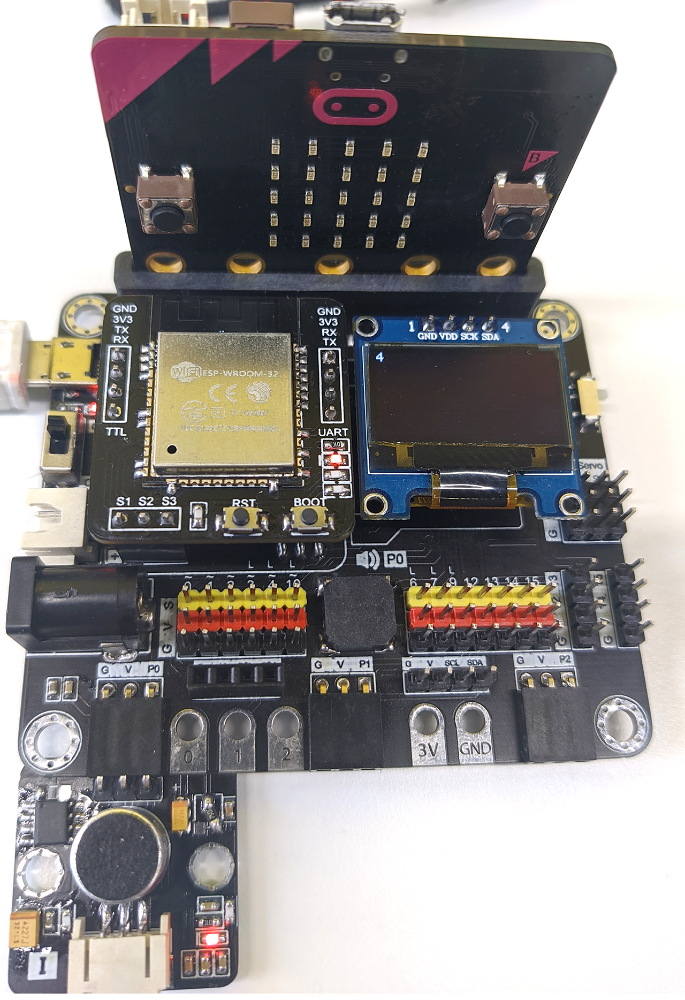
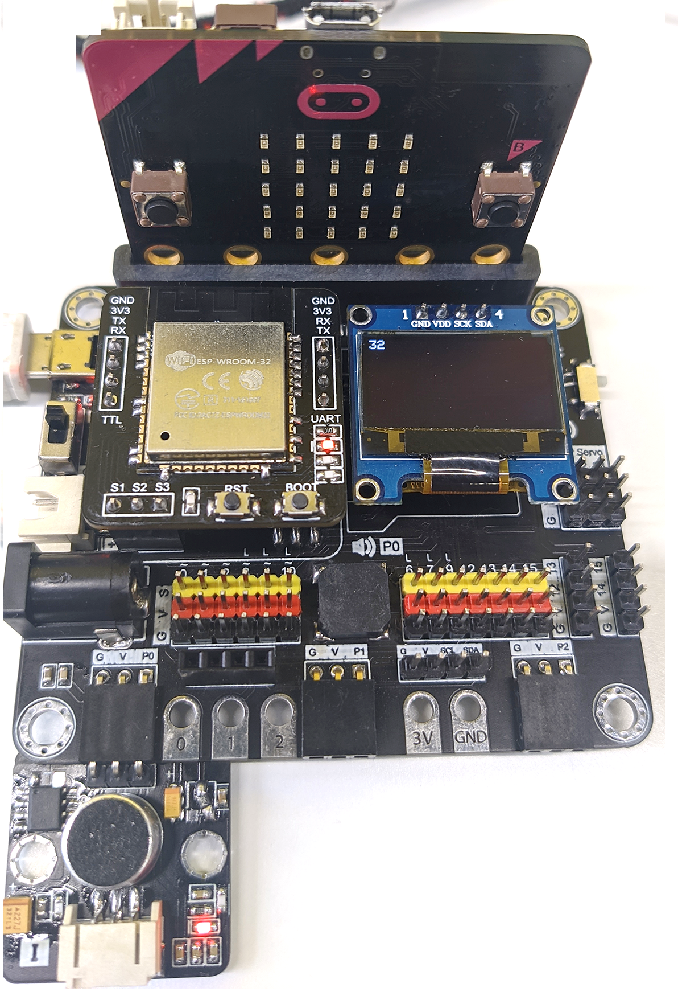

# Noise Sensor

## Introduction
Noise sensor use a microphone with an amplifier to detect the sound level of the environment. It will capture the original sound wave, enlarge, and reproduce it in voltage form. When using the sensor to calculate the sound level, use the amplitude to decide the result.

## The principle
The Noise Sensor is a combine of the microphone and amplifier, the microphone will capture the raw signal form the environment and let the amplifier chip lm386 to produce the amplified signal to the output. 

## Specification 
* Supply voltage: 3.3V – 5V
* Interface: Analog
* Output Range: 0~3.5V
 
Voltage when silent: (1.74~1.83V) 
 

Voltage Under 440Hz sound:(0.98 ~ 2.58V)
 

## Pinout Diagram

|Pin|Function|
|--|--|
|G|Ground|
|V|Voltage Supply|
|S|Voltage Signal Output|

## Outlook and Dimension

Size: 25mm X 25mm

## Quick to Start/Sample

* Connect the sensor to development board (using wire)

* Open Makecode, using the https://github.com/smarthon/pxt-smartcity PXT 

* Initial the OLED screen and show the reading of the noise level.

The value will be in range of 0 to 100

## Result

When the environment is quite silent without noise

When people speak louder 

## FAQ

## Datasheet

[LM386-datasheet](https://www.ti.com/lit/ds/symlink/lm386.pdf)
