# How to build a House Model

<H3>There are 3 type of house you can build</H3>
1. Big House Model
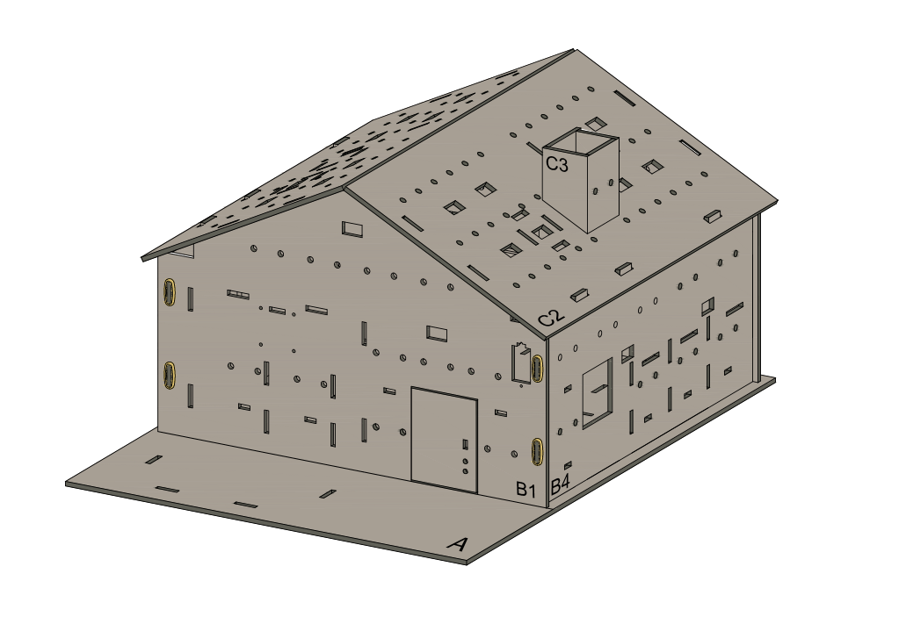
2. Small House Model
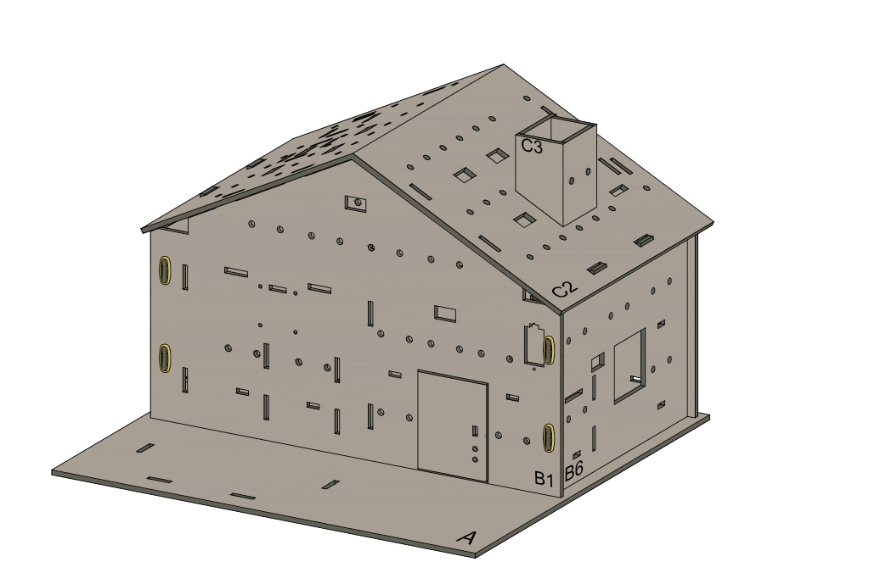
3. Open Style Model

To build a model, the house base is model A to model C.

## Big House Model

### Part list

### Assembly

Step 1 

* Add the 6 rubber bends to the bottom of the model B4 and B2.

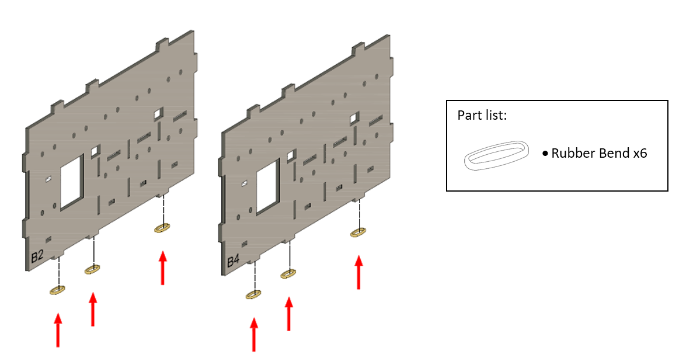

Step 2 

* Insert the model B2 and B4 to model A.

Step 3 

* Add the 6 rubber bends to the bottom of the model B1 and B3.

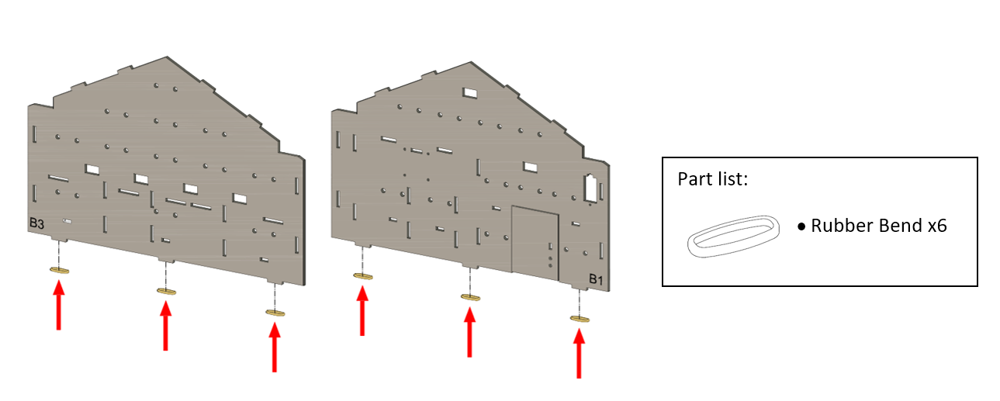

Step 4 

* Put the model B1, B3 to model A, and then insert to the model B2 and B4.

Step 5 

* Make sure <u>all the holes</u> of model A wrap the rubber from the model B1 to B4 properly and completely.

Step 6 

* Add the 4 rubber bends to the front side (Model B1) and back side (Model B3) of the house.

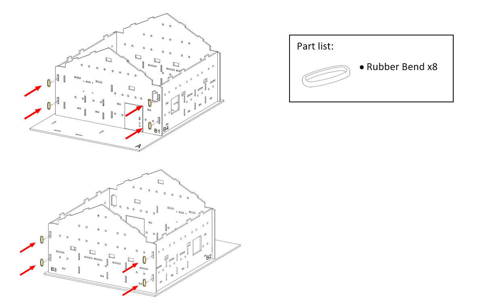

Step 7 

* Insert the model C1 and C2 on model B1, B2, B3, B4, align with the holes on them.

Step 8 

* Insert the model C3 on the model C2.

Step 9 

* Completed!

### Optional: Extra Room

Step 1 

* For extra room installation, Insert the model D1, D3 on model B1 align with  the holes on model A.

Step 2 

*  Put the model D2 on the holes of model A, and then insert it to model D1 and D3. 

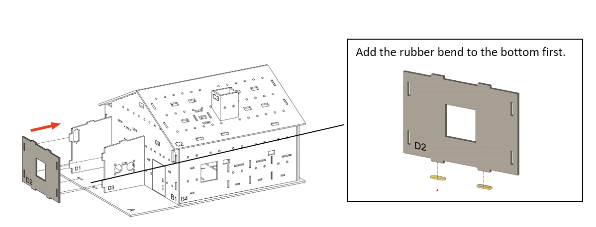

Step 3 

*   Add the 4 rubber bends to the model D2 so that the house will not loose.

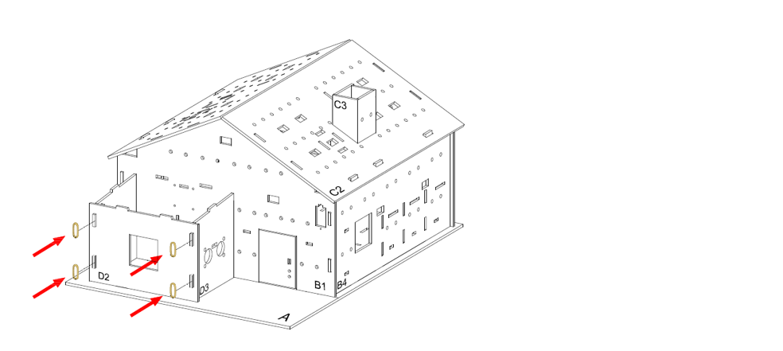

Step 4 

*   Insert the model D4 to the model B1, and then attach it to the model D1, D2 and D3.

Step 5 

* Completed! 

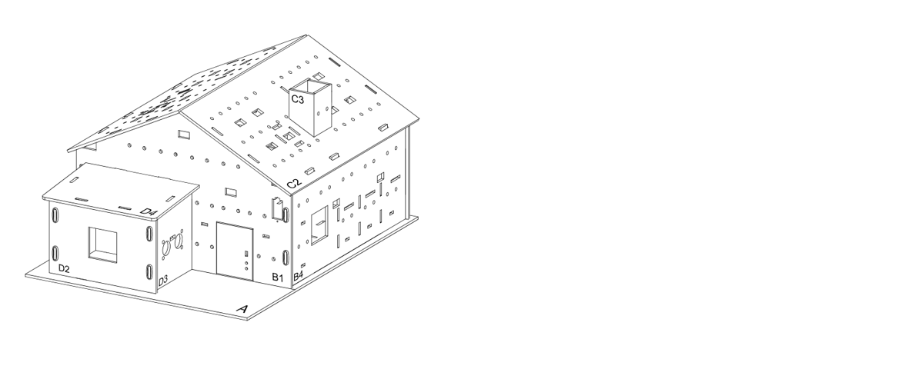

## Small House Model

Before we build a small house model, we need to cut the cardboard as instruction on cardboard.

### Part list

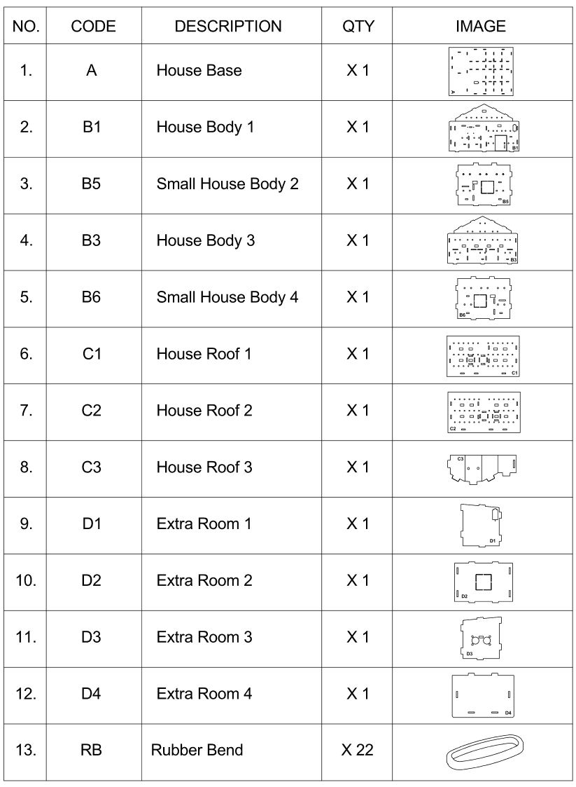

### Cut the cardboard

Step 1 

* Cutting with the dashed line on A cardboard. 

Step 2 

* Cutting with the dashed line on C1 and C2 cardboard.

### Assembly

Step 1 

* Add the 6 rubber bends to the bottom of the model B5 and B6. 

Step 2 

* Insert the model B5 and B6 to model A. 

Step 3 

* Put the model B3 to model A, and then insert to the model B5 and B6. put the model B1 on the model A, and then insert it to the model B5 and B6. 

Step 4 

* Make sure <u>all the holes</u> of model A wrap the rubber from the model B1 to B4 properly and completely.

Step 5 

* Add the 8 rubber bends to the model B1 and B3 so that the house will not loose. 

Step 6 

*  Insert the model C1 and C2 on model B1, B5, B3, B6, align with the holes on them.

Step 7 

*  Insert model C3 on the mode C2.

Step 8 

*  Completed!

### Optional: Extra Room

Step 1 

* For extra room installation, Insert the model D1, D3 on model B1, align with the holes  on model A.

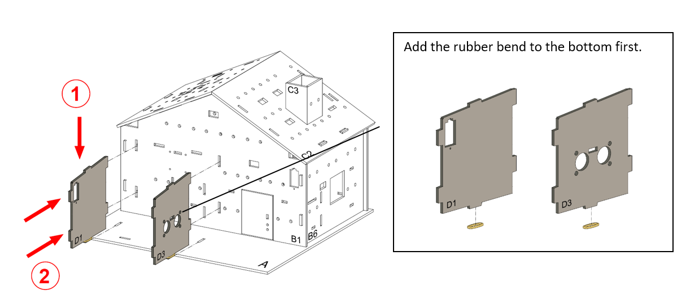

Step 2 

*  Put the model D2 on the holes of model A, and then insert it to model D1 and D3. 

Step 3 

*  Add the 4 rubber bends to the model D2 so that the house will not loose.

Step 4 

* Insert the model D4 to the model B1, and then attach it to the model D1, D2 and D3. 

Step 5 

* Completed! 

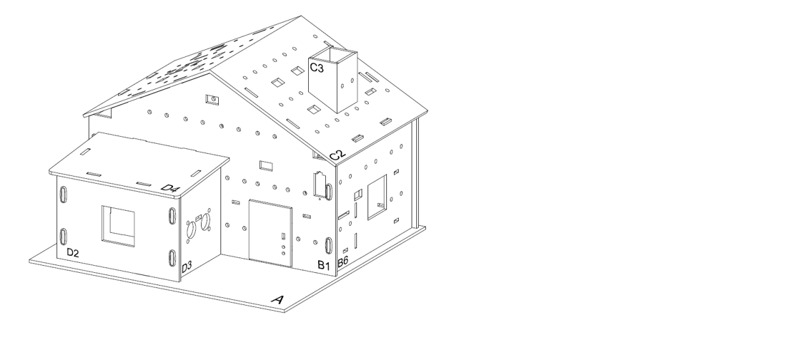

## Open Style Model

Before we build a open model, we need to cut the cardboard as instruction on cardboard.

### Part list

### Cut the cardboard

Step 1 

* Cutting with the dashed line on B1 and B3 cardboard.

Step 2 

* Cutting with the dash line on B2 & B4 cardboard.

### Assembly

Step 1 

* Add the 6 rubber bends to the bottom of the model B4 and B2.

Step 2 

* Insert the model B2 and B4 to model A.

Step 3 

* Add the 6 rubber bends to the bottom of the model B1 and B3.

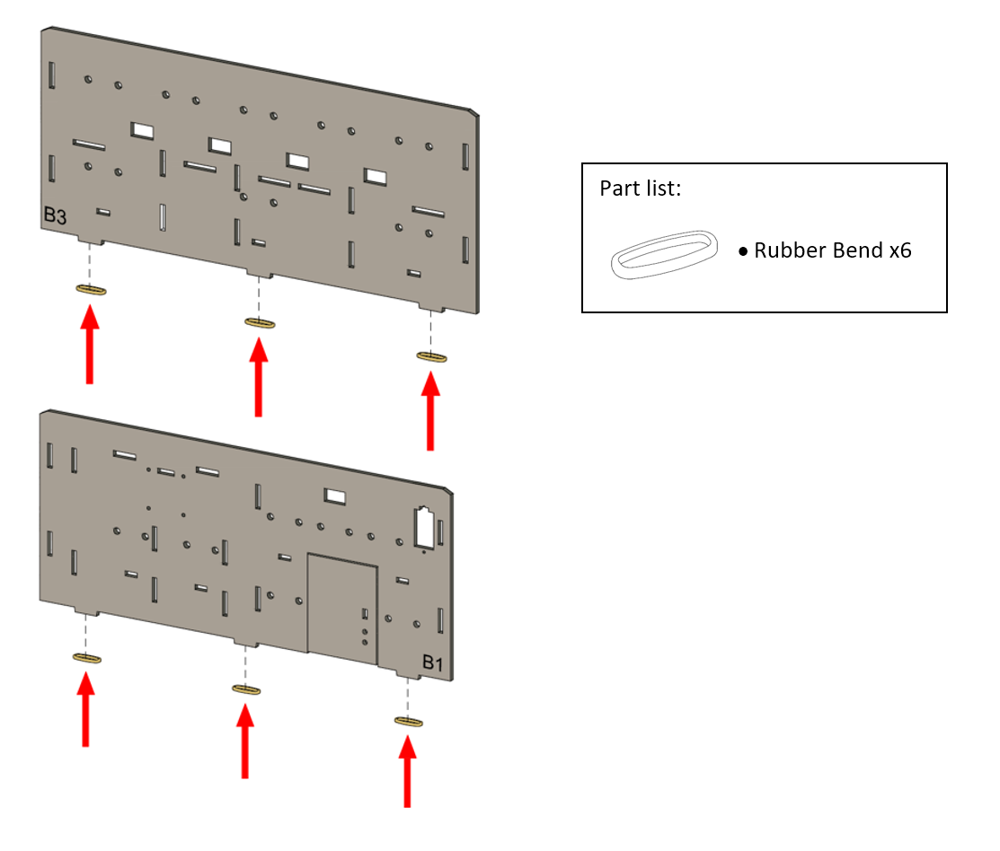

Step 4 

* Put the model B3 on the model A, and then insert to the model B2 and B4. Put the model B1 on the model A, and then insert it to the model B2 and B4.

Step 5 

* Make sure <u>all the holes</u> of model A wrap the rubber from the model B1 to B4 properly and completely.

Step 6 

* Add the 4 rubber bends to the model B1 so that the house will not loose.

Step 7 

* Completed! 

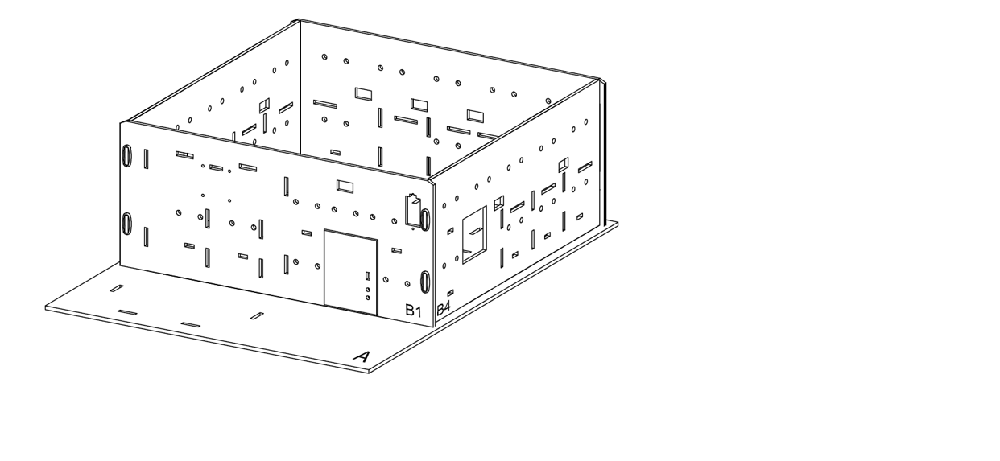

### Optional: Extra Room

Step 1 

* For extra room installation, Insert the model D1, D3 on model B1, align with the holes on model A.

Step 2 

* Put the model D2 on the holes of model A, and then insert it to model D1 and D3.

Step 3 

* Add the 4 rubber bends to the model D2 so that the house will not loose.

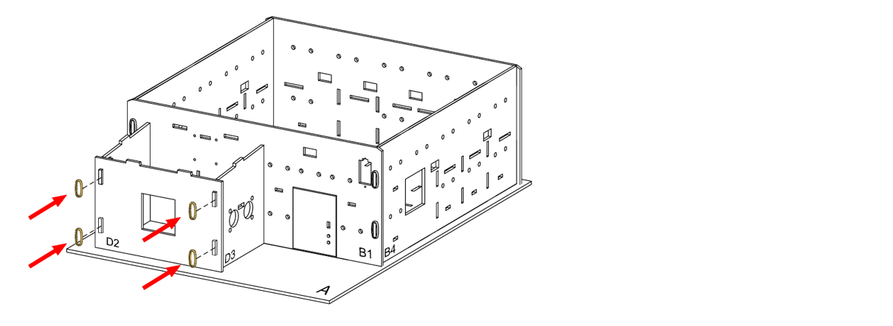

Step 4 

Insert the model D4 to the model B1, and then attach it to the model D1, D2 and D3.

Step 5 

Completed!

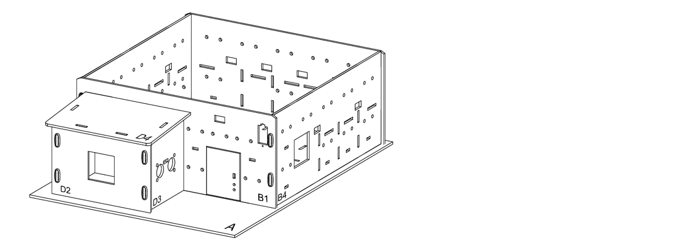
