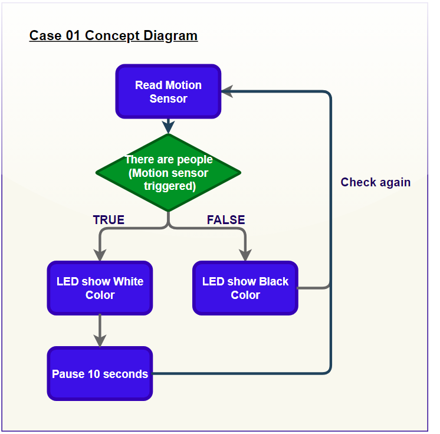
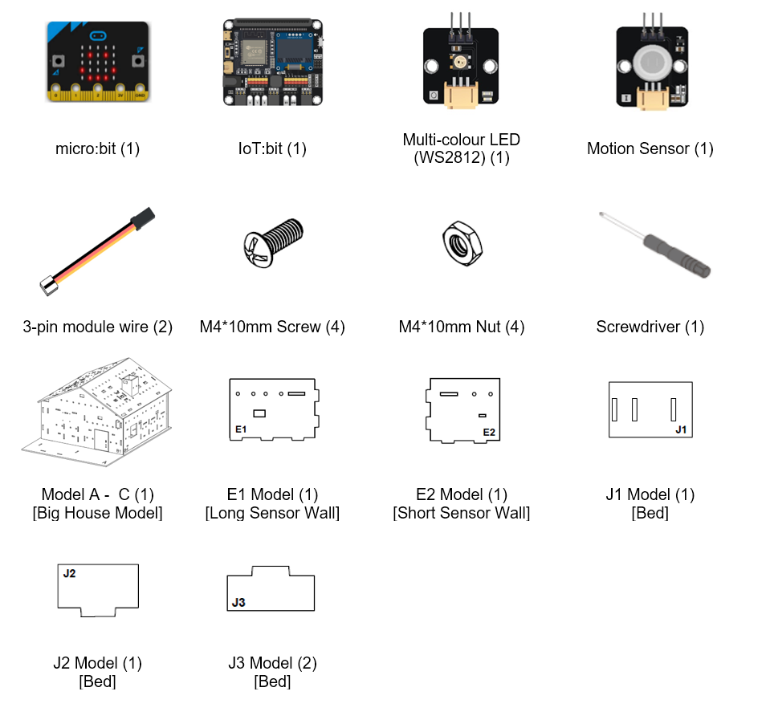
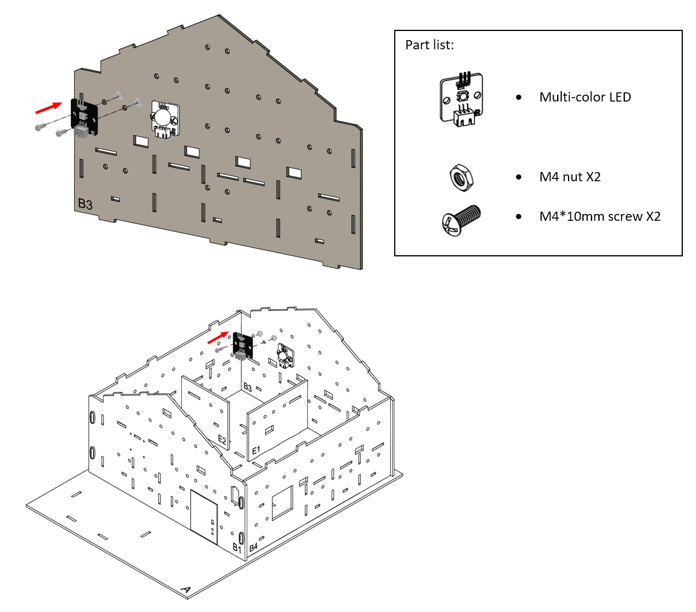
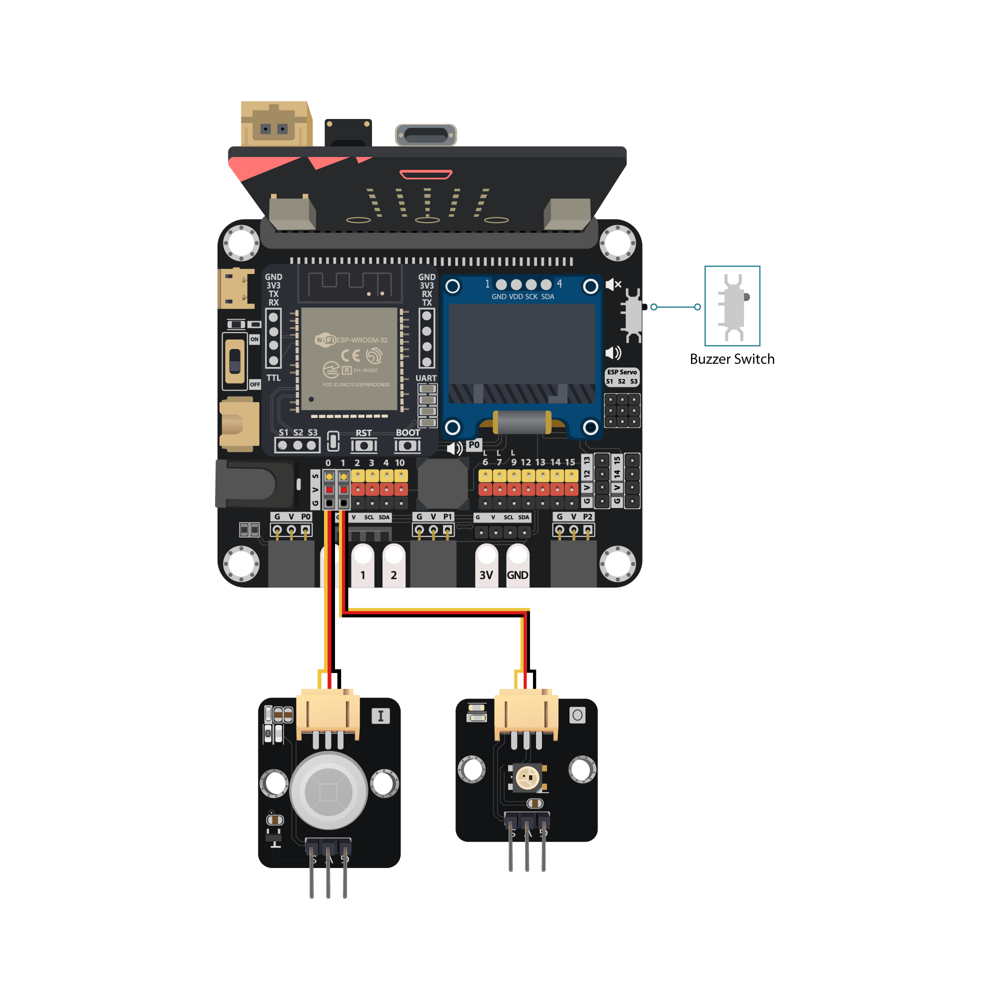

# Case 01: Smart Saving Light Bulb

Level: 

## Goal

Make a smart light bulb by detecting motion around the environment.

## Background

What is a Smart Light Bulb?

Smart light bulb is a smart light bulb that helps automation and saving electricity. When there is people coming in, the bulb will be turned on automatically. People always forget to turn off the light when he/she leave. After 10 mins, if there are no any motions inside the room, it will close the LED to save energy. 

Smart Saving Light Bulb Principle

Motion sensor is used to detect the presence of human activity in the room. If there are people moving in the room, the light bulb will be turned on, vice versa. 

## Part List

## Assembly step

Step 1 

 Pick one corner of the house. In this example, we pick the left upper corner, install the 2 walls (E1 & E2) to build a small room. 

Step 2 

Use M4 screw to Install the motion sensor on B3 model 

Step 3 

Use M4 screw to install the multi-color LED on wall 

Step 4 

Completed the installation 

Step 5 

Build the bed with J1,J2,J3,J4 cardboard 

Step 6 

Bed building completed 

Step 7 

Place the bed inside the bedroom 

Step 8 

Completed 

## Hardware connect

1. Connect the motion sensor to P0 
2. Pull up the switch to avoid interference from buzzer 
3. Connect the Multi-color LED(WS2812) to P1 

 

## Programming (MakeCode)

Step 1. Initialize Multi-Color LED 

* Before using the Multi-Color LED, need to do initialize
* Pull the `set strip to NeoPixel at pin P1 with 1 leds as RGB(GRB format)` to `on start`

Step 2. Change the LED Color by motion sensor result 
 
* In `Forever`, add a `if-else` statement
* Set (`Get motion (triggered or not) at Pin P0` = `true`) as condition
* Snap `strip show color white` into the `if` segment
* Snap `pause(ms) 10000` into `if` segment to keep light up for 10 second
* Snap `strip show color black` into the `else` segment
* When the condition is correct, that’s say motion is triggered, someone passes by. The program will run the `if` segment to turn on the light
* Otherwise, the program will run the `else` segment to turn off the light

Full Solution 

MakeCode: [https://makecode.microbit.org/_MopaifFb42v5](https://makecode.microbit.org/_MopaifFb42v5) 

You could also download the program from the following website: 
<iframe src="https://makecode.microbit.org/#pub:_MopaifFb42v5" width="100%" height="500" frameborder="0" sandbox="allow-same-origin allow-scripts"></iframe>

## Result

When the people are moving in the room, the motion sensor will trigger and keep the LED turned on. When there is no one moving, the LED will turn off. 

## Think

 

Q1. Besides implementing the smart light bulb into the toilet, where other places can the light bulb also be implemented? Discuss the place and briefly explain the point on energy reservation. 

Q2. Suggest addition of any component that allows the light bulb to be even smarter.
 

Q3. Can you add the timer in the program to make it only turn off after 10min of no activity?  
