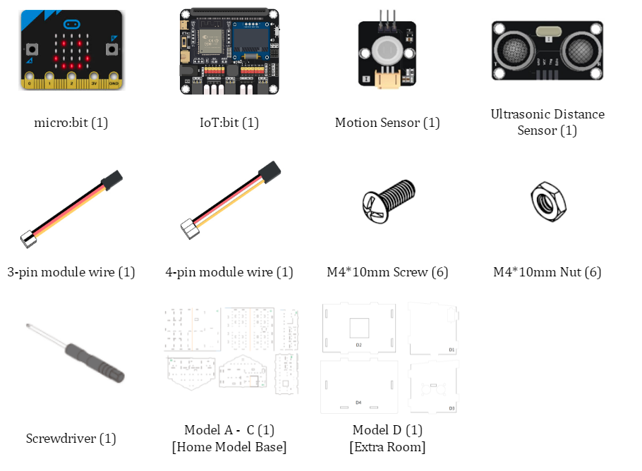
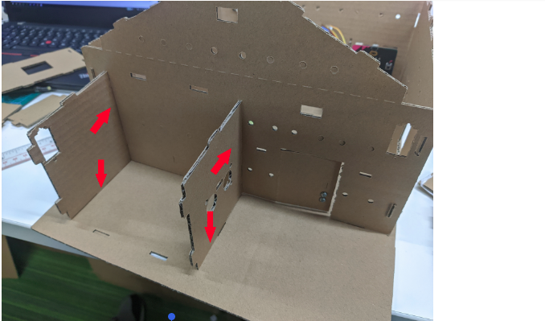
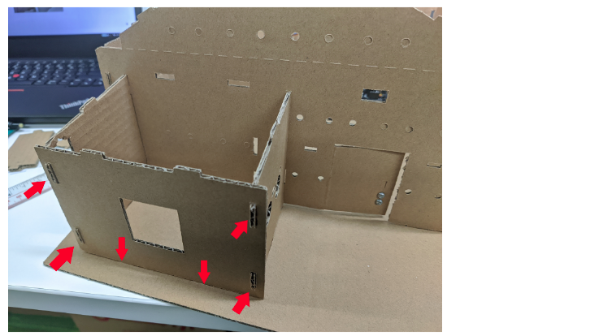
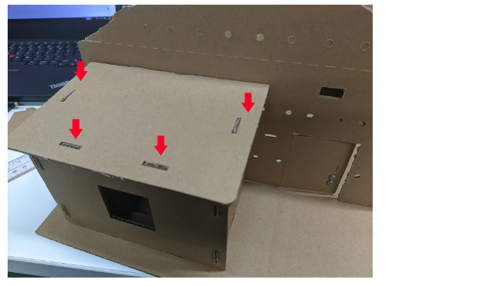
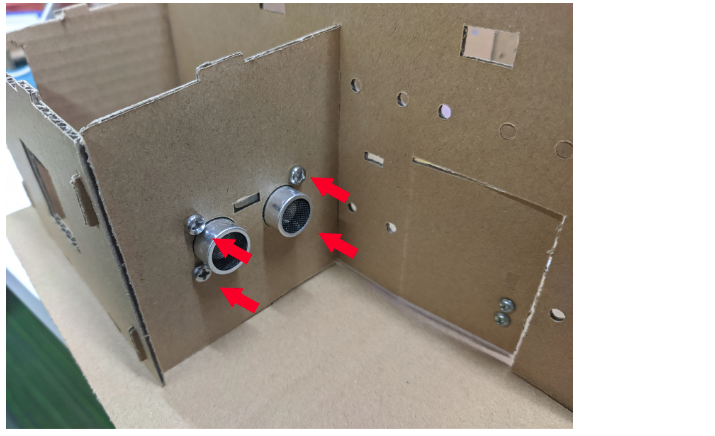
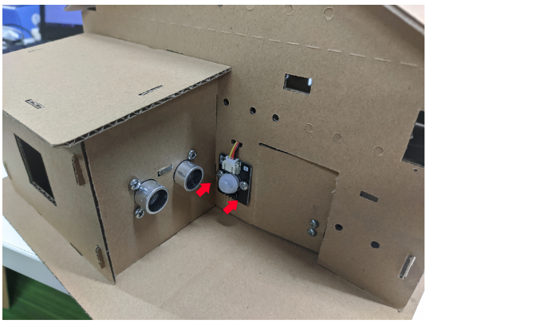
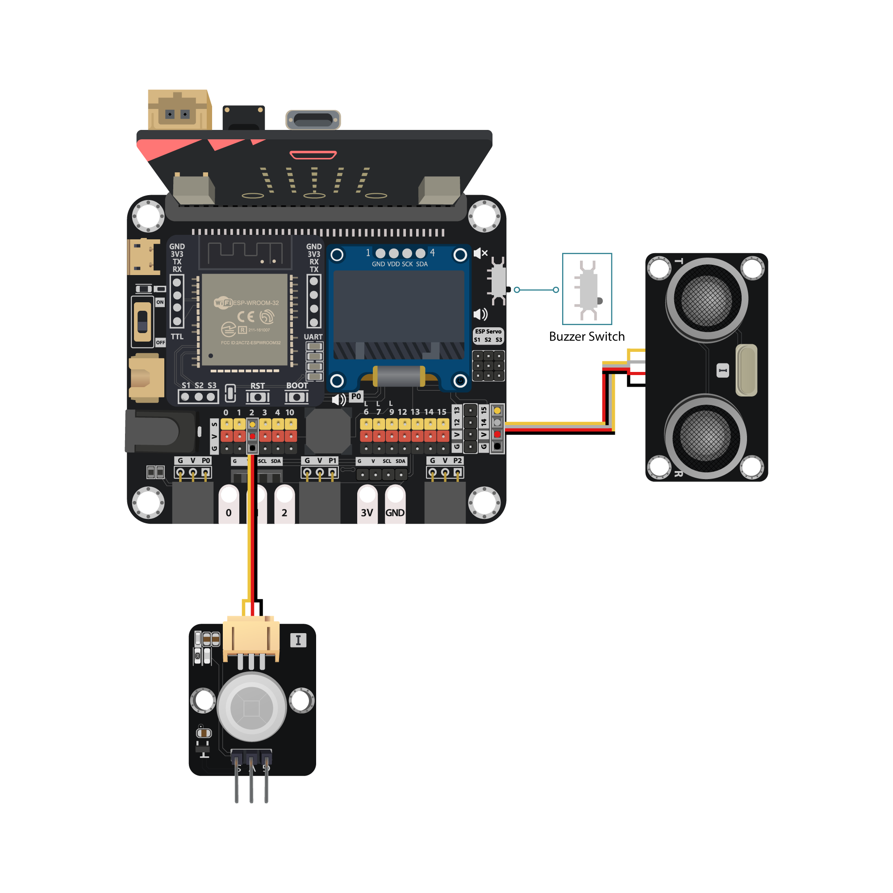
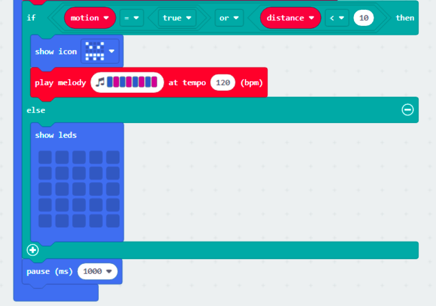

# Case 02: Security Vanguard Alarm System

Level: 

## Goal

Make an automatic home vanguard by detecting the motion around the home. 

## Background

What is a security vanguard alarm System?

Security vanguard alarm system is a smart defence system that triggers an alert automatically when detecting an unexpected visit, using motion sensor, distance sensor and buzzer. 

Vanguard working principle

Motion sensor and distance sensor is implemented over the house and monitor the surrounding environment to check if there are visitors. If there are moving objects nearby, the sensors will reflect data to the system and trigger the buzzer, until the objects move away. 

## Part List

## Assembly step

Step 1 

Build and install an extra Room (D1-D4) to the House Base
 

Step 2 

Use M4 screw and nuts to install the ultrasonic distance sensor to the model D3
 

Step 3 

Use M4 screw and nuts to install the motion sensor near the door (Model B1)
 

## Hardware connect

1. Connect the Motion sensor to P2
2. Connect Distance Sensor to P14,P15
3. Pull down the buzzer switch to connect buzzer

## Programming (MakeCode)

Step 1. Create and save the reading to variable 

* Create two variable `distance` and `motion`
* In `Forever`, use (set distance to `Get distance unit cm trig P14 echo P15`) to save the reading of distance to variable `distance`
* Use (set motion to `Get motion (triggered or not) at Pin P2`) to save the result of motion detection to variable

Step 2. Examine the reading 

* Snap `if-else` into `Forever` after saving reading to variables.
* To check both distance and motion result, the condition should include two comparison and one extra logic operators 
* set the condition as <B>[(`motion = true`) or (`distance < 10`)]</B>

Step 3. Defend! 

* In the `if` segment, means someone passing infront the door, show a angry icon by `show icon`
* Also play a warning sound to expel the suspicious by `play melody at tempo 120 (bpm)`
* In the `else` segment, no one is stay around home, no need to show the angry face, use `show leds` to clear up. 
* Add a 1 second interval `pause (ms) 1000` for the security system running in 1 second sampling rate

Full Solution 

MakeCode: [https://makecode.microbit.org/_cc21MTdEuhMv](https://makecode.microbit.org/_cc21MTdEuhMv) 

You could also download the program from the following website: 
<iframe src="https://makecode.microbit.org/#pub:_cc21MTdEuhMv" width="100%" height="500" frameborder="0"></iframe>

## Result

 When someone is get close to the door, either distance sensor or motion sensor will detect it and warn alert to house owner.

## Think

Q1.Except simply triggering the alarm system, what else do you think a smart vanguard system should have? (e.g. send notification/ call the police) 

Q2. Are other positions able to place the motion sensor to get the defend effect? (e.g in the living room) 

