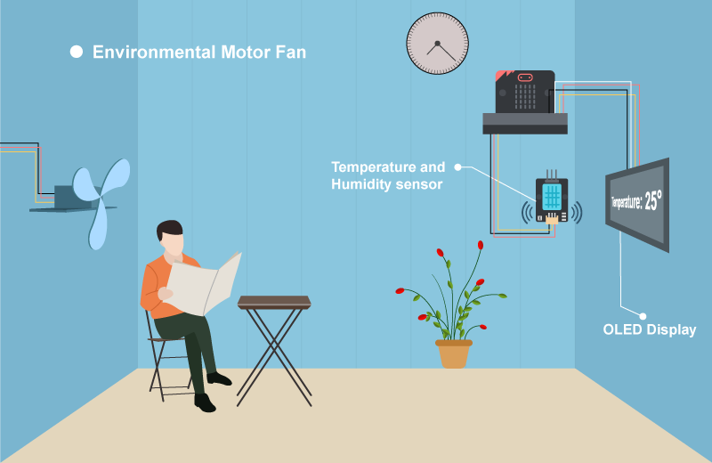
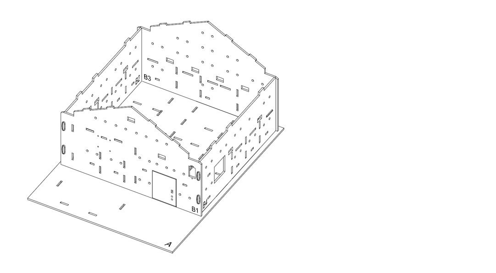
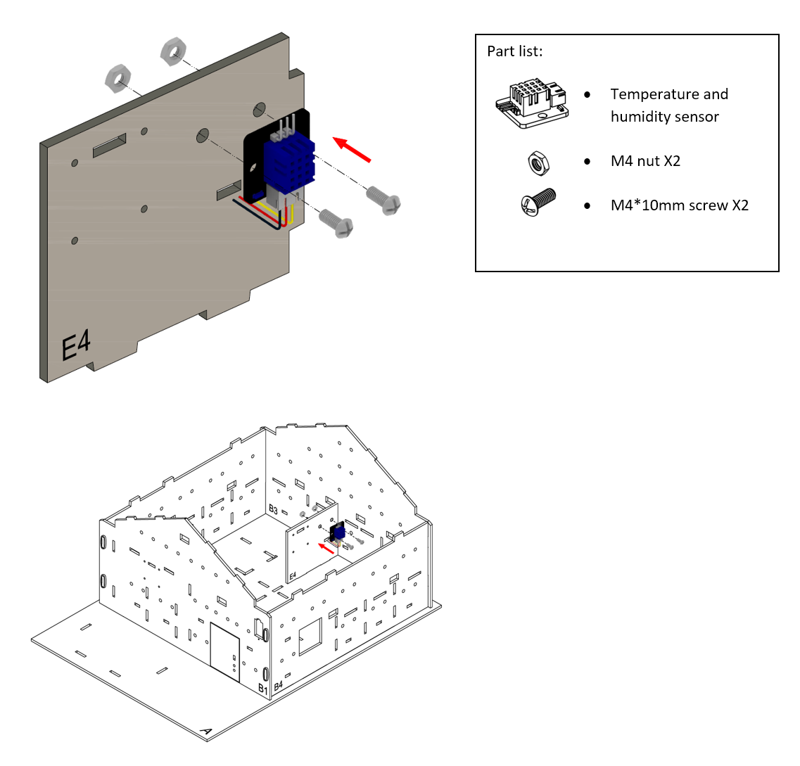
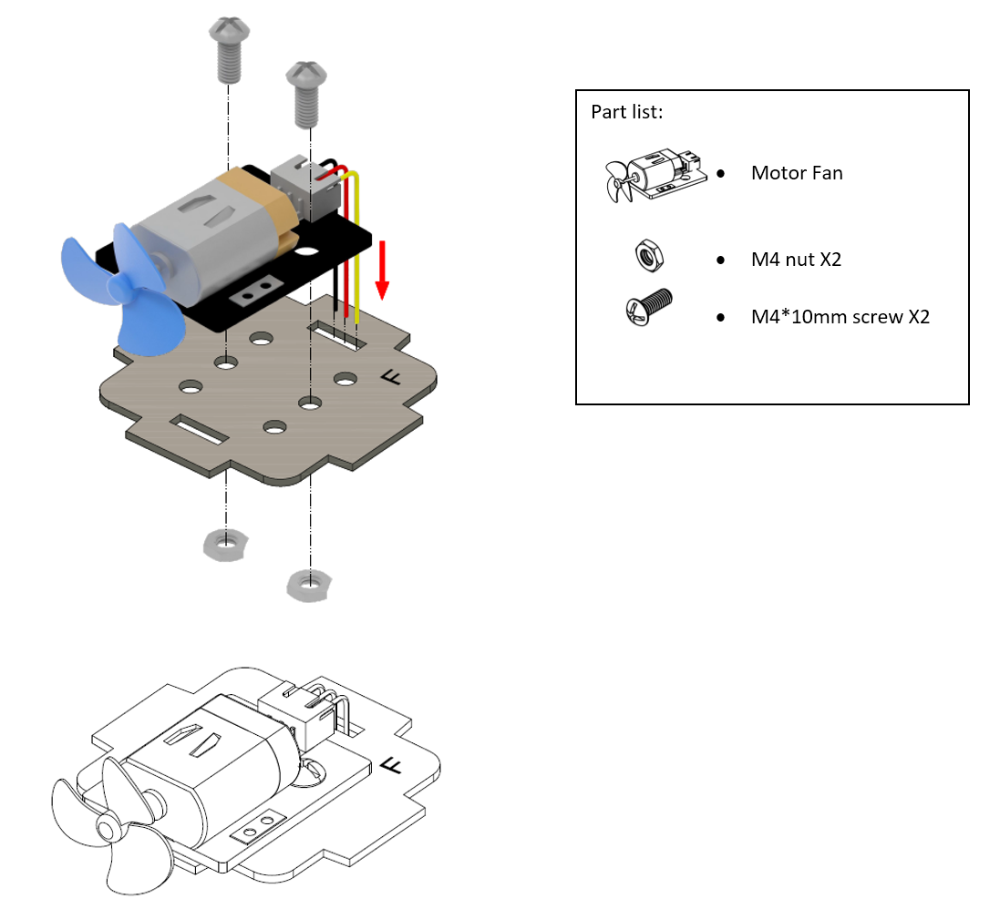
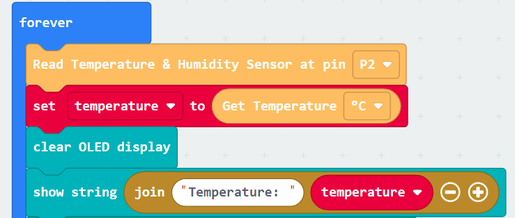
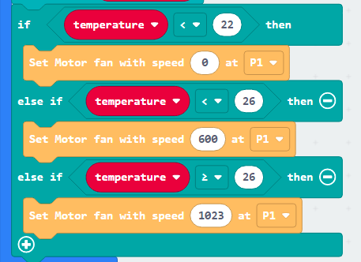

# Case 03: Environmental Motor Fan

Level: 

## Goal

Make an environmentally friendly automated motor fan by detecting the surrounding temperature. 

## Background

What is smart motor fan?

Smart motor fan is a fan that can adjust the power, turn on and off automatically to save electricity when not needed. 

Environmental motor fan principle

The temperature and humidity sensor installed in the house will scan for surrounding conditions continuously. When the temperature is too low or at average, the fan will change the intensity to off or low. When the temperature is high the fan will adjust to max power. 

## Part List

## Assembly step

Step1

Use M4 screws and nuts to install the Temperature and humidity sensor (DHT11)  

Use M2 screws and nuts to install OLED display to E4 cardboard 

Step 2

Use M4 screws to install motor module to F cardboard
 

Step 3

Insert E4 cardboard to A and B3 cardboard to build a wall
 

Step 4

Insert F cardboard to B2 and B3 cardboard to build a fans stand
 

<H3>Optional:</H3>

Step 5

Build a table with I cardboard 

Step 6

Place at the room corner 

## Hardware connect

1. Connect the Temperature and Humidity sensor (DHT11) to P2
2. Connect the extended OLED display to I2C Port 
3. Connect the Motor module to P1

## Programming (MakeCode)

Step 1. Initialize OLED display

* In `on start`, put `initialize OLED with width 128 height 64` to initialize the OLED display

Step 2. Create variable

* Create a variable called `temperature`

Step 3. Read and show the reading from DHT11

* In `Forever`, read the data by `Read Temperature & Humidity Sensor at pin P2`
* Get the temperature value from data, and save it to variable by `(set temperature to Get Temperature °C`)
* Before update the screen infomation, suggest clear up the OLED display each time
* Use `clear OLED display` to clear the display
* Then use `show string join Temperature: temperature` to show the temperature value with formatted text on display

Step 4. Examine the temperature

* In `Forever`, put a nested `if-else` statement
* Use the `temperature < 22` as first condition
* In the first `if` segment, turn off the fan by `Set Motor fan with speed 0 at P1`
* Use the `temperature < 26` as second condition
* In the second `if` segment, turn on the fan with half speed by `Set Motor fan with speed 600 at P1`
* Use the `temperature >= 26` as third condition
* In the third `if` segment, turn on the fan with full speed by `Set Motor fan with speed 1023 at P1`

Full Solution 

MakeCode: [https://makecode.microbit.org/_c2637VXcbfHP](https://makecode.microbit.org/_c2637VXcbfHP) 

You could also download the program from the following website: 
<iframe src="https://makecode.microbit.org/#pub:_c2637VXcbfHP" width="100%" height="500" frameborder="0"></iframe>

## Result

When the room temperature changing, it will match either one of the condition, and the fans will turn on or off with different speed according to the room temperature. 

## Think

Q1. Apart from open the fans, any other method to reduce the temperature? 

