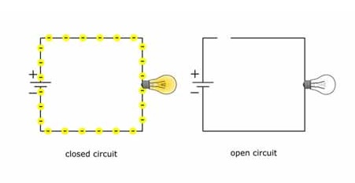
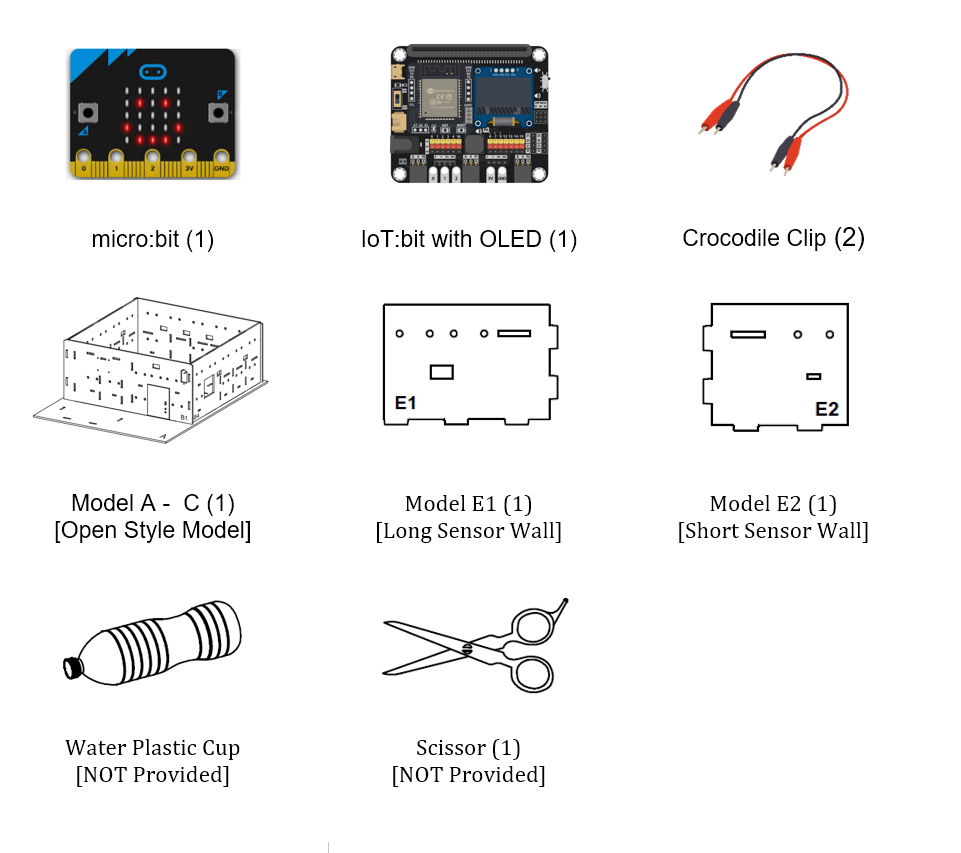

# Case 04: Toilet Water Leakage Detection System

Level: 

## Goal

Make a toilet water leakage detection system by checking the conductivity of device connected. 

## Background

What is a toilet water leakage detection system?

Toilet water leakage detection system is a system that can trigger alert upon unwanted water leakage situations. 

What is “On Pin Pressed”?

"On Pin Pressed” means the Pin connected to the ground, it will get the analog reading “0” and return “True". When it is not connected to ground, the reading will be not “0” and return “False”.

What is an Electrical circuit?

Electrical Circuit is one of basic concepts in electronic engineering, when something can let electric current pass through, it builds up a circuit.

Generally, a circuit will have two states, if the circuit is complete, able to let the current pass, it is called closed circuit. If the circuit has a breakpoint, and cannot let the current pass, it becomes an open circuit.

However, how to let the current pass through? It is related to the material of the circuit. In daily life, metal usually has a high conductivity, so it can be used to build the circuit. In addition, some ionic material such as tap water also takes the same property, able to become a conductor to build a circuit. But air has very bad conductivity, so it is hard to let current pass through. 

Toilet water leakage detection system principle

The system will consist of two crocodile clips each with one side connected to the board, one installed to the place of detection, with two clips physically disconnected. Air is an excellent insulator, so the circuit will become open circuit.  When water is leaked around that area, the water will replace the air between two clips, thus becoming a closed circuit, electricity will flow between the Board's detection Pin and ground Pin. It will trigger the detection to make the water leakage be detected and the system will send an alert. 

## Part List

## Assembly step

Step 1

Now, we will build a toilet room. Insert E3 cardboard on A cardboard, align with holes at A, B2 

Step 2

Insert E1 cardboard on A cardboard, align with holes at A,B3 

Step 3

* Find a plastic water bottle and cut it to become a water tank

* Place the water tank in the toilet

Place two clips to position that want to detect water flowing
 

## Hardware connect

1. Connect the two crocodile clip cables to P1 and GND
2. Put the two clip at the detection level on sink
3. Pull down the buzzer switch to connect the buzzer

## Programming (MakeCode)

Step 1

Step 1. Check the Pin state
* In `Forever`, put a `if` statement
* Put `pin P1 is pressed = true` as condition

Step 2. Alert warning

* If in `if` segment, that's means the water was connected two clips
* Use `play tone High A for 2 beat` to play warning sound

Full Solution 

MakeCode: [https://makecode.microbit.org/_bPw0ViLrR6Jm](https://makecode.microbit.org/_bPw0ViLrR6Jm) 

You could also download the program from the following website: 
<iframe src="https://makecode.microbit.org/#pub:_bPw0ViLrR6Jm" width="100%" height="500" frameborder="0"></iframe>

## Results

When the water level rises to the crocodile clip’s position, the warning sound is triggered to warn the user. 

## Think

Q1. Apart from the warning by buzzer, any other method can be used to notify the house owner? i.e. showing red LED 

