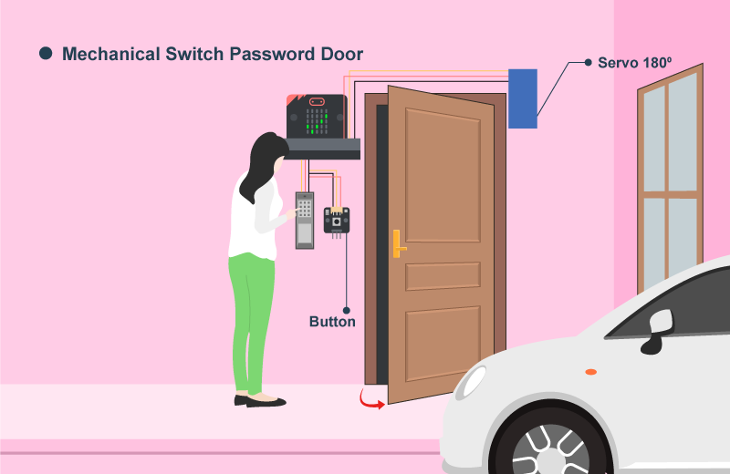
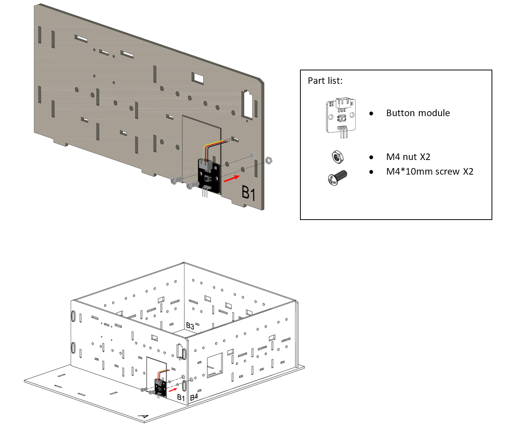
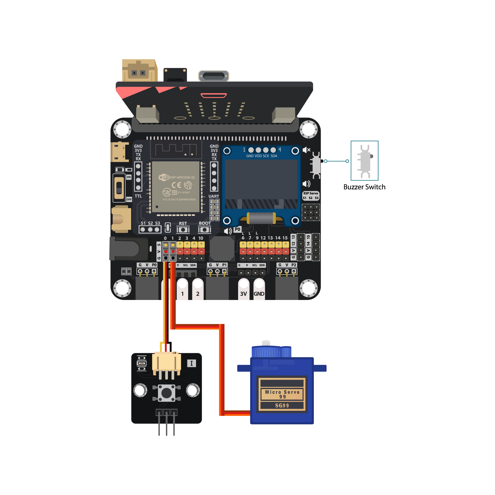
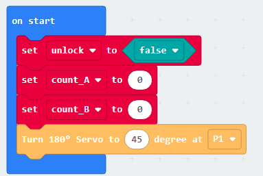
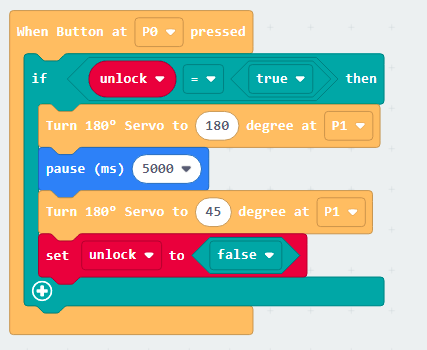
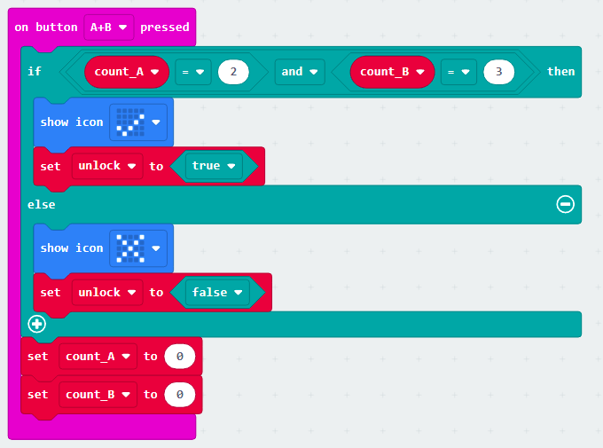

# Case 06: Mechanical Password Switch Door

Level: 

## Goal

Make a mechanical door that open upon button pressed and password correct 

## Background

What is a mechanical password switch door?

Nowadays, digital locks are common, apart from preventing theft going in, it also provides convenience, for example, no need to bring the physical key, just use the password or Biometric information, the door can auto open or close without pushing or pulling it. In this case, it will demonstrate the use of the basic switches and micro:bit to perform a mechanical password switch door.
 

## Part List

## Assembly step

Step 1

Build the base model of house 

Step 2

Use M4 screws to install the button module on B1 cardboard, take place near the door 

Step 3

Install the servo on the ground and connect to the door by hook  

	

## Hardware connect

1. Connect the button module to P0
2. Connect the 180 degree servo to P1
3. Pull up the buzzer switch to disconnect from buzzer

## Programming (MakeCode)

Step 1. Create variable and initialize the servo

* Create a variable called `count_A`, `count_B`, `unlock`

* In `on Start`, initialize the state of door to closed by `set unlock to false` and `Turn 180 Servo to 45 degree at P1`, also set the count variable `count_A` and `count_B` to `0`

Step 2. Monitoring the button pressing state and take action

* Snap the `When Button at P0 pressed` block to editor
* Put a `if` statement in the `When Button at P0 pressed` block
* Set the condition to `unlock = true`
* When `unlock = true`, that's means it is unlock successfully, the servo should open the door by `Turn 180 servo to 180 degree at P1`, after that, wait for 5 second by `pause (ms) 5000`, then close and lock the door again by `Turn 180 servo to 45 degree at P1` and set variable `unlock` to `false`

Step 3. password input method

* Snap `on button A pressed` to editor
* Use `change count_A by 1` to increase the count variable by 1
* Repeat the step with minor different on target to let button B also can increase `count_B`

Step 4. Examine the password

* Snap `on button A+B pressed` to editor
* Put a `if-else` statement inside
* Use `count_A = 2 and count_B = 3` as condition, you may also change it to your favourite password
* In the `if` segment, that's means the input is correct, `show icon tick`, and `set unlock to true` to allow open the door when press the extended button
* In the `else` segment, that's means the input is not correct, `show icon cross`, and `set unlock to false` to denied open the door when press the extended button
* Reset the two count variable `count_A` and `count_B` to `0` for next input

Full Solution 

MakeCode: [https://makecode.microbit.org/_agKTsmi8tD4C](https://makecode.microbit.org/_agKTsmi8tD4C) 

You could also download the program from the following website: 
<iframe src="https://makecode.microbit.org/#pub:_agKTsmi8tD4C" width="100%" height="500" frameborder="0"></iframe>

## Results

After pressing the correct number of button A and B, press A+B to do the validation. If it is the correct password, press the extended button, the door will open. After 5 seconds, the door will close and lock again. If wrong, do not open the door.
 

## Think

Apart from using a physical button, are there better ways of controlling the open and close of the door?

1. Can it make a doorbell to produce sound when the door is opening?
2. Other than the door, can the switch apply to other usage? (e.g Turn on/off LED)
3. Can you add a rule, if input is incorrect more than 3 times, show the alert message and lock the door for 5 minutes?