# IoT Case 11: Kitchen Safety Flame Monitoring Alert

Level: 

## Goal

Make an automatic fire alert system by detecting the existence of fire nearby.

## Background

What is a smart kitchen fire alert system? 

Smart kitchen fire alert system is an alert system that reacts towards the presence of fire in the surrounding areas.
 

Kitchen Safety Flame Monitoring Alert principle 

By installing a fire sensor in the area, the system will trigger an alarm and send a IFTTT notification to the house owner when there is fire detected in the sensor’s sight.
 

<!-- 

 -->

## Part List

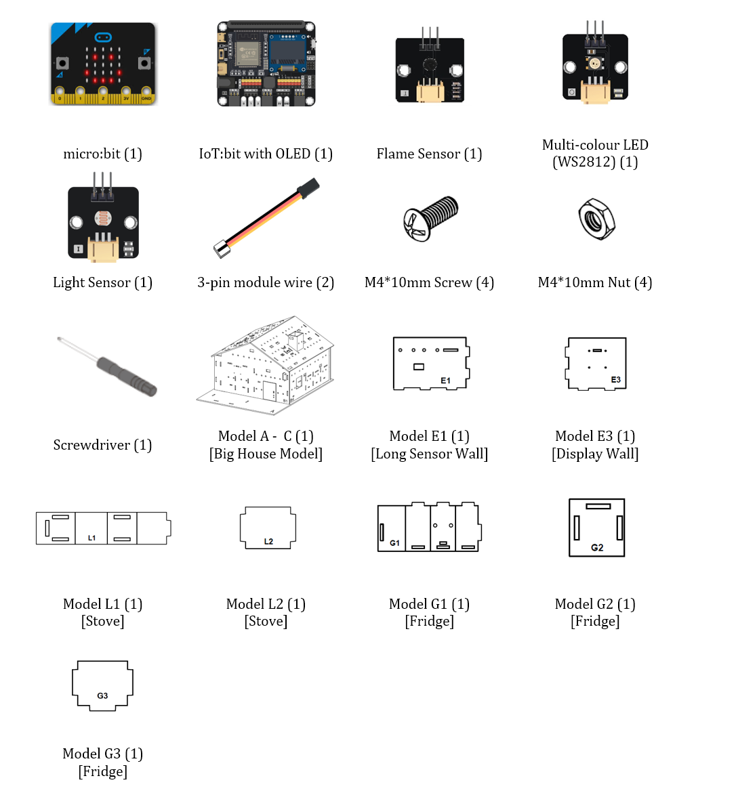

 
## Assembly step

Step 1 

Insert the two L2 cardboard to L1 cardboard, then fold the L1 cardboard into box shape, aligned with the holes.  

Step 2 

Stick the paper that drawing your favorite cooking stove look 

Step 3 

Use M4 screws and nuts to install the flame sensor to B3 cardboard 

Step 4 

Use M4 screws and nuts to install the multi-color LED to B3 cardboard 

Step 5 

Insert the E3 cardboard on A cardboard, align with holes at A and B2 cardboard 

Step 6 

Insert the E2 cardboard on A cardboard, align with holes at A and B2 cardboard 

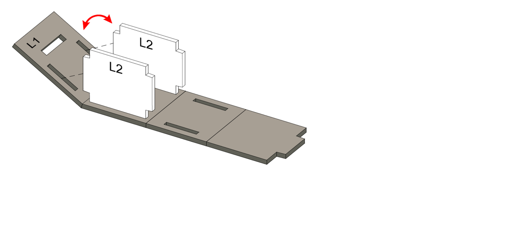

Step 7 

Place the cooking stove model to correct place 

Step 8 (Optional) 

Place the fridge model to suitable place   

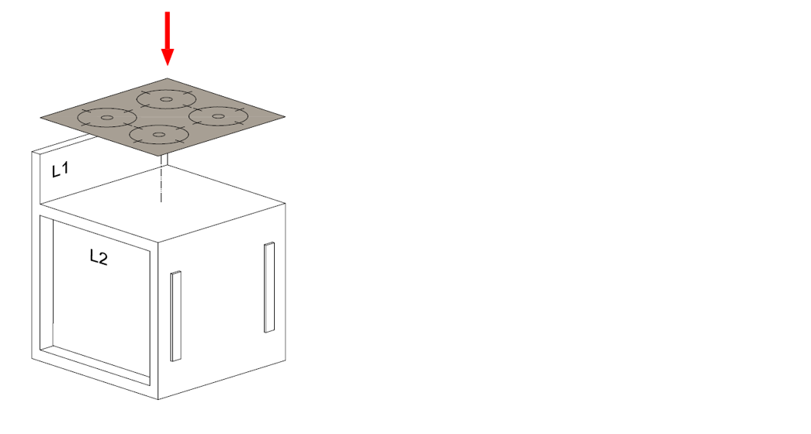

## Hardware connect

1. Connect the flame sensor to P2
2. Connect the Multi-Color LED to P1
3. Pull down the buzzer switch to connect buzzer

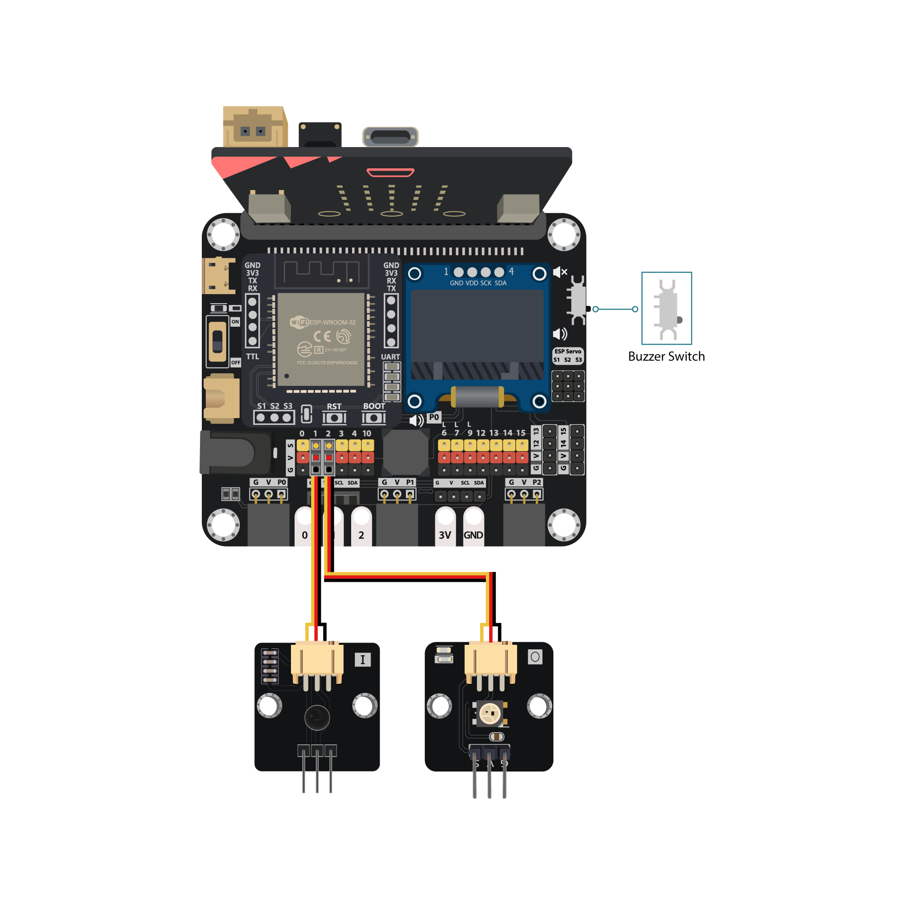

## IoT (IFTTT)

### Part 1: Setup IFTTT
1. Create a IFTTT account and login
2. Create a new Applet
3. In the IF, search "Webhooks" and click the Webhooks application 

4. Choose the "Received a web request" and enter the event name "fire" 
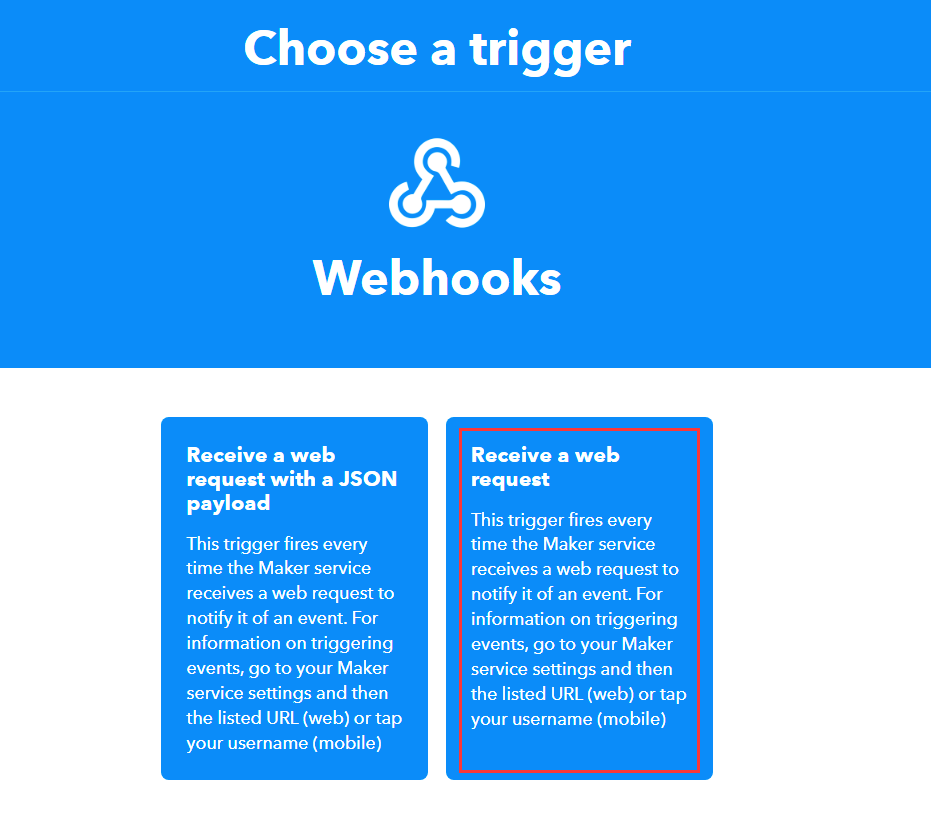

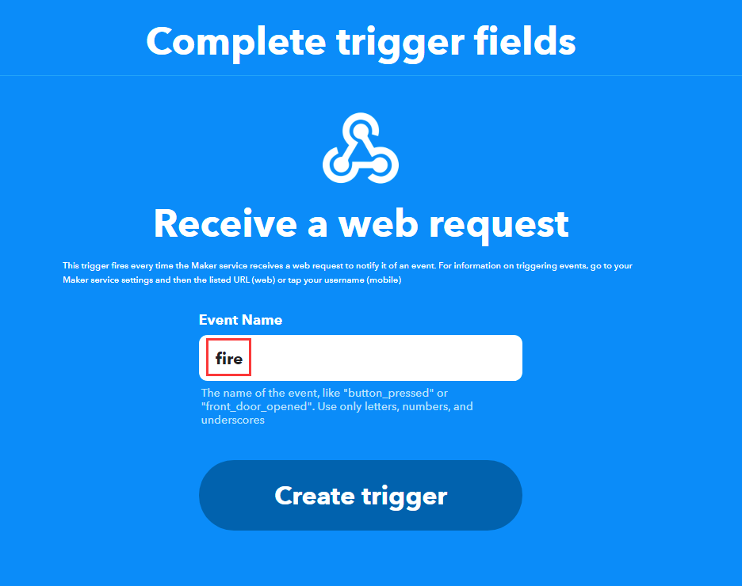

5. In the THEN, search "Notifications" and click the notifications application
6. Choose the "Send a notification from the IFTTT App" 

7. After the applet is finish setup, click the Webhooks icon -> documentation 
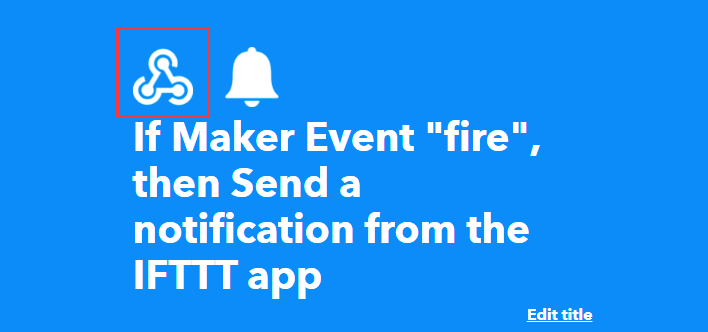
 

8. Copy the Key 

<H4>Optional: Use email as notification method</H4>

In the THEN field, search for the “email” and use it to replace the “notifications” in previous step

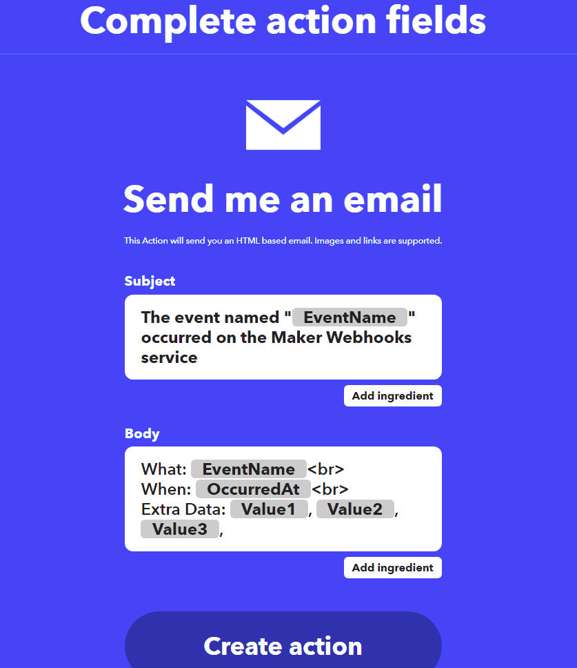

### Part 2: Install the IFTTT App on smartphone
1. Go to play store or app store to search and download the IFTTT App

2. Login to your IFTTT account

## Programming (MakeCode)

Step 1. Initialize OLED, IoT:bit and connect to WiFi, create variable 

* Snap `Initialize OLED with width:128, height: 64` to `on start`
* Snap `Initialize IoT:bit TX P16 RX P8` from `IoT:bit` to `on start`
* Snap `Set Wi-Fi to ssid pwd` from `IoT:bit`
* Enter your Wi-Fi name and password. Here we set `smarthon` as `SSID` and `12345678` as `password`
* Snap `Set strip to NeoPixel at pin P1 with 1 leds as RGB(GRB format)`
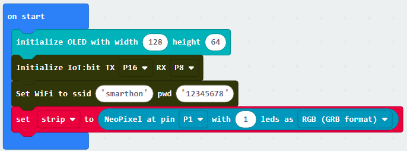

Step 2. Show icon “tick” after WiFi connection 

* Snap `show icon` from `basic` to `On WiFi connected` and select icon `tick`

Step 3. Check the internet connection status 

* In the `Forever`, put a `if` statement with condition `WiFi connected?` to check the connection status

Step 4. Check the flame sensor result and action on OLED display 

* Put another `if` statement with condition `Get flame detection at Pin P2 = true` to recognize the flame 
* Play a warning sound when the flame was detected 

Step 5. Action on Warning LED 

* The LED should be blinking to telling dangerous 
* Put `strip show color red` to turn on the LED in red color
* Add a `pause (ms) 100` to wait for 0.1 second
* Put `strip show color black` to turn off the LED
* Pause for 0.1 second again
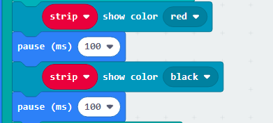

Step 6. Action on IFTTT 

* Put a `Send IFTTT key* XXXXXXXXX event_name* XXXXX ....` to send the event to IFTTT
* Fill in the `IFTTT key` from your Webhooks and the Applet's `event_name`

Step 7. Know the Upload result 

* To check the upload state, use the `On IFTTT Uploaded` to get the sending result
* Inside the `On IFTTT Uploaded`, use OLED display to show the information
* Clear the OLED display before each update by `clear OLED display`
* Show upload state by `show string join IFTTT: Status`, the `Status` value is from the function's placeholder
* Show error_code by `show string join Error: Error_code`, the `Error_code` value is from the function's placeholder
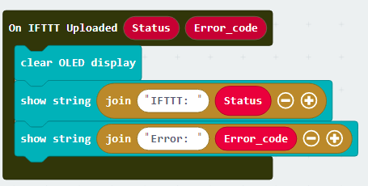

Full Solution 

MakeCode: [https://makecode.microbit.org/_PaX5qwPeRa0e](https://makecode.microbit.org/_PaX5qwPeRa0e) 

You could also download the program from the following website: 
<iframe src="https://makecode.microbit.org/#pub:_PaX5qwPeRa0e" width="100%" height="500" frameborder="0"></iframe>

## Result

When the flame source is detected by the flame sensor, it will trigger to blink the LED, making alert sound, and send the warning notification to IFTTT
 

## Think

1. Other than warning, any task we can do when we detect the flame? (e.g add a fan or sprinkler to extinguish the fire, call the police?)
 

