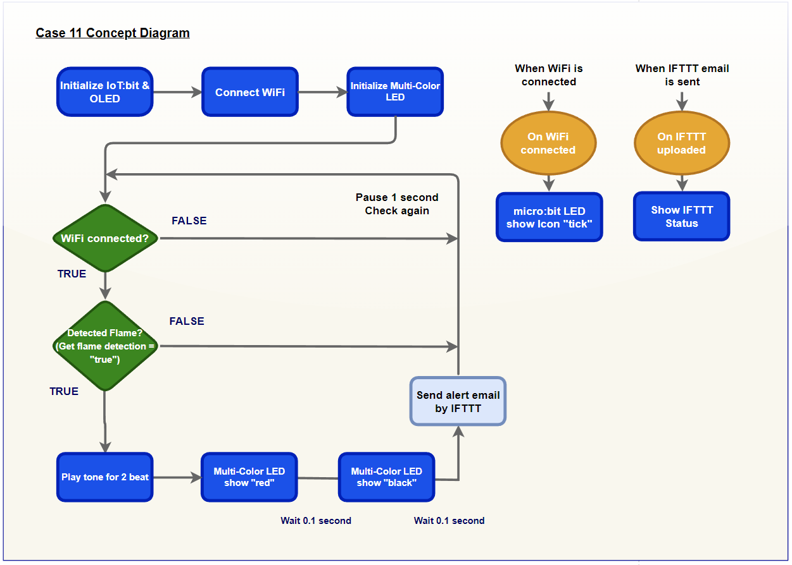
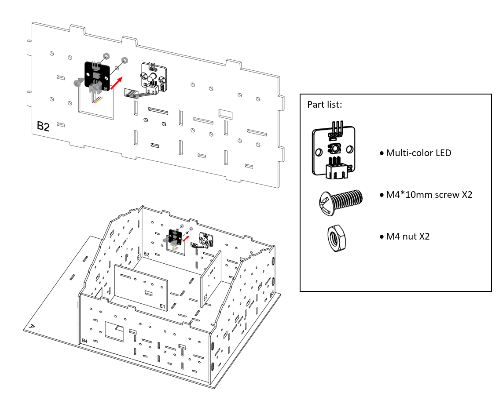
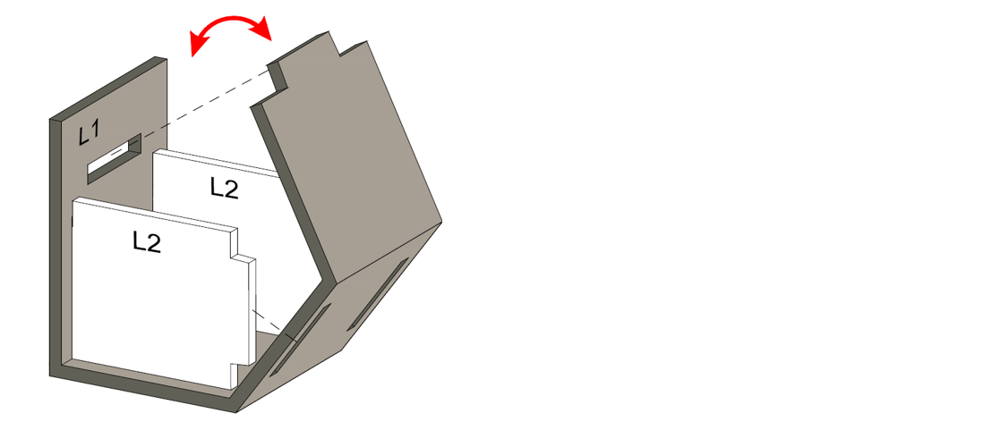
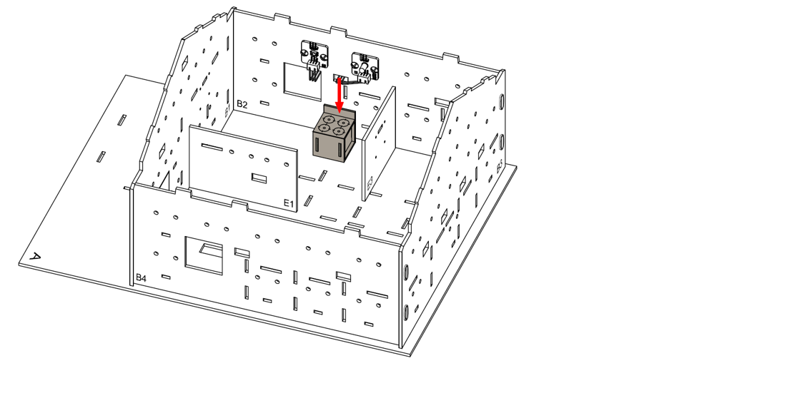
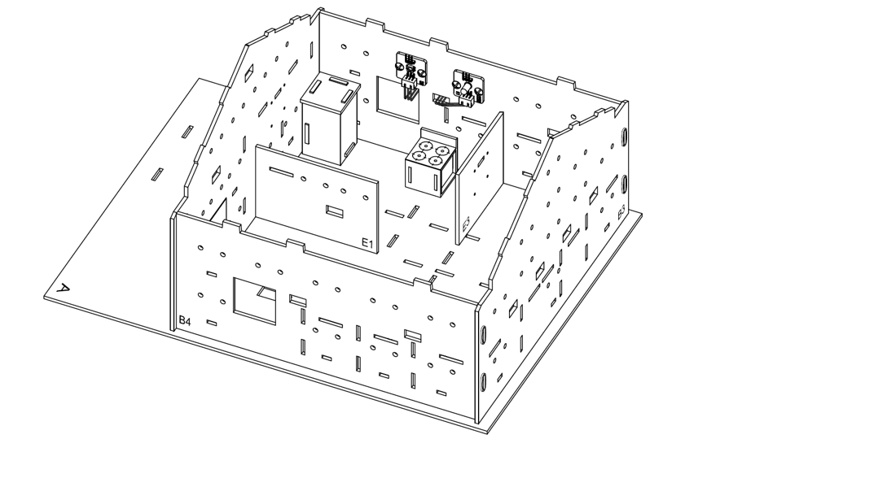
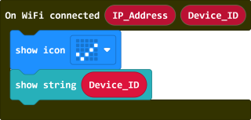
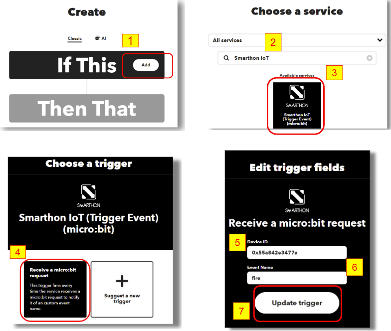
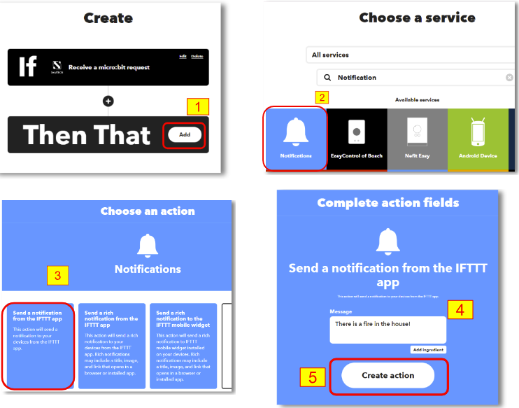
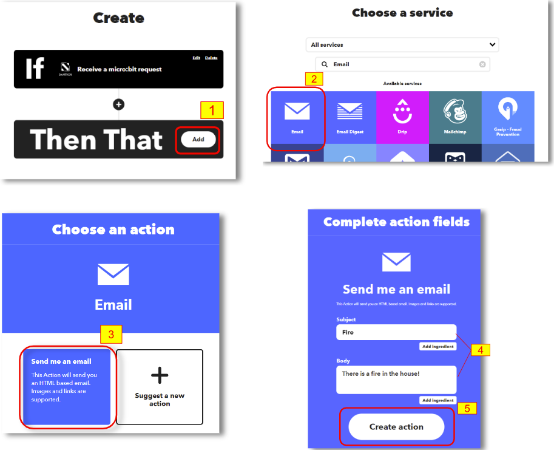

# IoT Case 11: Kitchen Safety Flame Monitoring Alert

Level: 

## Goal

Make a flame monitoring alert system by detecting the existence of strong fire nearby.

## Background

Nowadays, fire accidents always happen when the homeowner is sleeping or outside the home. It is good to install an IOT system in the kitchen or living room to alert the user on his/her phone when he/she is sleeping or in the office so that he/she will wake up and rush out from the home to prevent a terrible accident happened. 

 

Kitchen Safety Flame Monitoring Alert Principle 

By installing a flame sensor in the area, the system will trigger an alarm and blink the red LED to alert the home owner inside the home when there is fire detected. At the same time, it will send a IFTTT notification to the house owner's phone so that can alert user when he/she is sleeping or outside the home.
 

## Part List

 
## Assembly step

Step 1 

In this case, build the “Big Style Model” as a home base. 

Step 2 

To build a kitchen, put model E3 & E1 onto model A, align with holes at model A and B2 & B1.
 

Step 3 

Attached the flame sensor to the model B2 using M4\*10mm screws and nuts. And the connecting wire should be bended to the hole nearby.
 

Step 4 

Attached multi-color LED to the model B2 using M4\*10mm screws and nuts. And the connecting wire should be bended to the hole below.
 

Step 5 

To build a stove model. Put the model L2 to model L1 from the top to bottom. 

Step 6 

Fold the model L1 into the model L2 according to the arrow. 

Step 7 

Fold the another side of model L1 into the model L2 according to the arrow.
 

Step 8 

Stick the paper with a cooking stove pattern. 

Step 9 

The cooking stove Completed! 

Step 10 

Place the cooking stove model at the kitchen. 

Step 11 

To build a fridge, attach light sensor onto model G1 using M4 \* 10mm screws and nuts. And the connecting wire could be bended to the hole below it. 

Step 12 

Fold and bend the Model G1 accordinglyand put Model G3 into the Model G1, align with the holes.
 

Step 13 

Put Model G2 onto the Model G1, align with the holes.
 

Step 14 

The fridge completed! 

Step 15 

Place the fridge model at the coner of the kitchen. 

Step 16 

The fridge Completed! 

## Hardware connect

1. Connect the flame sensor to P2
2. Connect the Multi-Color LED to P1
3. Pull down the buzzer switch to connect buzzer

## Programming (MakeCode)

Step 1. Initialize OLED, IoT:bit and connect to WiFi, create variable 

* Snap `Initialize OLED with width:128, height: 64` to `on start`
* Snap `Initialize IoT:bit TX P16 RX P8` from `IoT:bit` to `on start`
* Snap `Set Wi-Fi to ssid pwd` from `IoT:bit`
* Enter your Wi-Fi name and password. Here we set `smarthon` as `SSID` and `12345678` as `password`
* Snap `Set strip to NeoPixel at pin P1 with 1 leds as RGB(GRB format)`

Step 2. Show icon “tick” and Device ID after WiFi connection 

* Snap `show icon` from `basic` to `On WiFi connected` and select icon `tick`
* Draw the `Device ID` variable from `On WiFi connected` to the `show string` block placeholder

Step 3. Check the internet connection status 

* In the `Forever`, put a `if` statement with condition `WiFi connected?` to check the connection status

Step 4. Check the flame sensor result and action on OLED display 

* Put another `if` statement with condition `Get flame detection at Pin P2 = true` to recognize the flame 
* Play a warning sound when the flame was detected 

Step 5. Action on Warning LED 

* The LED should be blinking to telling dangerous 
* Put `strip show color red` to turn on the LED in red color
* Add a `pause (ms) 100` to wait for 0.1 second
* Put `strip show color black` to turn off the LED
* Pause for 0.1 second again

Step 6. Action on IFTTT 

* Put a `Send IFTTT event_name* XXXXX` to send the event to IFTTT
* Fill in the Applet's `event_name`

Step 7. Know the Upload result 

* To check the upload state, use the `On IFTTT Uploaded` to get the sending result
* Inside the `On IFTTT Uploaded`, use OLED display to show the information
* Clear the OLED display before each update by `clear OLED display`
* Show upload state by `show string join IFTTT: Status`, the `Status` value is from the function's placeholder
* Show error_code by `show string join Error: Error_code`, the `Error_code` value is from the function's placeholder

Full Solution 

MakeCode: [https://makecode.microbit.org/_RziMMzU1eLiW](https://makecode.microbit.org/_RziMMzU1eLiW) 

You could also download the program from the following website: 
<iframe src="https://makecode.microbit.org/_RziMMzU1eLiW" width="100%" height="500" frameborder="0"></iframe>

## IoT (IFTTT)

### Part 1: Setup IFTTT

Step 1 

Go to [http://www.ifttt.com](http://www.ifttt.com), register an account and login to the platform 

Step 2 

On the top right menu, click “Create” > “Applets” 

Step 3 

* Select this 
* Select Smarthon IoT
* Input Device ID and Event Name. (eg. Device ID: 0x55a842e3477a, Event Name: Fire)
* Click “Create trigger”  

Step 4 

* Select “That”
* Notifications 
* Send a notification from the IFTTT app 
* Message (eg. There is a fire in the house!), the click “Create action”

  

Optional: Use email as notification method 

In the THEN field, search for the “email” and use it to replace the “notifications” in previous step

 

### Part 2: Install the IFTTT App on smartphone
1. Go to <U>play store</U> or <U>app store</U> to search and download the IFTTT App

2. Login to your IFTTT account

## Result

When the flame source is detected by the flame sensor, it will trigger to blink the LED, making alert sound, and send the warning notification to IFTTT
 

## Think

1. Other than warning, any task we can do when we detect the flame? (e.g add a fan or sprinkler to extinguish the fire, call the police?)
 

