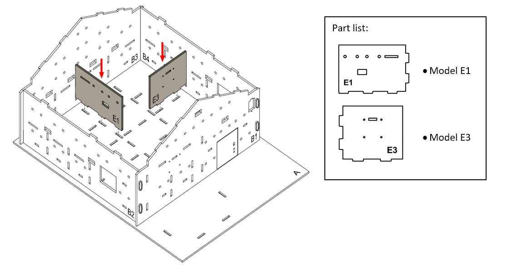
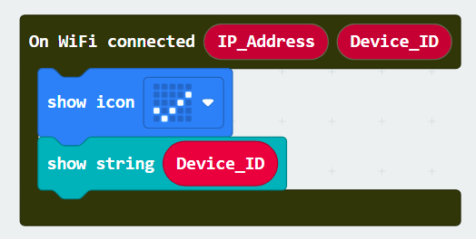
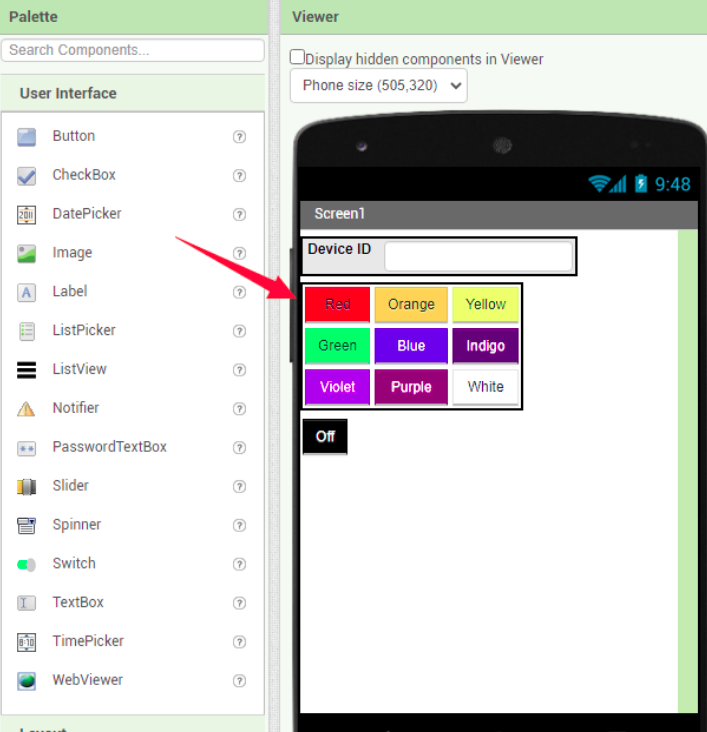
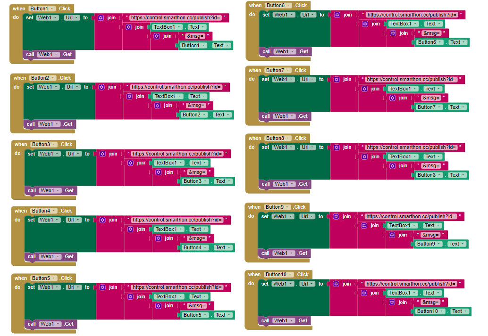

# IoT Case 12: Room Smart Colourful Light App Control

Level: 

## Goal

Make a smart colorful light that will change colors upon remote control.

## Background

What is Smart Colorful Light? 

A smart colorful light is a multi-color LED light that allows switching color of light between various colors, usually being able to be requested through remote control, for example a mobile app. It is a good device for adjusting the room light according to needs, like when sleeping or switching moods.
 

Smart Colorful Light operation 

A smart light can be controlled through wireless communication, in this case a mobile app. Upon different colors chose from the application, respective commands will be sent through Internet and thus reaching the light, and the light will react and change the color as requested. 

## Part List

 
## Assembly step

Step 1 

Use M4 screw and nuts to install the Multi-color LED to B4 cardboard 

Step 2 

Insert the E3 cardboard on A cardboard, align with holes at A and B3 cardboard
 

Step 3 

Insert the E2 cardboard on A cardboard, align with the holes at A and B3 cardboard
 

Step 4 

Build the bed model with J1,J2,J3,J4 cardboard
 

Step 5 

Place the bed at the suitable position
 

Step 6 

Place the Decoration Display (H cardboard) at the suitable position
 

## Hardware connect

1. Connect the Multi-color LED (WS2812) to P0
2. Pull up the buzzer switch to disconnect the buzzer

## Programming (MakeCode)

Step 1. Initialize OLED, IoT:bit and connect to WiFi, initialize the Multi-color LED 

* Snap `Initialize OLED with width:128, height: 64` to `on start`
* Snap `Initialize IoT:bit TX P16 RX P8` from `IoT:bit` to `on start`
* Snap `Set Wi-Fi to ssid pwd` from `IoT:bit`
* Enter your Wi-Fi name and password. Here we set `smarthon` as `SSID` and `12345678` as `password`
* Snap `set strip to NeoPixel at pin P0 with 1 leds as RGB(GRB format)` from Neopixel

Step 2. Show icon “tick” and Device ID after WiFi connection 

* Snap `show icon` from `basic` to `On WiFi connected` and select icon `tick`
* Draw the `Device ID` variable from `On WiFi connected` to the `show string` block placeholder

Step 3. Receive Command 

* Inside the `On WiFi Received`, put a nested `if-else` statement with different conditions
* Set the first condition as `WAN_Command = Red`
* In the `if` segment, perform the change color action by `strip show color red` 
* In the next `if` condition, use `WAN_Command = Orange`
* Set the color to Orange by `strip show color orange`
* Repeat the previous steps, with changes on the Color, to finish the setup of responding to each color.

Full Solution 

MakeCode: [https://makecode.microbit.org/_bruDF46qs5zY](https://makecode.microbit.org/_bruDF46qs5zY) 

You could also download the program from the following website: 
<iframe src="https://makecode.microbit.org/#pub:_bruDF46qs5zY" width="100%" height="500" frameborder="0"></iframe>

## IoT (App inventor 2)

Step 1. Create an APP project 

* Create a APP inventor account at [http://ai2.appinventor.mit.edu/](http://ai2.appinventor.mit.edu/)
* Create a new project

Step 2. Design the layout of APP 

* In the designer page, pull the layout element from the left side to the editor 

* In this example case, using different `button`, `textbox`, `label` and `layout control`
* Place the element in your way
* For each element has their own property, you may change it in your mind, such as the `background color`, `font size`, `width`, `height`, `align`.  In this example, you are required to change the `Text` to the <I><B>Color that button representing</B></I> to get the same result as documentation. For example, button who send "Red" command need to be "Red" as `Text`property
* Remember to put `Web` element to editor, it will used for sending command

Step 3. Programming the elements in APP  

* Switch to Blocks page by click the button at top right corner

* According to the catalog of function needs, find it at the left side and put to editor
* Go to `buttonX` element, find the `when buttonX.Click do` function, put it to editor ( X represent the number of button)
* Go to `Web1` element, find the `set Web1.URL to`, put it inside to the `when buttonX.Click do`
* Go to `Text` catalog, find the `join` and `" "` element to start build the control API
* Control API is: `https://control.smarthon.cc/publish?id=ID&msg=MSG` , while `ID` and `MSG` means `IoT:bit ID` and `Command` respectively 
* The program need to replace the `ID` and `MSG` according to different IoT:Bit and command in the API
* Use `TextBox1.Text` to get the `ID` input from user
* You may hard code the `MSG` with text command
* But, you can also use `ButtonX.Text` to get the `Text` property of button, which can used as the `MSG` in the example case, be careful you need to set up the `Text` property before you do that 
* Use `join` properly to concatenate the API from each parts
* After complete the API URL, use `call Web1.Get` from `Web1` to send the API Command

For example

* After finish the function for `button1`, repeat the steps for other buttons, with changes on target button element ( from `button1` to `button2`, `button3`, ... )

[AIA](https://raw.githubusercontent.com/SMARTHON/smarthon-docs-en/master/docs/_static/smarthome_case12_app.aia)

	
[APK](https://raw.githubusercontent.com/SMARTHON/smarthon-docs-en/master/docs/_static/smarthome_case12_app.apk)

## Result

After sending color messages from APPs, the color of light will change. 

## Think

1. Can you think of a suggestion to make the colorful light even smarter? 
(e.g. add automatic decision rather than always wait for command)

2. Can you try to add some buttons on the app for more complex action?
