# Adv IoT Case 14: Control Real Home Electronics

Level: 

## Goal

Can use the Micro:bit to control the Real IoT electronics

## Background

What is an IOT electronics(Smart Plug/Bulb)?
 

IoT electronics are a new generation of electronics, they integrate the concept of Internet of Things and have the ability to connect to the internet. Users can use different methods to control them, such as mobile apps, web service platforms, or other IoT devices.  

Control Real IoT electronics principle
 

By using Webhooks extension on IFTTT platform, commands can be pre-set as trigger. When the micro:bit sending the command to IFTTT, the webhooks services in the applet will trigger the user’s preferences IoT electronics IFTTT service. 

## IFTTT Platform Configuration

1. Login the IFTTT account 
2. Create a new Applet  

3. Search and choose webhooks service 
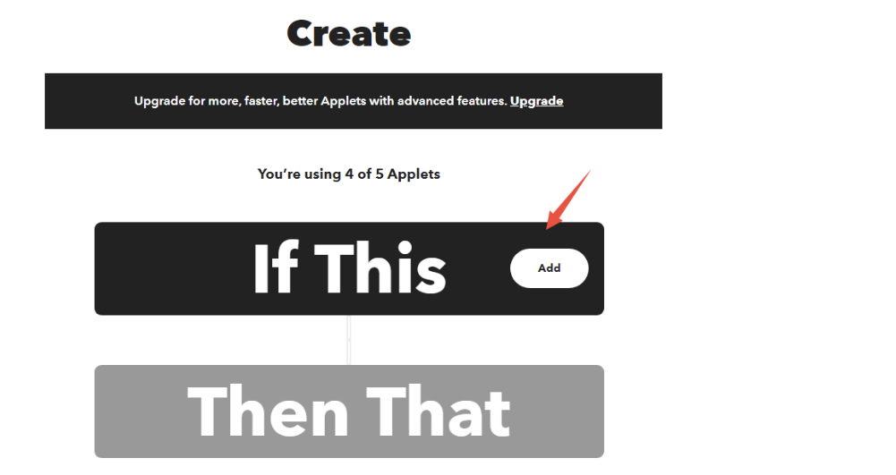

4. Choose “Receive a web request” 
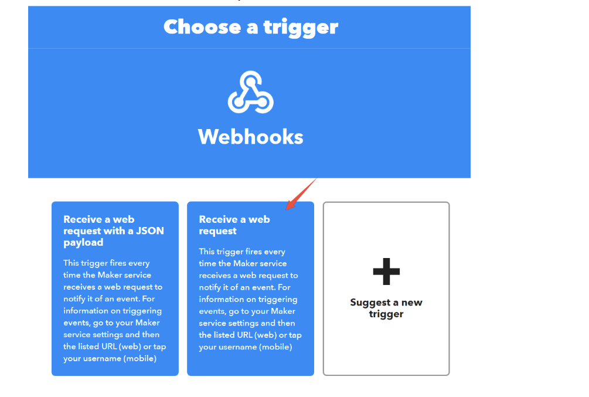

5. Input the command which used for micro:bit call later
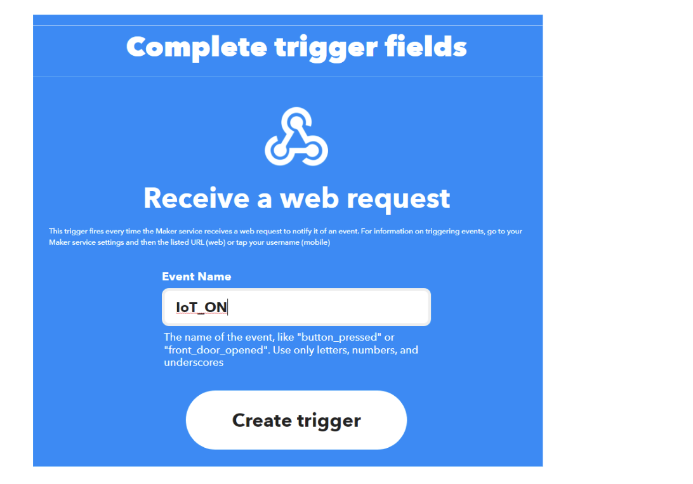

6. Choose the IFTTT service that is the IoT device you are using  
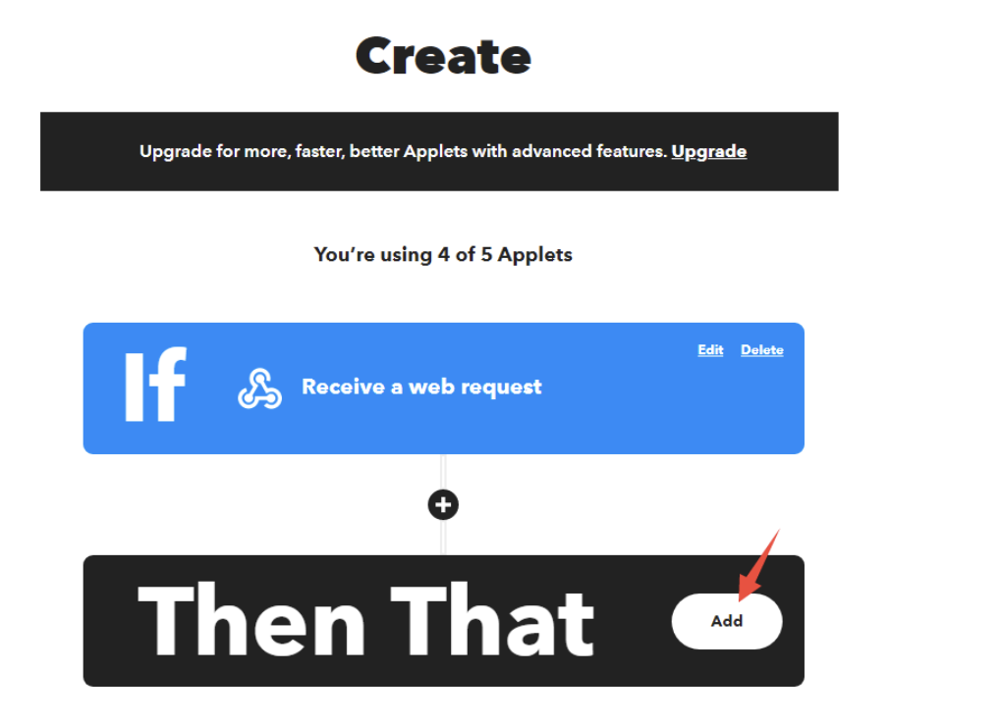

7. You may input the IoT electronics product name or brand name to search, for example: ewelink, philips hue 
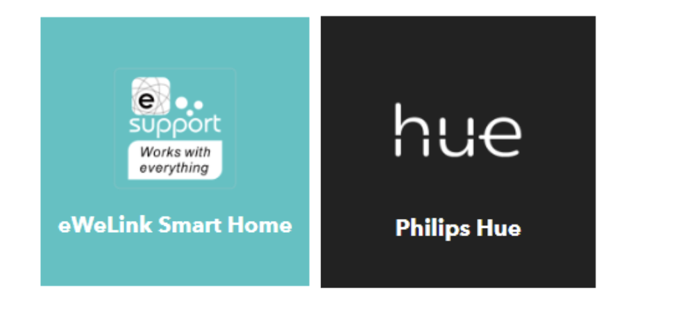

8. Choose your target action 
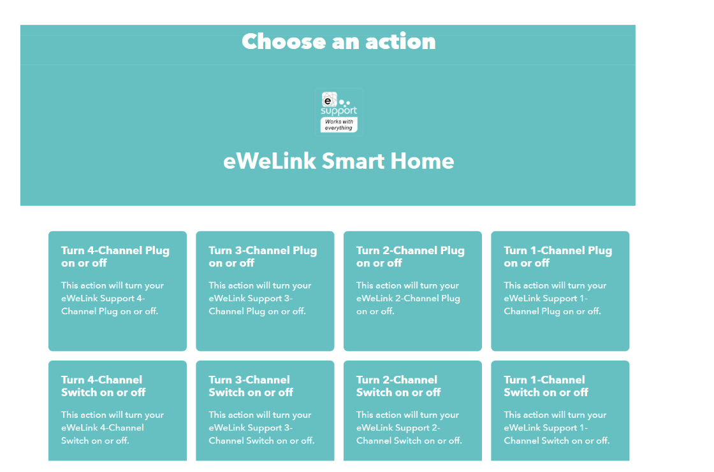

9. For each command and action, you need to have one applet. If you need more sets of command and action, create more applets. 
10. After finish applet setup, go to my service->webhooks 
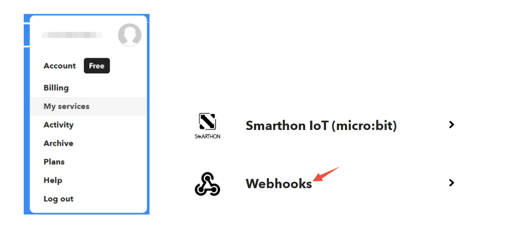

11. Go to documentation  
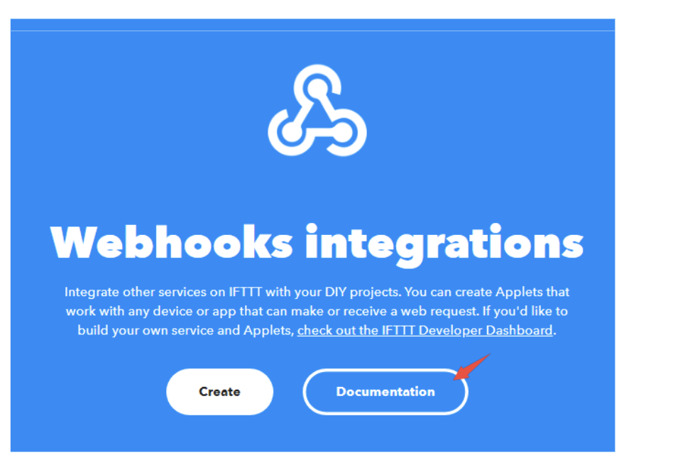

12. Copy your key for micro:bit call later 

## Example 1: Remote Control Real Plug

### Part List

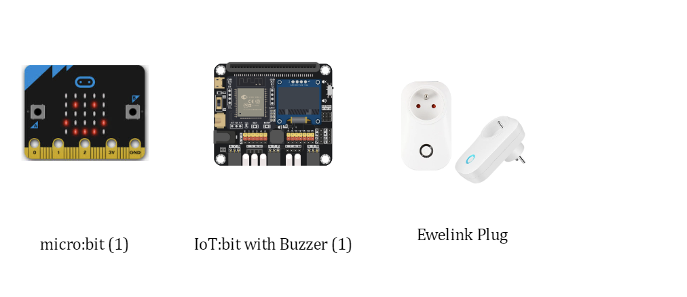

### How to install

1. Install the plug  
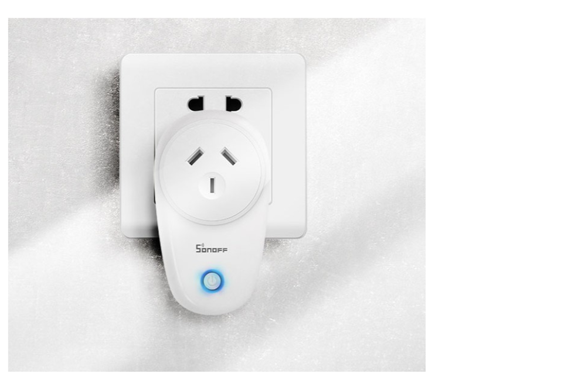

2. Download the apps and config the plug connect to internet 
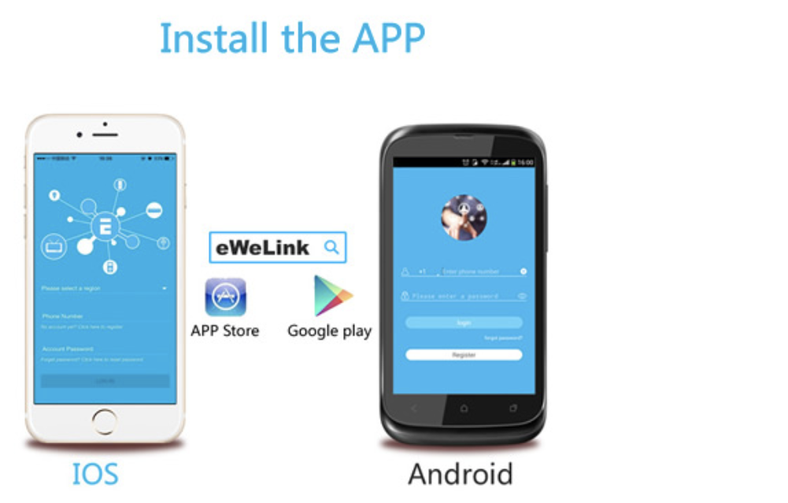

### Hardware connect

1. Insert the micro:bit to iot:bit connect edge
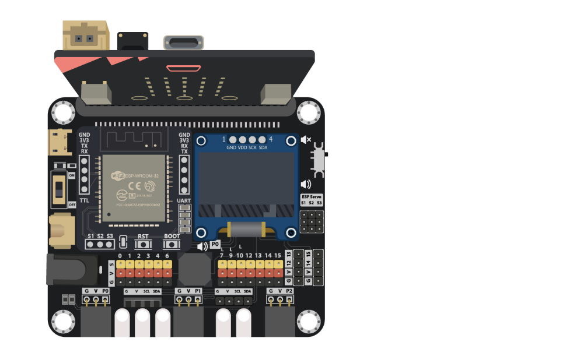

### Programming (MakeCode)

Step 1. 
On Start, initialize the IoT:Bit and connect to WiFi

Step 2.  After WiFi connected, use “On WiFi connected” block to show a tick

Step 3. 
 Use button function block “on button X pressed” to receive the input action and trigger the following process

Step 4. 
 Do it for both button A and button B

Step 5. 
 For each button function block, put a “send IFTTT key ….” function inside

Step 6.  Fill in the fields of key and event_name

* Key: your webhooks key  
* Event_name: the command that you set in the applet  

### Result

press micro:bit A -> turn on plug 

## Example 2: Motion control Real Light Bulb

### Part List

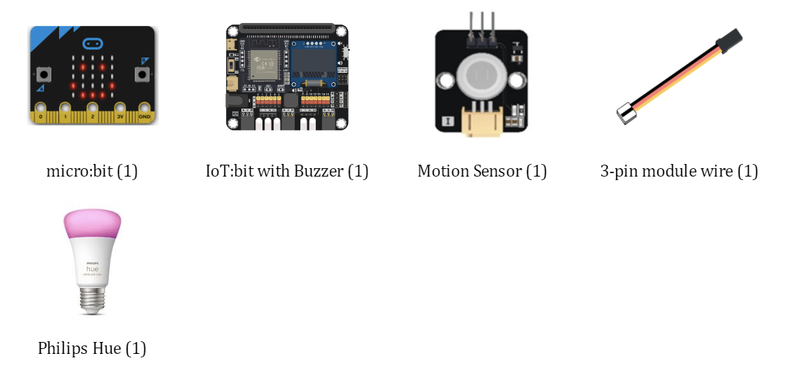

### How to install

1. Install the philips hue bulb to socket or bridge  
2. Config it to connect the internet  
3. Go to IFTTT, search philips hue service and connect it. 

### Hardware connect

1. Connect motion sensor to P1
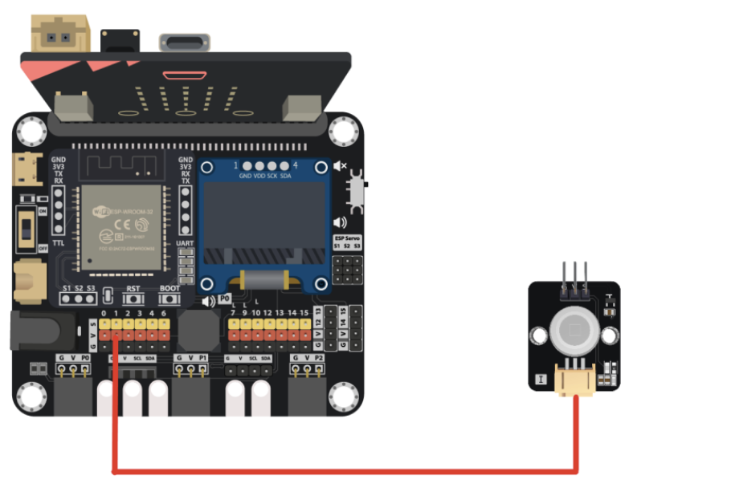

### Programming (MakeCode)

Step 1.  On Start, initialize the IoT:Bit and connect to WiFi

Step 2.  After WiFi connected, use “On WiFi connected” block to show a tick

Step 3. 
 In the forever block, put a “if” statement with “wifi connected?” condition

Step 4. 
 Put another “if-else” statement inside 

Step 5.
 For the if condition, use “Get motion (triggered or not) at Pin P1 = true” to detect the people movement

Step 6. 
 Put the “Send IFTTT key …” block in the if statement, fill in the fields with the webhooks key and “open” command which is pre-set in the applet

Step 7. 
 Add a pause 10 second to avoid it turn off so quick if not moving

Step 8. 
 Put another “Send IFTTT key …” block at the else statement, fill in with same key but "close" command

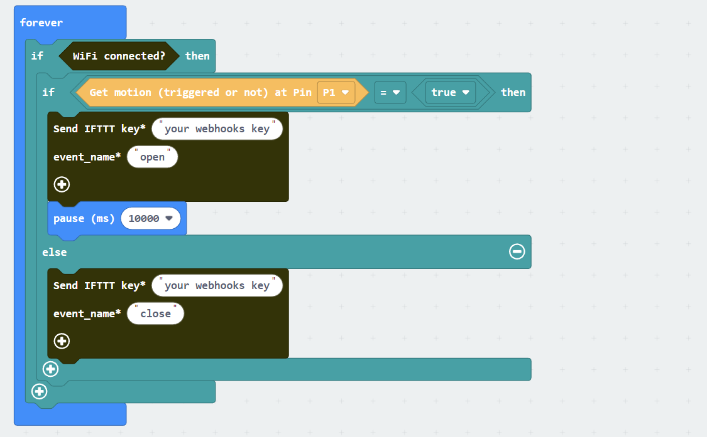

### Result

Walking in front of motion sensor –> the light turn on

## More Idea

You may take a review of previous case, and make use of the concept you was learnt to apply on the project that control real electronics, such as:  

* Turn Case 03 Motor Fan to a real electronic fan with the smart plug 

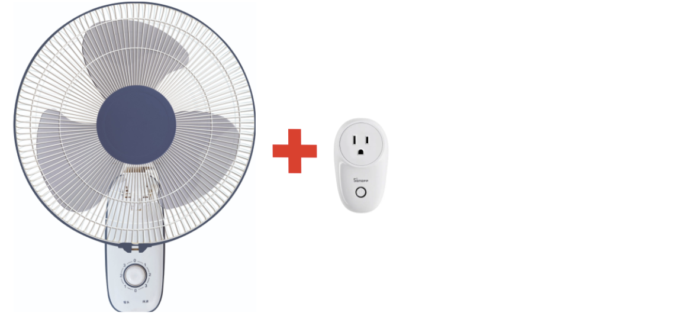

* Turn Case 08 servo curtain to a real electronic IoT curtain  

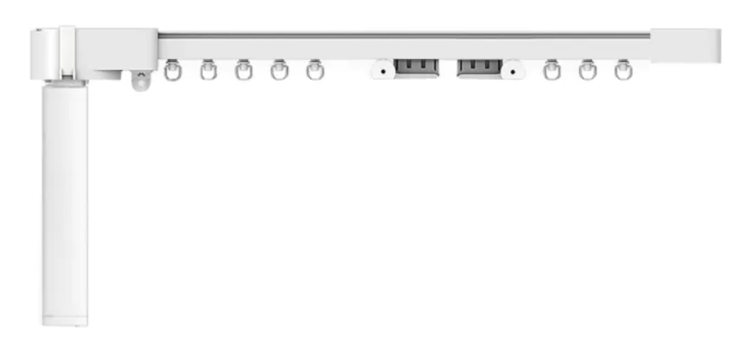

