# Scenario Example 4 : Smart Intelligent IOT Home

Level : 
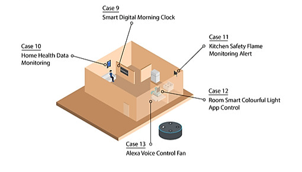

## Introduction:

**Smart Intelligent IOT Home** make use of the numerous internet resources is the advantage of IoT device, with that smart home can be monitoring and controlling by the internet.  

This Scenario is the integration of these five functions:

* Smart Digital Morning Clock (Case 9\)  
* Home Health Data Monitoring (Case 10\)  
* Kitchen Safety Flame Monitoring Alert (Case 11\)  
* Room Smart Colourful Light App Control (Case 12\)  
* Smart Fan Voice Control (Case 13\)

## Part List:

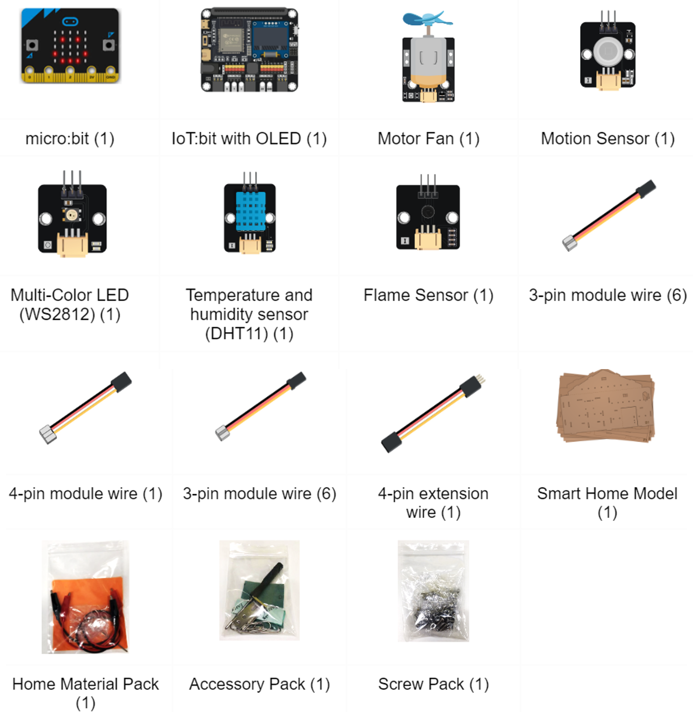

## IOT Technology Applied:

* ThingSpeak  
* IFTTT  
* App Inventor  
* Alexa  
* IFTTT  
* Google Assistant  
* Siri

## Assembly Step:

Refer case 9, 10, 11, 12, 13

## Hardware connect:

* Connect the OLED monitor to I2C.  
* Connect the temperature and humidity sensor DHT11 to P2.  
* Connect the multi LED to P7.  
* Connect the flame sensor to P1.  
* Pull down the buzzer switch to connect the buzzer.  
* Connect the motor fan to P9.

## Programming (MakeCode):

**Scenario 4 Full Solution:**

MakeCode: [https://makecode.microbit.org/S89685-01693-81459-28013](https://makecode.microbit.org/S89685-01693-81459-28013)

You could also download the program from the following website: 
<iframe src="https://makecode.microbit.org/#pub:S89685-01693-81459-28013"  width="100%" height="500" frameborder="0"></iframe>
 

## Step By Step Tutorial

### Part 1: Setting up the Smart Digital Morning Clock (Case 9 revised)

1.1 Hardware Connect

* Connect the OLED monitor to I2C.

    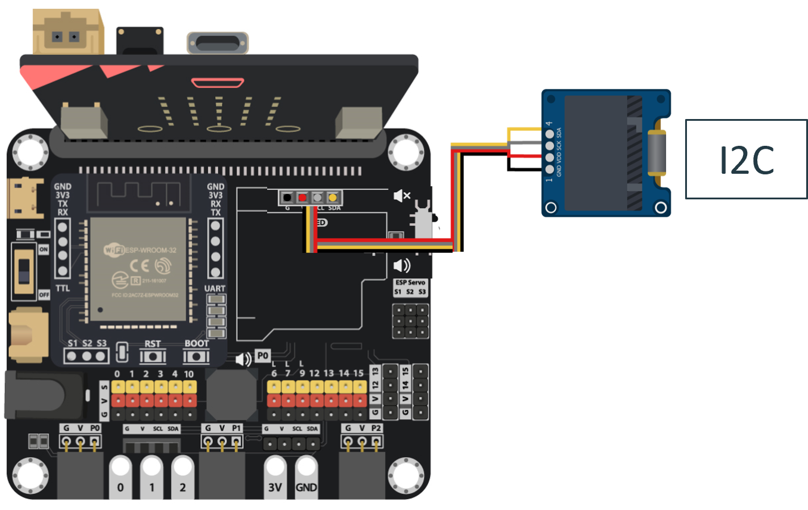

 1.2 Programming (MakeCode)

**Step 1\. Initialize OLED, IoT:bit and connect to WiFi, create the variable**

* Snap led enable false inside on start.  
* Snap Initialize OLED with width 128, height 64 to on start.  
* Snap Initialize IoT:bit TX P16 RX P8 to on start.  
* Snap Set Wi-Fi to ssid pwd to on start and enter the SSID and password.

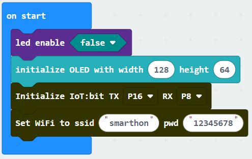

**Step 2\. Show Device ID after WiFi connection**

* Snap the On WiFi connected block to editor.  
* Put a show string Device\_ID inside the block.  
    
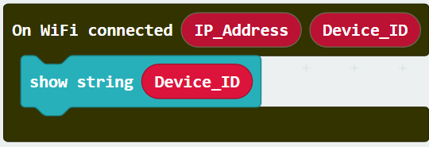

**Step 3\. Get the NTP time**

* Put a if statement in Forever.  
* Snap get NTP Current Time at city HongKong(UTC+8) to get NTP time.  
* Snap pause 1 second.

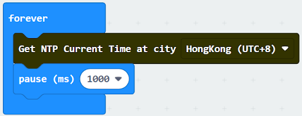

**Step 4\. Show the NTP time on display**

* Put On NTP received to editor.  
* When get the NTP time, the program in this block will running.  
* Snap clear OLED display.  
* Snap show string join “ID: ” Device ID.  
* Show the formatted time string with show string join Time: Hour:Minute:Second.

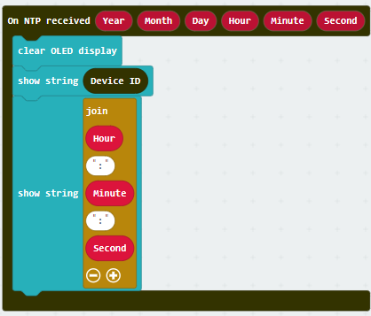

Part 1 Solution:

MakeCode: [https://makecode.microbit.org/S57493-33550-64425-59615](https://makecode.microbit.org/S57493-33550-64425-59615) 

You could also download the program from the following website: 
<iframe src="https://makecode.microbit.org/#pub:S57493-33550-64425-59615"width="100%" height="500" frameborder="0"></iframe>

Part 1 Result

After you connect to the Internet, the tick will open and start getting NTP time.  
    

### Part 2: Setting up the Home Health Data Monitoring (Case 10 revised)

2.1 Hardware Connect

* Connect the temperature and humidity sensor DHT11 to P2.   
    
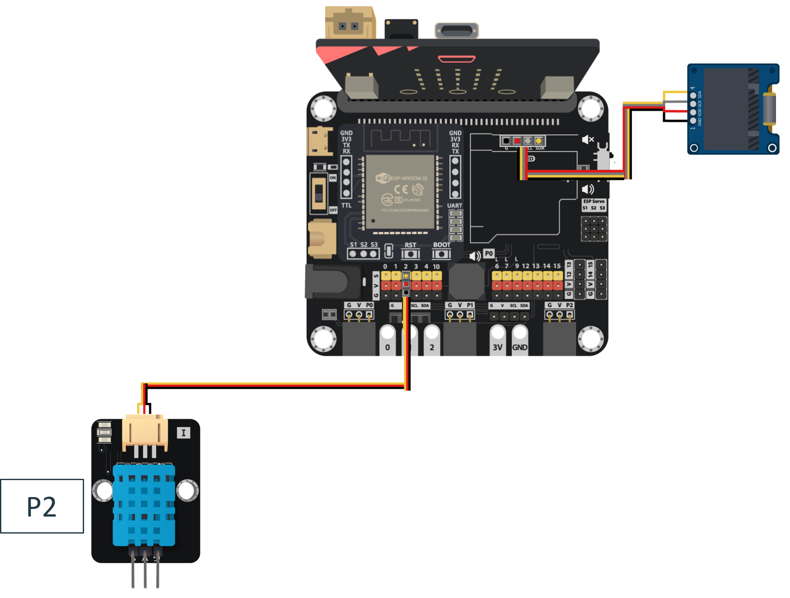

2.2 IOT Setup (ThingSpeak)

**Step 1\. Create Thingspeak channel**

* Go the ThingSpeak create an account and create a channel.  
    
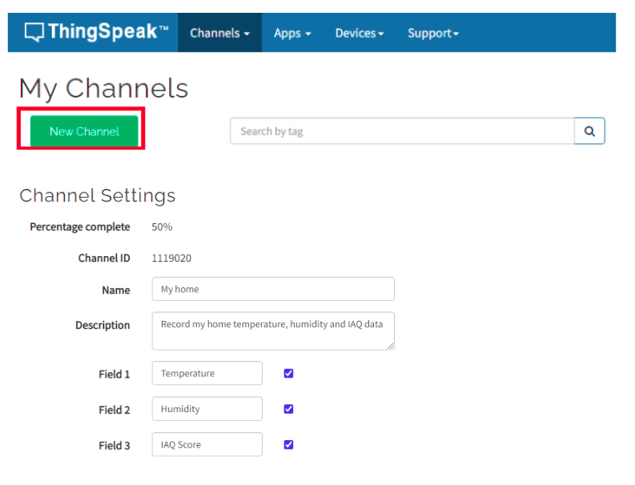

**Step 2\. Get channel API**

* After created a new channel, get the write in API.  
    
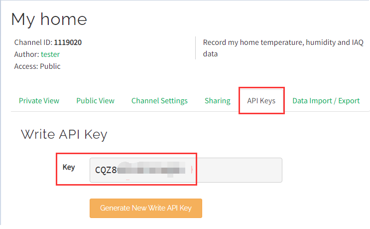

2.3 Programming (MakeCode)

**Step 1\. Set up function upload\_thingspeak**

* Set up a new function named upload\_thingspeak.  
* Snap change thingspeak\_counter by 1\.  
* Snap if WiFi connected?.  
* Inside the if loop, create a new variable counter, snap if thingspeak\_counter \>15.  
* Snap Read Temperature & Humidity Sensor at pin P2.  
* Send the data to Thingspeak by Send Thingspeak key XXXX field1 value XXX ..., fill in the write API key from the Thingspeak channel and the values need to be upload.  
* Snap set thingspeak\_counter to 0\.  
    
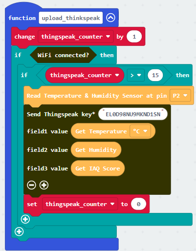

**Step 2\. Update NTP received**

* Inside On NTP received, Snap show string join “Temperature: ” Get Temperature °C.  
* Snap show string join “Humidity: ” Get Humidity.  
* Snap show string join “IAQ: ” Get IAQ Score.  
    
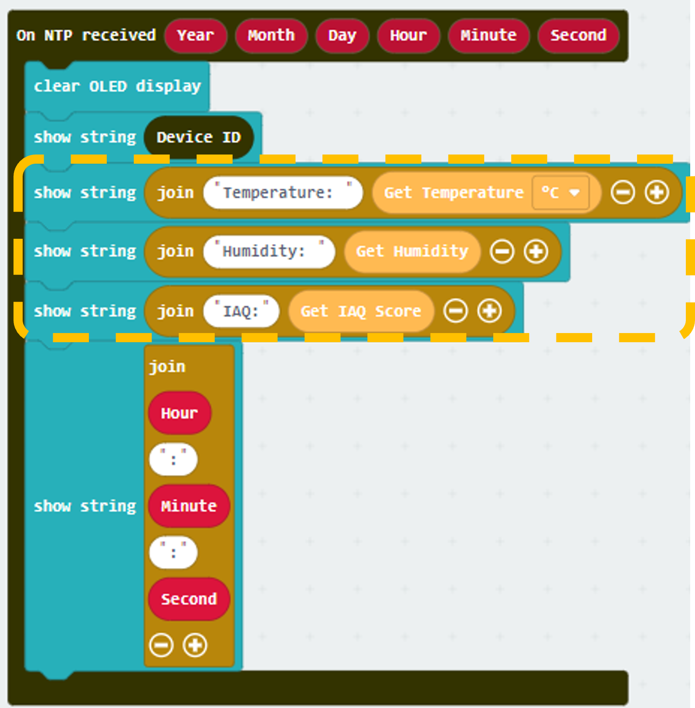

**Step 3\. Call upload\_thingspeak**

* Snap change counter by 1\.  
* Snap call read\_temperature.  
    
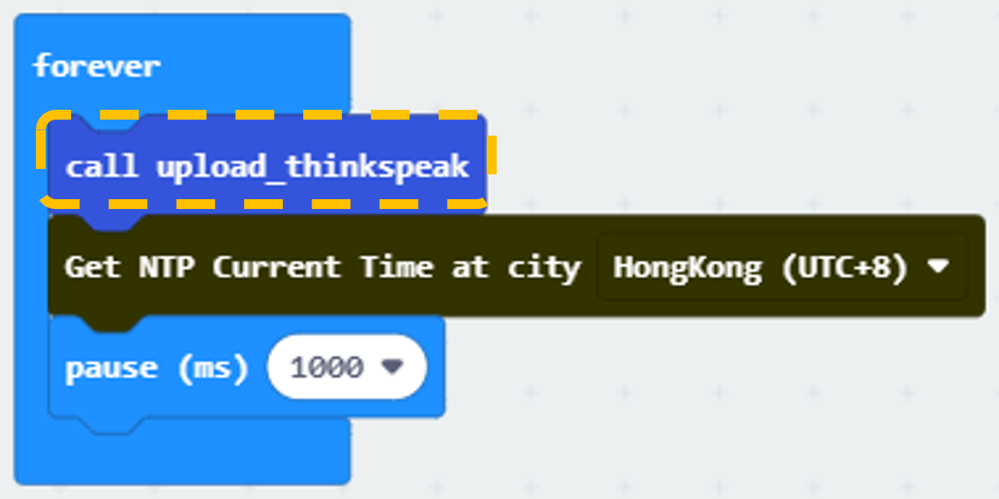

Part 2 Full Solution:

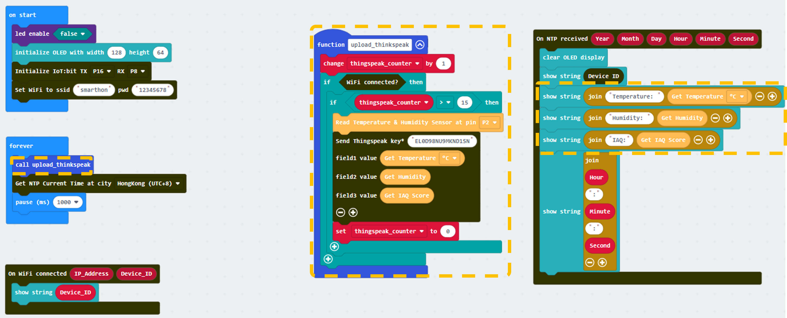

MakeCode: [https://makecode.microbit.org/S45857-45924-11958-57541](https://makecode.microbit.org/S45857-45924-11958-57541) 

You could also download the program from the following website: 
<iframe src="https://makecode.microbit.org/#pub:S45857-45924-11958-57541" width="100%" height="500" frameborder="0"></iframe>

Part 2 Result

The OLED show the temperature, humidity, IAQ Score and the environment condition based on IAQ Score. After upload, show the uploading information

### Part 3: Setting up the Kitchen Safety Flame Monitoring Alert (Case 11 revised)

3.1 Hardware Connect

* Connect the flame sensor to P1.  
* Pull down the buzzer switch to connect the buzzer.
* Connect the multi LED to P7.   
    
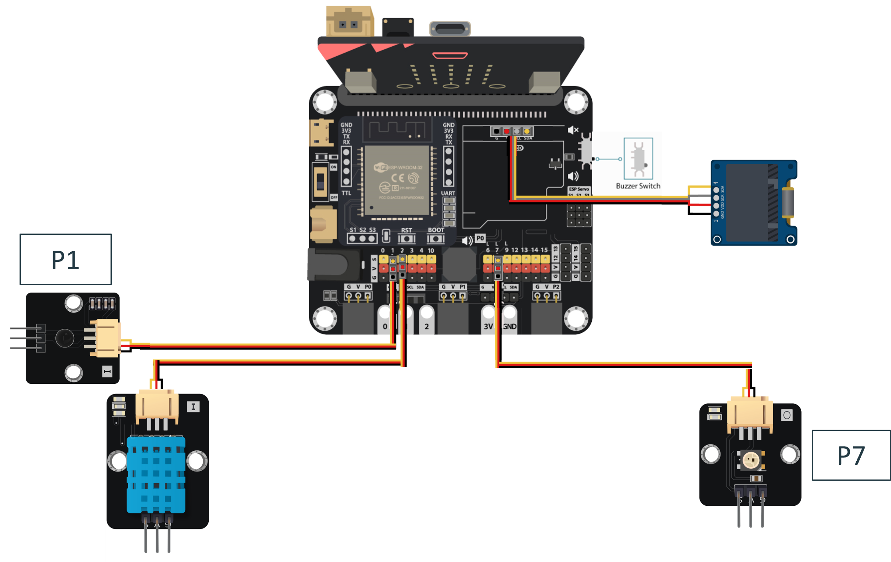

3.2 IOT Setup (IFTTT)

* Go to https://ifttt.com/ , create applet (if webhooks then Notification)

* Go to “My services” \> “Webhooks”, select “Documentation” . Copy your Webhooks Key as follows:
     
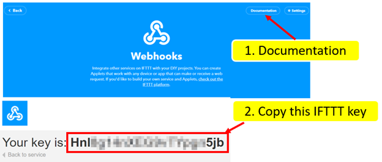

**Optional: Use email as notification method**

* In the THEN field, search for the “email” and use it to replace the “notifications” in the previous step. 
     

4.2 Programming (MakeCode)

**Step 1. Create variable**

* In on Start, create a new variable flame and snap snap set flame to false.
* In on start, set strip to NeoPixel at Pin P7 with 1 leds as RGB (GRB format).  

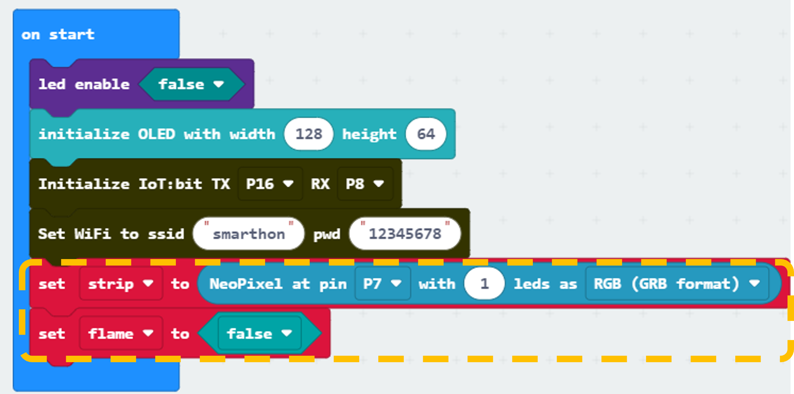

**Step 2\. Setup the function flame\_detection**

* Add a new function name flame\_detection.  
* Inside the function, put an if-else statement with condition WiFi connected? to check the connection status.  
* Inside the if loop, put an if statement with condition Get flame detection at Pin P1 \= true to recognize the flame.  
* Snap play tone High B for ½ beat until done.  
* Snap strip show color red.  
* Snap pause 100 ms.  
* Snap strip show color black.  
* Snap pause 100 ms.  
* Snap if flame \= false,  
* Inside the if statement, Put a Send IFTTT key\* XXXXXXXXX event\_name\* XXXXX .... to send the event to IFTTT. Fill in the IFTTT key from your Webhooks and the Applet's event\_name (fire).  
* Outside the if loop, set flame to true.  
* In the else statement, set flame to false.  
    
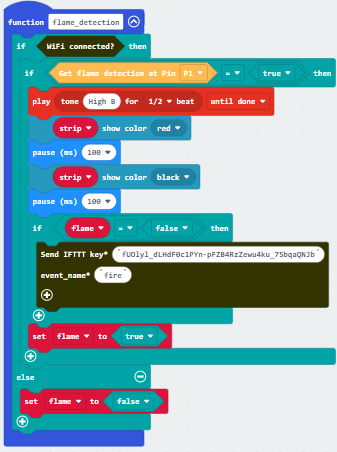

**Step 3\. Call fire\_detection function**

* In forever, snap call fire\_detection.  
     
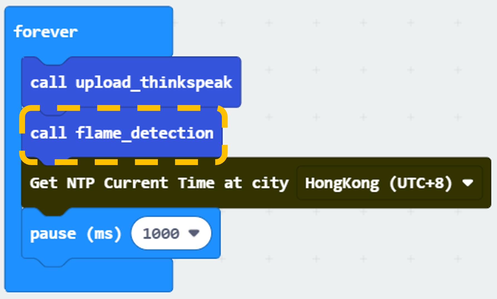

Part 3 Full Solution:

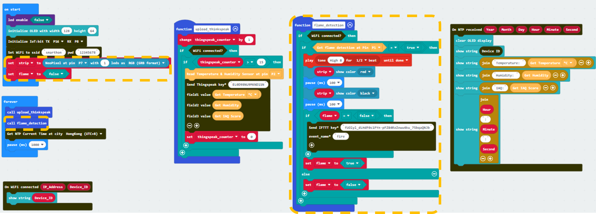

MakeCode: [https://makecode.microbit.org/S72737-24073-05539-26482](https://makecode.microbit.org/S72737-24073-05539-26482) 

You could also download the program from the following website: 
<iframe src="https://makecode.microbit.org/#pub:S72737-24073-05539-26482" width="100%" height="500" frameborder="0"></iframe>

Part 3 Result

When the flame source is detected by the flame sensor, it will trigger to blink the LED, making alert sound, and send the warning notification to IFTTT.

### Part 4: Setting up the Room Smart Colourful Light App Control (Case 12 revised)

4.1 IOT Setup (App Inventor 2\)

* Create a APP inventor account at [http://ai2.appinventor.mit.edu/](http://ai2.appinventor.mit.edu/) .  
* Create a new project.  
    

**Step 2\. Design the layout of APP**

* In the designer page, pull the layout element from the left side to the editor.  
* In this example case, using different buttons, textbox, label and layout control.  
* Place the element in your way.  
* For each element has their own property, you may change it in your mind, such as the background color, font size, width, height, align.  
* Remember to put the Web element to the editor, it will be used for sending commands.  
    
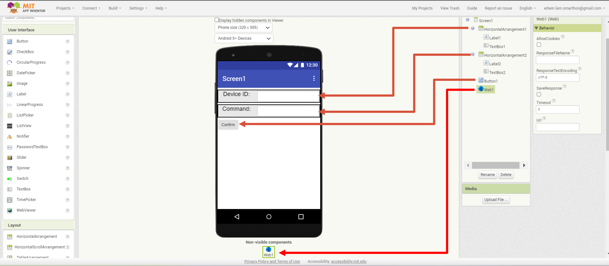

**Step 3\. Programming the elements in APP**

* Switch to Blocks page by click the button at top right corner.  

* According to the catalog of function needs, find it at the left side and put to editor.  
* Go to buttonX element, find the when buttonX.Click do function, put it to editor ( X represent the number of button).  
* Go to Web1 element, find the set Web1.URL to, put it inside to the when buttonX.Click do.  
* Go to Text catalog, find the join and " " element to start build the control API.  
* Control API is: https://control.smarthon.cc/publish?id=ID\&msg=MSG , while ID and MSG means IoT:bit ID and Command respectively.  
* Use join properly to concatenate the API from each parts.  
* After complete the API URL, use call Web1.Get from Web1 to send the API Command.  
    

4.2 Programming (MakeCode)

**Step 1\. Receive Command**

* Inside the On WiFi Received, put a nested if-else statement with different conditions.  
* Set the first condition as WAN\_Command \= Red, and strip show color red.  
* In the next if condition, use WAN\_Command \= Green, and strip show color green.  
* In the next if condition, use WAN\_Command \= Blue, and strip show color blue.  
     
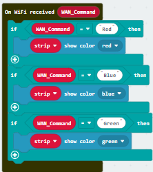

Part 4 Full Solution:

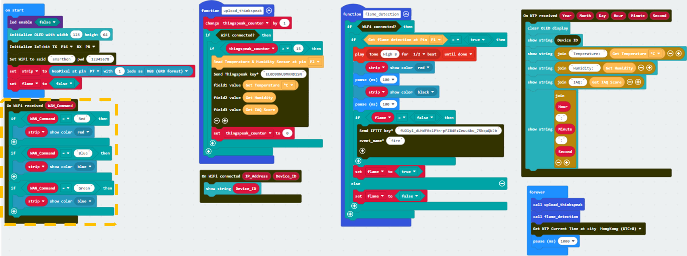

MakeCode: [https://makecode.microbit.org/S33616-36337-43084-95613](https://makecode.microbit.org/S33616-36337-43084-95613) 

You could also download the program from the following website: 
<iframe src="https://makecode.microbit.org/#pub:S33616-36337-43084-95613" width="100%" height="500" frameborder="0"></iframe>

Part 4 Result

After sending color messages from APPs, the color of light will change.

### Part 5: Setting up the Smart Fan Voice Control (Case 13 revised)

5.1 Hardware Connect

* Connect the motor fan to P9.  
    
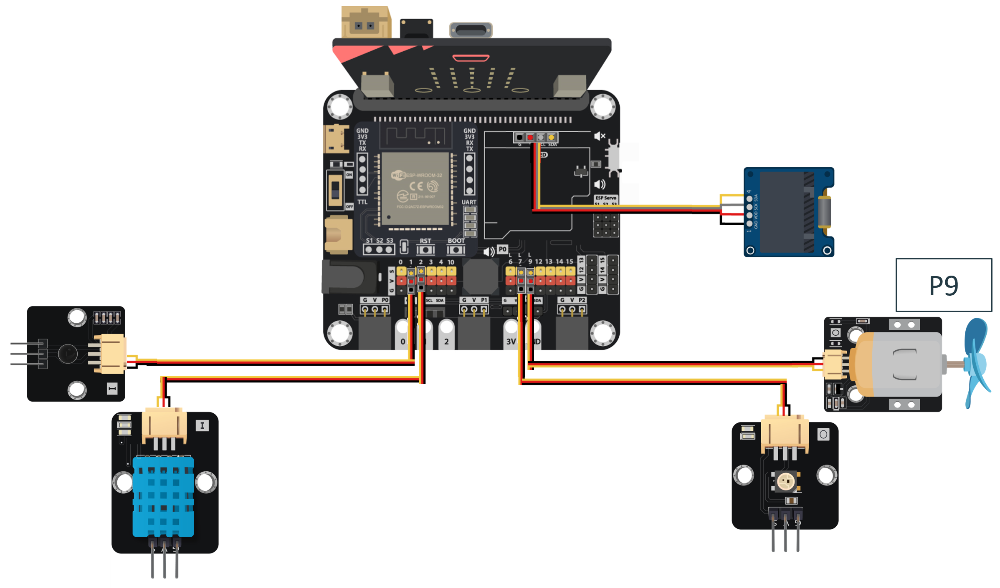

5.2 IOT Setup (Alexa / Google Assistant / Siri, Cloud Control, IFTTT)

**There are three different methods you can use to set up the IOT part for this case:**

* **For Amazon Alexa, you can refer to this link: 
[IoT Alexa of case 13](https://smarthon-docs-en.readthedocs.io/en/latest/smartHomeIoT/case13.html\#iot-alexa-cloud-control-ifttt)**  
    
* **For Google Assistant, you can refer to this link: 
[IoT Google Assistant of case 13](https://smarthon-docs-en.readthedocs.io/en/latest/smartHomeIoT/case13.html\#iot-google-assistant)** 
    
* **For Siri, you can refer to this link: 
[IoT Siri of case 13](https://smarthon-docs-en.readthedocs.io/en/latest/smartHomeIoT/case13.html\#iot-apple-s-siri)**

5.3 Programming (MakeCode)

**Step 1\. Update receive WiFi command.**

* In the On WiFi received block, snap if WAN\_Command \= turn\_on\_fan,  
* Then snap set Motor fan with 1023 at P9.  
* Snap if WAN\_Command \= turn\_off\_fan,  
* Snap set Motor fan with 0 at P9.  
    
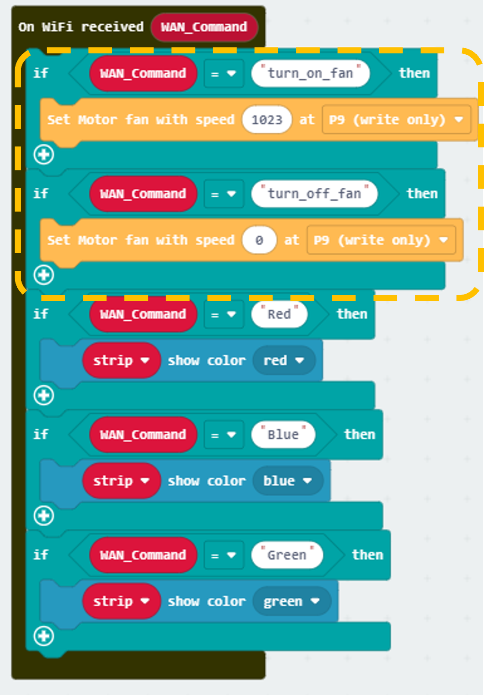

Part 5 Full Solution:

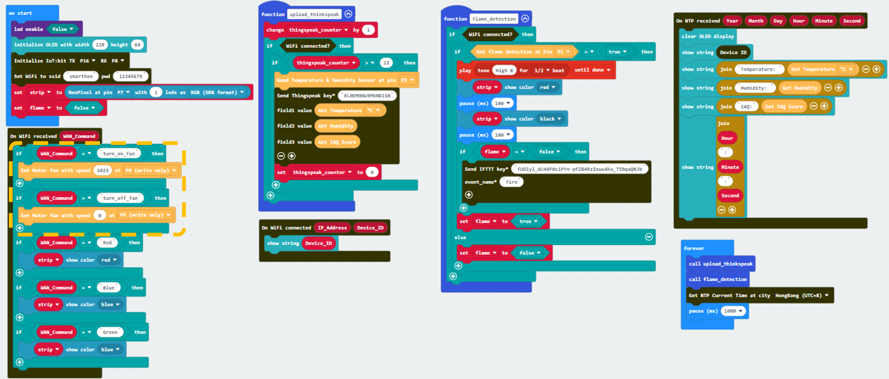

MakeCode: [https://makecode.microbit.org/S89685-01693-81459-28013](https://makecode.microbit.org/S89685-01693-81459-28013) 

You could also download the program from the following website: 
<iframe src="https://makecode.microbit.org/#pub:S89685-01693-81459-28013" width="100%" height="500" frameborder="0"></iframe>

Part 5 Result:

You can use voice to control the fan to turn on or off with Alexa/ Google Assistant/ Siri.

