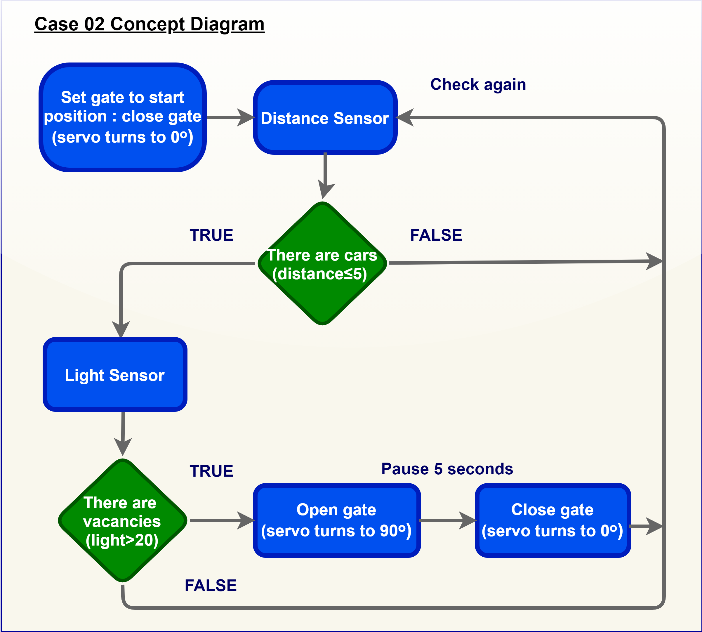
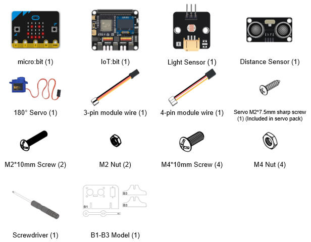
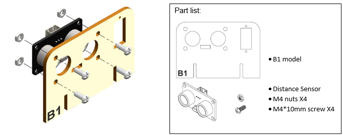
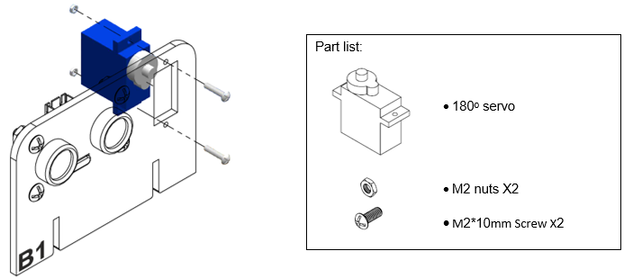
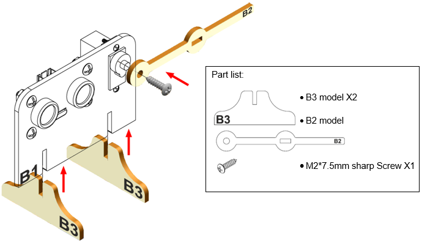
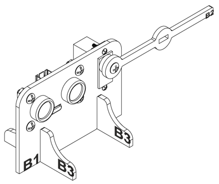
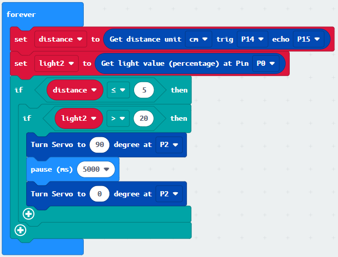
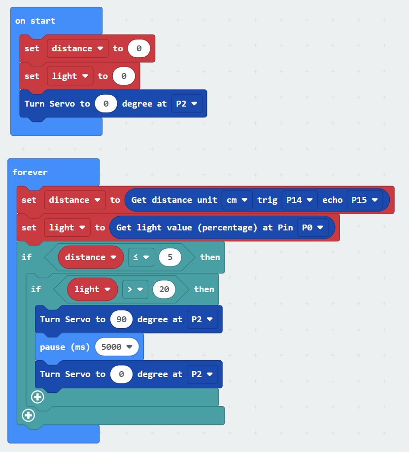

# Case 02: Smart Car park Access Barrier

Level: 

## Goal

Make a smart car park gate which opens automatically if there are vacancies in the car park and there are cars coming in. 

## Background

What is smart car park access barrier?

Smart Car park Access Barrier is used to allow people to live conveniently. It can reduce manpower and time in controlling the gate and manage information (e.g. car park vacancies). It will be opened automatically if there are vacancies in the car park and there are cars coming in. 

Car park gate operation

The car park gate open and close operation is controlled by 180ᵒ servo. It will be opened if there are vacancies in the car park (i.e. detected by light sensor) and cars near the car park gate (i.e. detected by distance sensor). Otherwise, the gate will be closed. 

When there are no vacancies (detected by light sensor), then the gate will keep closed. 

## Part List

## Assembly step

Step 1 

Attach the distance sensor to B1 model with M4 * 10mm screws and nuts.  

Step 2 

Attach the servo to B1 model with M2 * 10mm screws and nuts 

Step 3 

Attach the B2 model to the servo with servo M2 * 7.5mm sharp screw. Put B3 model onto B1 model. 

Step 4 

Assembly completed!  

## Hardware connect

Connect the Distance Sensor to P14 (trig)/ P15 (echo) port of IoT:bit 

Connect Light Sensor to P0 port of IoT:bit 

Connect 180° Servo to P2 port of IoT:bit 

*Pull the buzzer switch 'up' to disconnect the buzzer in this execrise*
## Programming (MakeCode)

Step 1. Set variables and servo at start position 

* Inside `on start`, snap `set variable distance to 0` and `set light to 0` from `variables`. Snap `Turn Servo to 0 degree at P2`.

Step 2. Get distance and light value 

* Drag `get distance to get distance unit cm trig P14 echo P15`, store the value to variable `distance`.
* `Get light value (percentage) at Pin P0`, store the value to variable `light`

Step 3. Open/close gate with light value 

* Snap `if statement` into forever, set if variable `distance` ≤ 5
* Snap another `if statement` set variable `light` value >20

Step 4. Set servo position 

* Snap `Turn Servo to 90 degree at P2` as the gate is opened.
* Snap `pause` to the loop to wait 5 seconds
* Snap `Turn Servo to 0 degree at P2` as the gate is closed.

Full Solution 

MakeCode: <a href="https://makecode.microbit.org/_UgRKmX2XzH2u" target="_blank">https://makecode.microbit.org/_UgRKmX2XzH2u</a>

## Result

The light sensor is used to check the vacancies in the car park while the distance sensor is used to detect if there are any cars coming near the car park gate 

The car park gate is controlled by 180ᵒ servo. When there are vacancies in the car park and there are cars near the car park gate, the car park is available. The gate will be opened for 5 seconds and then closed to let the car entering the car park. 

## Think

Q1. How can you show the light and distance value on OLED? 

Q2. Can you show signals on micro:bit LED to let drivers know there are vacancies in the car park? 

