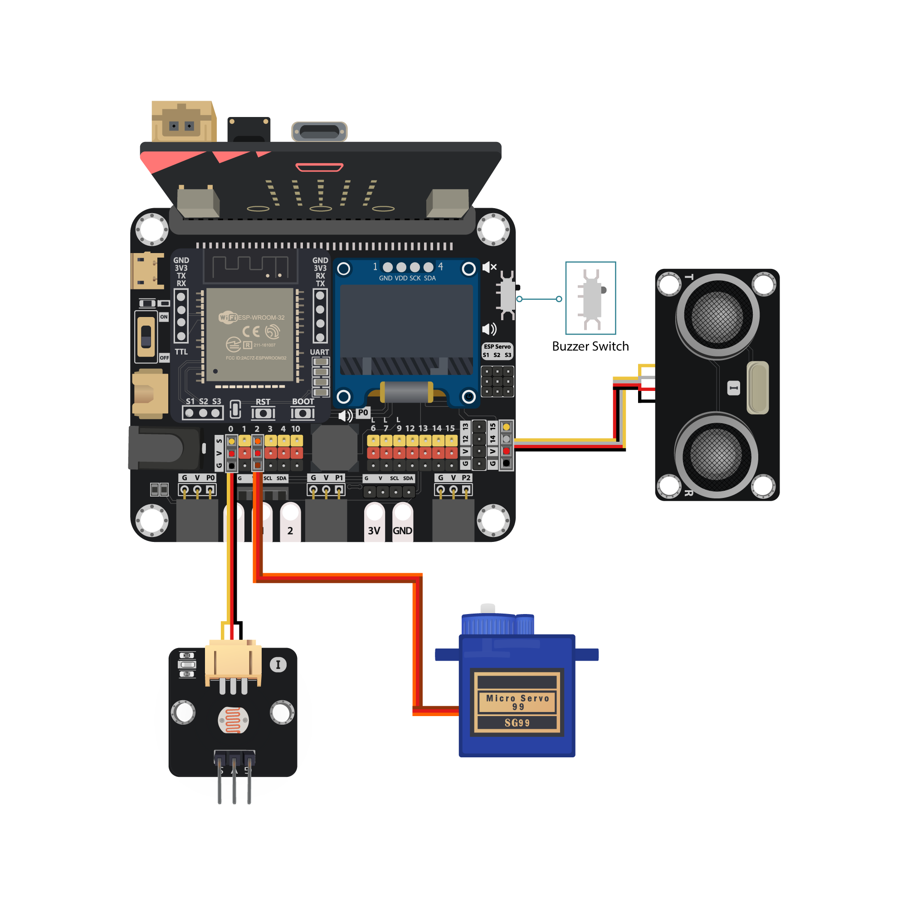
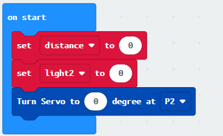
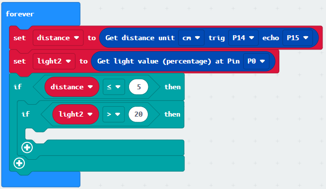

# Case 02: Smart Car park Access Barrier

Level: 

## Goal

Make a smart car park gate which opens automatically if there are vacancies in the car park and there are cars coming in. 

## Background

What is smart car park access barrier?

Smart Car park Access Barrier is used to allow people to live conveniently. It can reduce manpower and time in controlling the gate and manage information (e.g. car park vacancies). It will be opened automatically if there are vacancies in the car park and there are cars coming in. 

Car park gate operation

The car park gate open and close operation is controlled by 180ᵒ servo. It will be opened if there are vacancies in the car park (i.e. detected by light sensor) and cars near the car park gate (i.e. detected by distance sensor). Otherwise, the gate will be closed. 

When there are no vacancies (detected by light sensor), then the gate will keep closed. 

## Part List

<table><tr><td>
Electronics:
<ul display='inline-block'>
<li>micro:bit X1</li>
<li>IoT:bit X1</li>
<li>OLED X1</li>
<li>USB Wire/Battery Holder</li>
&nbsp;&nbsp;1. Light Sensor X1 (with 3-pin module wire) 
&nbsp;&nbsp;2. Distance Sensor X1 (with 4-pin module wire) 
&nbsp;&nbsp;3. 180° Servo X1 
</ul>
</td></tr>
<tr>
<td>Model:
<ul>
<li>Distance Sensor Stand Model B1-B3 X1</li>
<li>M4 Screws X4</li>
<li>M4 Nuts X4</li>
<li>M2 Screw x 10mm X2</li>
<li>M2 Nuts X2</li>
<li>Servo M2 Sharp Screw X2</li>
</ul>
</td></tr>
<tr><td>Equipment:
<ul><li>ScrewDriver X1</li></ul></td></tr></table>

## Practical operation

Step 1 

Attach the distance sensor to B1 model with M4 screws and nuts 

Step 2 

Attach the servo to B1 model with M2 x10mm screws and nuts 

Step 3 

Attach the B2 model to the servo with servo M2 sharp screw. 

Step 4 

Put B3 model onto B1 model.  

## Hardware connect

Connect the Distance Sensor to P14 (trig)/ P15 (echo) port of IoT:bit 

Connect Light Sensor to P0 port of IoT:bit 

Connect 180° Servo to P2 port of IoT:bit 

## Programming (MakeCode)

Step 1 

Drag on start block from Basic. Set distance and light to 0 from variables and turn servo to 0 degree at P2 at the beginning. 

Step 2 

Drag forever block from Basic. Set distance to get distance unit cm trig P14 echo P15. set light to get light value (percentage) at Pin P0. 

Step 3 

Snap if statement into forever, set if distance ≤ 5. Snap another if and set light value >20 then,  

Step 4 

After measuring the distance and light, turn servo to 90 degree at P2, pause 5 seconds and turn servo to 0 degree at P2.  

That’s say when there is car entering and there is vacancy inside the car park, the car park gate will be opened for 5 seconds for car entering. 

Full Solution 

MakeCode: [https://makecode.microbit.org/_3tFXmYU3uKXW](https://makecode.microbit.org/#pub:_3tFXmYU3uKXW) 

You could also download the program from the following website: 
<iframe src="https://makecode.microbit.org/#pub:_3tFXmYU3uKXW" width="100%" height="500" frameborder="0"></iframe>

## Result

The light sensor is used to check the vacancies in the car park while the distance sensor is used to detect if there are any cars coming near the car park gate 

The car park gate is controlled by 180ᵒ servo. When there are vacancies in the car park and there are cars near the car park gate, the car park is available. The gate will be opened for 5 seconds and then closed to let the car entering the car park. 

## Think

Q1. How can you show the light and distance value on OLED? 

Q2. Can you show signals on micro:bit LED to let drivers know there are vacancies in the car park? 

