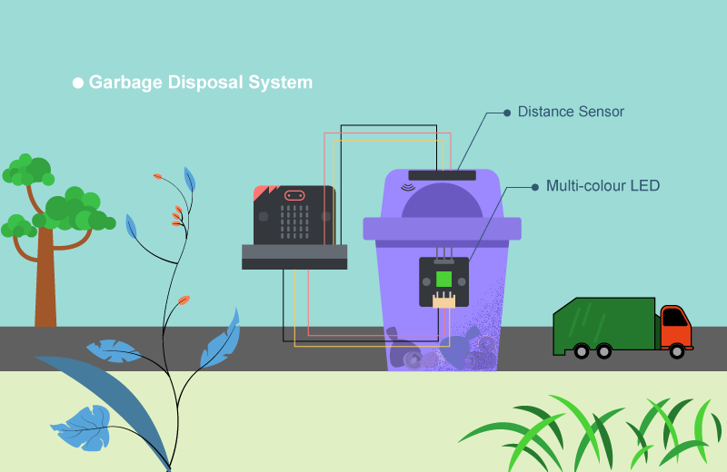
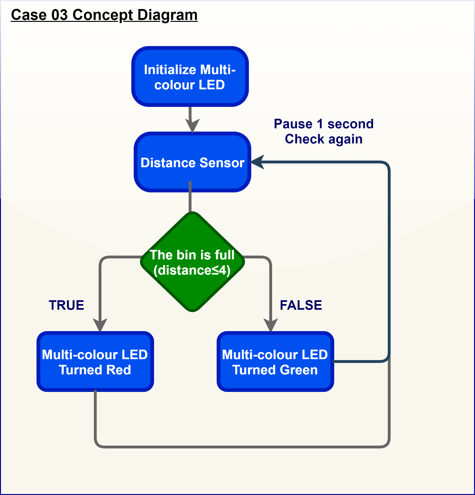
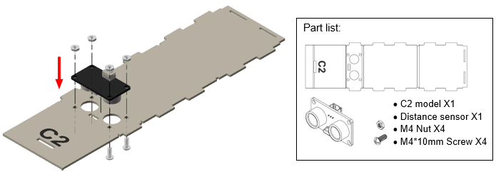
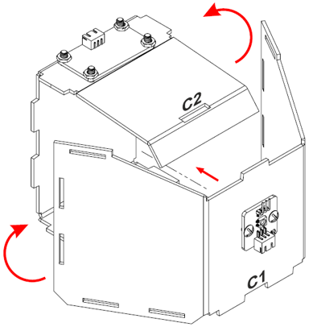
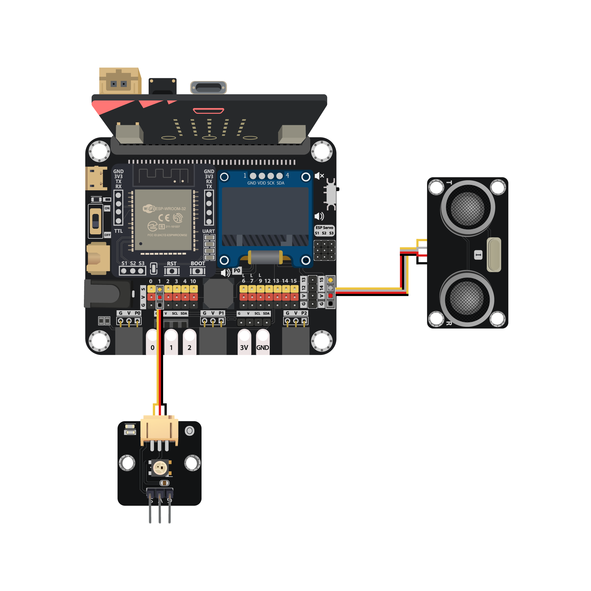
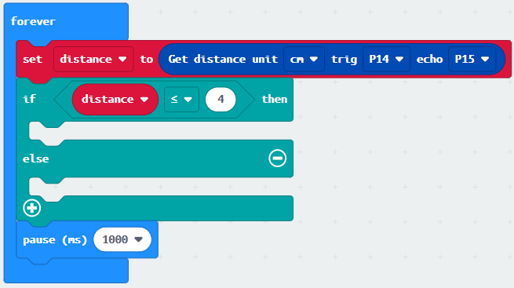
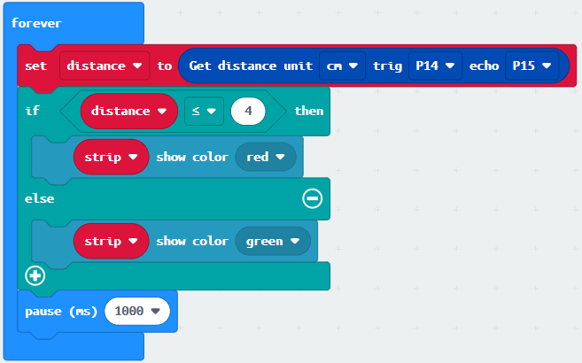

# Case 03: Garbage disposal system 

Level: 

## Goal

Make a smart garbage bin by showing different colors of light according to the volume of garbage inside. 

## Background

What is garbage disposal system?

LED light on the garbage bin can show people the amount of garbage inside the garbage bin so that garbage truck can easily determine if the garbage is full or not. This can minimize the wastage of the garbage bags and become a more environmental-friendly city. 

Garbage disposal system operation

The distance sensor should be able to sense the amount of garbage is inside the garbage bin. Multi-colour LED can be used to emit different colour of light (green and red light), which represent the emptiness of the garbage bin. 

## Part List

## Assembly step

Step1

Attach the Multi-colour LED to C1 model with M4 * 10mm screws and nuts. 

Step 2

Attach the distance sensor to C2 model with M4 * 10mm screw and nuts. 

Step 3

Put together all the cardboard parts (C1-C2). 

Step 4

Assembly completed! 

## Hardware connect

Connect the Distance Sensor to P14 (trig)/ P15 (echo) port of IoT:bit 

Connect Multi-color LED to P1 port of IoT:bit 

## Programming (MakeCode)

Step 1. Set variable and initialize multi-colour LED

* Inside `on start`, snap `set variable distance to 0` from `variables`
* Snap `set strip to NeoPixel at pin... ` from `Neopixel`. Set pin P1 with 1 led of the block.
* Snap `strip set brightness` from `Neopixel` > `more` and set brightness 50
* Snap `pause` to wait 5 seconds

Step 2. Get distance value

* Inside block `forever`. Set `distance` to `get distance unit cm trig P14 echo P15`, that’s say get the distance value by connecting the distance sensor to P14 and P15
* Snap `if statement` into `forever`, set `distance ≤ 4` into `if statement`
* Snap `Pause` to the loop to wait 1 second for next checking

Step 3. Show indicating colours with distance value

* If distance ≤ 4, then `strip show color red`, else `strip show color green`

Full Solution 

MakeCode: [https://makecode.microbit.org/_TfH6k4FvHRcg](https://makecode.microbit.org/#pub:_TfH6k4FvHRcg) 

You could also download the program from the following website: 
<iframe src="https://makecode.microbit.org/#pub:_TfH6k4FvHRcg" width="100%" height="500" frameborder="0"></iframe>

## Result

The distance sensor can return the distance value between the top of the garbage bin and the level of garbage inside the garbage bin. The LED light is used to indicate if the bin is full or not. If it is empty or there are some garbage, the LED turns green, if it is full, the LED turns red. 

## Think

Q1. How to make sound notification if there are full of garbage (i.e. using buzzer)? 

