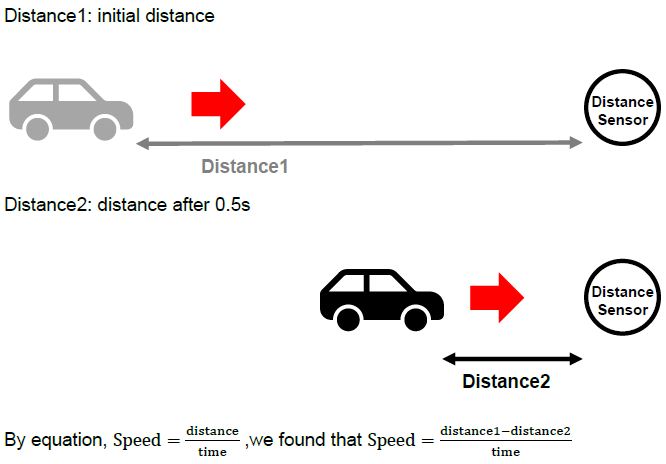
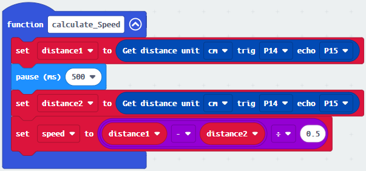
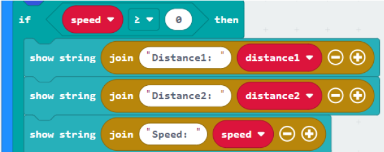

# Case 05: Car speed monitoring 

Level: 

## Goal

Make a car speed monitor to detect car speed on the road. 

## Background

What is car speed monitoring?

It is an automatic system to check car speed on the road at certain time interval. There are cars often over-speed causing traffic accidents, therefore installing a car speed monitoring is a must to minimize the chances of traffic accidents. 

Car speed monitor operation

The distance sensor measures two different distances at certain time interval, and therefore car speed can be calculated and shows it on the OLED.  

On every 500ms (0.5 second), the distance sensor will keep updating distance between the sensor and the car.  

If distance 1 ≥ distance 2, that’s say the car is moving towards. The moving distance is distance1 -distance2. The speed is (distance1-distance2)/0.5 (unit: cm/s)  

If distance 1 = distance 2, that’s say the car has stop moving or there are no cars. The moving distance and speed are 0  

For car speed < 0, it is the exceptional case (the car turns left/right and leave the road) and the speed will not be shown.  

A bar graph on micro:bit LED is shown to indicate the instant speed of the cars.  

## Part List

<table><tr><td>
Electronics:
<ul display='inline-block'>
<li>micro:bit (with OLED) X1</li>
<li>IoT:bit X1</li>
<li>OLED extension wire X1</li>
<li>USB Wire/Battery Holder </li>
&nbsp;&nbsp;1. Distance Sensor X1 (With 4-pin mModule wire)  
</ul>
</td></tr>
<tr>
<td>Model:
<ul>
<li>Car speed monitoring stand Model E1-E2 X1</li>
<li>Car speed showing stand Model D1-D2 X1</li>
<li>M4 Screws X4</li>
<li>M4 Nuts X4</li>
<li>M2 Screws X4</li>
<li>M2 Nuts X4</li>
</ul>
</td></tr>
<tr><td>Equipment:
<ul><li>ScrewDriver X1</li></ul></td></tr></table>

## Assembly step

Step 1

Attach the OLED to D1 model using M2 x10mm screw and nut. 

Step 2

Put D2 model onto the D1 model. 

Step 3

Attach the distance sensor to E1 model using M4 screw and nut. 

Step 4

Put the E2 model onto E1 model. 

## Hardware connect

Connect the Distance Sensor to P14 (trig)/ P15 (echo) port of IoT:bit  

Extend the connection of OLED to the I2C connection port of IoT:bit  

## Programming (MakeCode)

Step 1

Drag on start block from Basic. Drag Initialize IoT:bit at OLED from IoT:bit, set OLED height:64, width:128. 

Step 2

Set distance 1, distance 2 and speed to 0 from variables.  

 

Step 3

Set up a new function (calculate_Speed). Set distance1 to get distance unit cm trig P14 echo P15 (distance from the car to the distance sensor before 0.5 second) 

Step 4

Pause 500ms and get distance2 to get distance unit cm trig P14 echo P15 (distance from the car to the distance sensor after 0.5 second) 

 

Step 5

By the equation of speed = distance / time. We get the speed of the moving car to (distance1-distance2)/0.5 (unit: cm/s) 

 

Step 6

Drag forever block from Basic. Call function (calculate_Speed) to get the speed of the moving car. 

 

Step 7

If the speed ≥0, then OLED will show the distance1, distance2 and speed. 

 

Step 8

Plot bar graph of speed up to 20 from LED, which means showing a bar graph on Micro:bit based on the recorded speed. 

Full Solution 

MakeCode: [https://makecode.microbit.org/_iiiJeyMCe4Pi](https://makecode.microbit.org/#pub:_iiiJeyMCe4Pi) 

You could also download the program from the following website: 
<iframe src="https://makecode.microbit.org/#pub:_iiiJeyMCe4Pi" width="100%" height="500" frameborder="0"></iframe>

## Results

It will keep checking the distance of cars from distance sensor by distance sensor in every 500ms. The speed of the cars will be shown on OLED. A bar chart of speed will be shown on micro:bit LED also. 

Car moving with low speed

Car moving with high speed

## Think

How can we set a sound alert to notify that there is car over-speeding? 

