# Case 05: Car speed monitoring 

Level: 
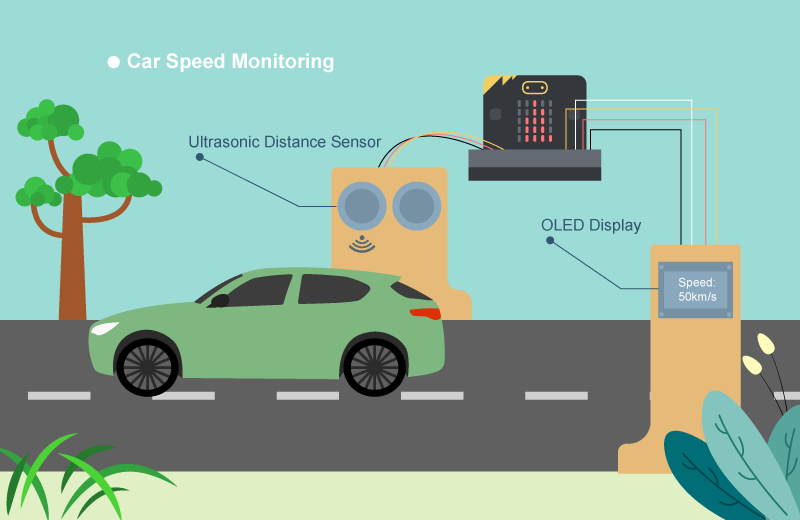

## Goal

Make a car speed monitor to detect car speed on the road. 

## Background

What is car speed monitoring?

It is an automatic system to check car speed on the road at certain time interval. There are cars often over-speed causing traffic accidents, therefore installing a car speed monitoring is a must to minimize the chances of traffic accidents. 

Car speed monitor operation

The distance sensor measures two different distances at certain time interval, and therefore car speed can be calculated and shows it on the OLED.  

On every 500ms (0.5 second), the distance sensor will keep updating distance between the sensor and the car.  

If distance 1 ≥ distance 2, that’s say the car is moving towards. The moving distance is distance1 -distance2. The speed is (distance1-distance2)/0.5 (unit: cm/s)  

If distance 1 = distance 2, that’s say the car has stop moving or there are no cars. The moving distance and speed are 0  

For car speed < 0, it is the exceptional case (the car turns left/right and leave the road) and the speed will not be shown.  

A bar graph on micro:bit LED is shown to indicate the instant speed of the cars.  

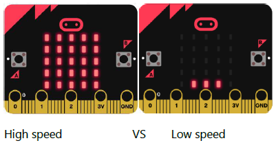

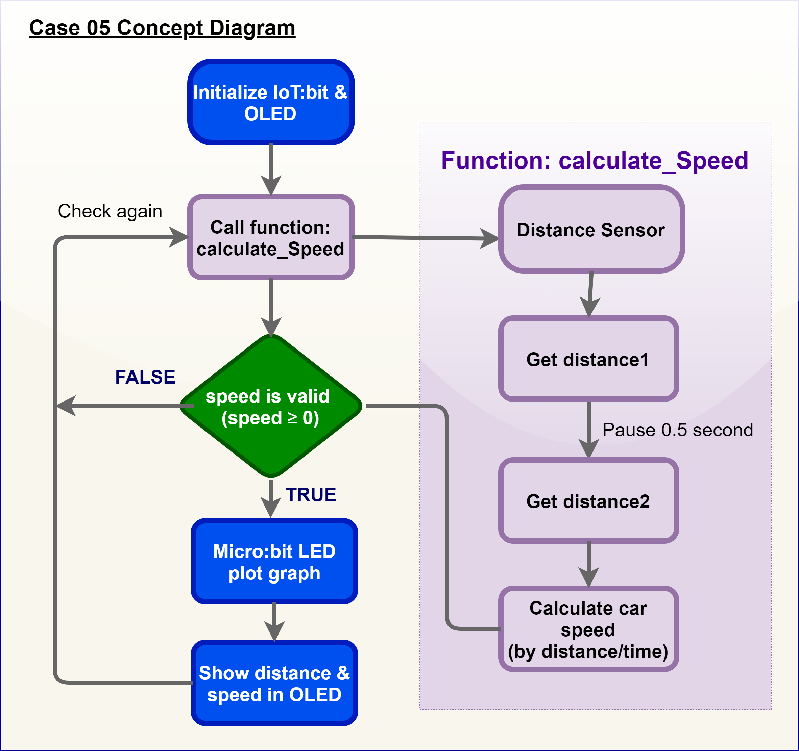

## Part List

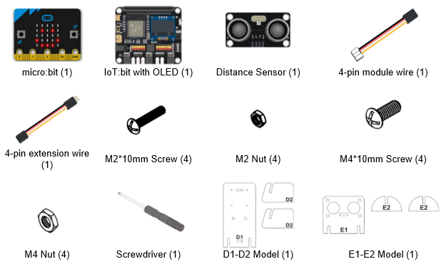

## Assembly step

Step 1

Attach the OLED to D1 model using M2 * 10mm screw and nut. 

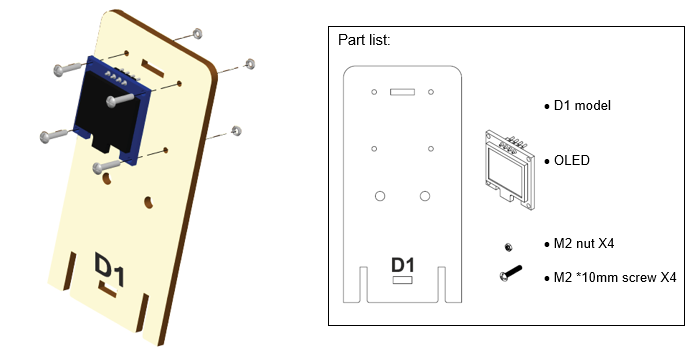

Step 2

Put D2 model onto the D1 model. 

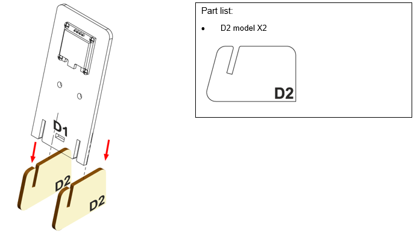

Step 3

Assembly completed!
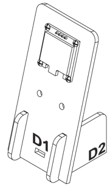

Step 4

Attach the distance sensor to E1 model using M4 screw and nut. 

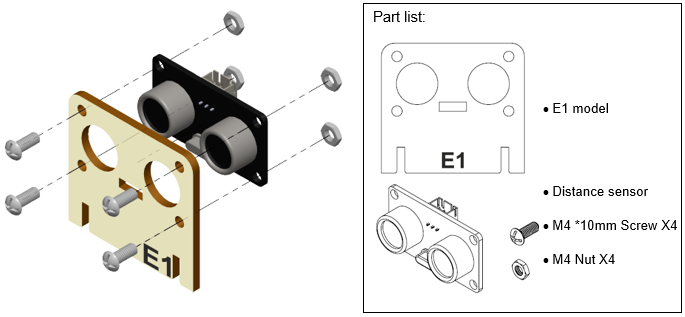

Step 5

Put the E2 model onto E1 model. 

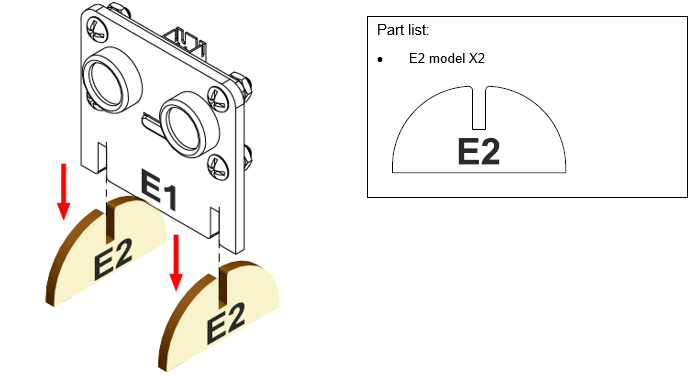

Step 6

Assembly completed! 

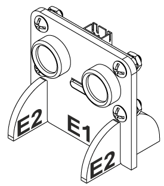

## Hardware connect

Connect the Distance Sensor to P14 (trig)/ P15 (echo) port of IoT:bit  

Extend the connection of OLED to the I2C connection port of IoT:bit  

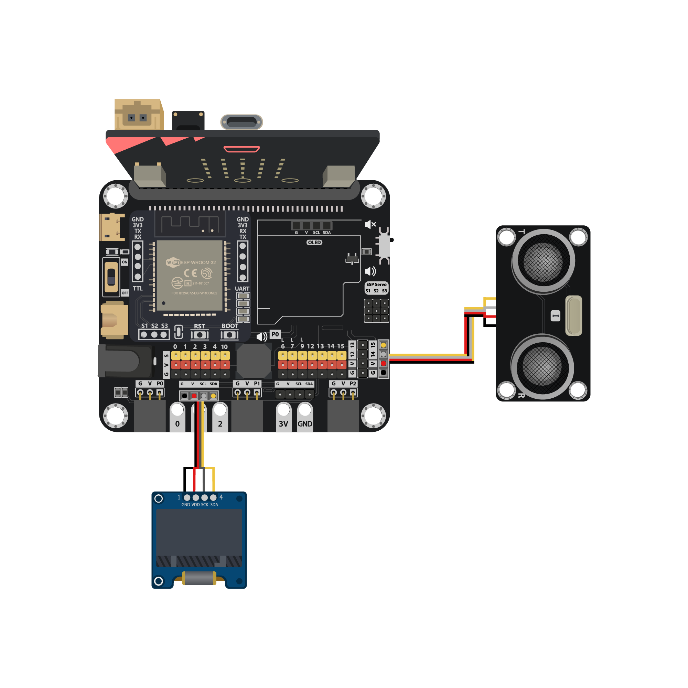

## Programming (MakeCode)

Step 1. Initialize OLED screen

* Drag `Initialize OLED with width:128, height: 64` to `on start`
* Set `distance1`, `distance2` and `speed` to 0 from `variables`

Step 2. Set up function (calculate_Speed)

* Set up a new function `calculate_Speed` from `Advanced` > `Functions`. 
* Set `distance1` to `get distance unit cm trig P14 echo P15` (distance from the car to the distance sensor before 0.5 second)
Drag `Pause` to wait 500ms and set `distance2` to `get distance unit cm trig P14 echo P15` (distance from the car to the distance sensor after 0.5 second)
* By the equation of speed = distance / time. We get the `speed` of the moving car to (`distance1`-`distance2`)/0.5 (unit: cm/s)

Step 3. Calculate car speed

* In block `forever`, call function `calculate_Speed` from `Advanced` > `Functions` to get the speed of the moving car
* Snap `If statement` into the loop
* If `speed ≥0`, then it will `plot bar graph of …` from `Led` and draw variable `speed` into the plotted value. Set value up to 20 
* Snap `clear OLED display` from `OLED` to avoid overlap
* Snap `show string` and show value of variables `distance1`, `distance2` and `speed`
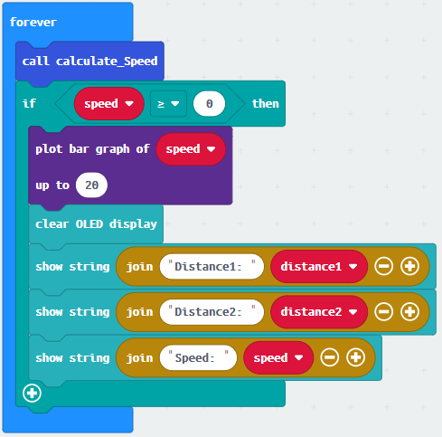

Full Solution 

MakeCode: <a href="https://makecode.microbit.org/_0Y0h5MWPde4A" target="_blank">https://makecode.microbit.org/_0Y0h5MWPde4A</a>

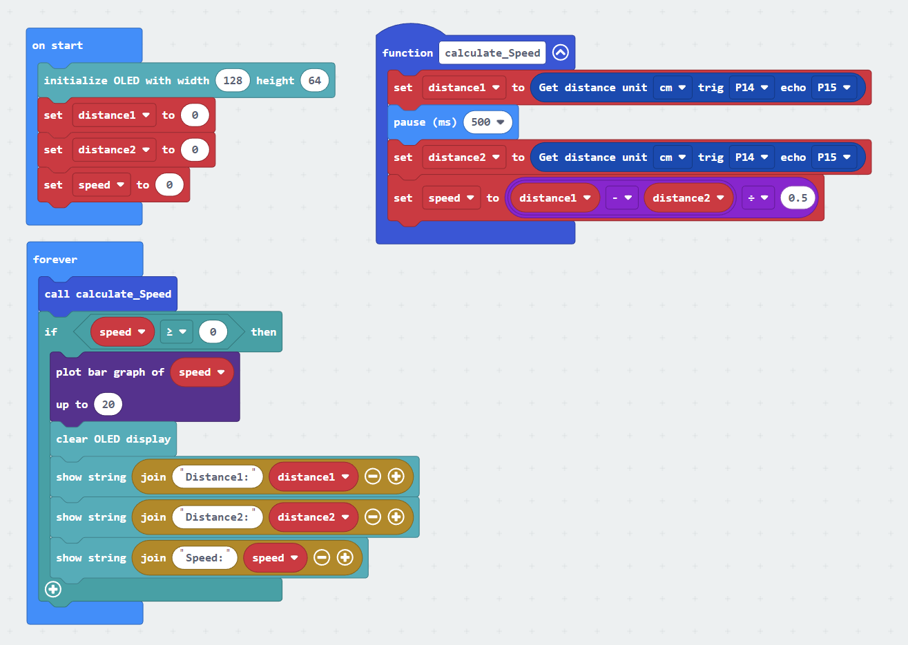

## Results

It will keep checking the distance of cars from distance sensor by distance sensor in every 500ms. The speed of the cars will be shown on OLED. A bar chart of speed will be shown on micro:bit LED also. 

## Think

How can we set a sound alert to notify that there is car over-speeding? 

