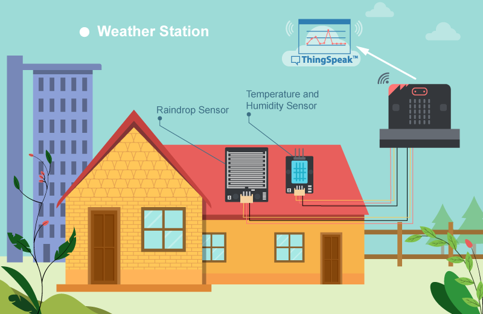
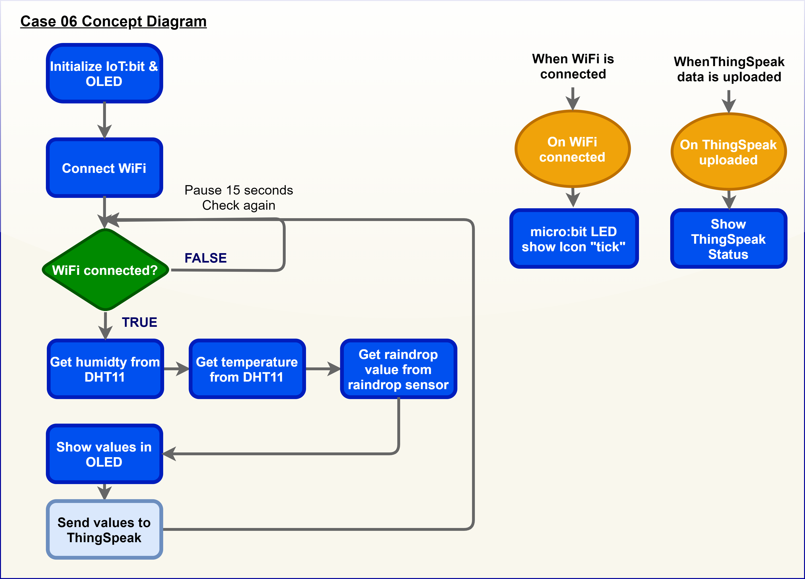
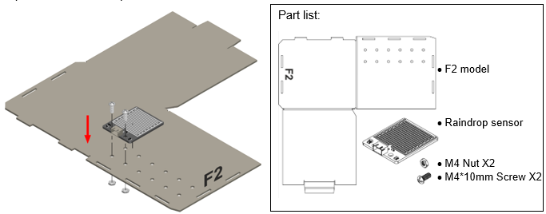
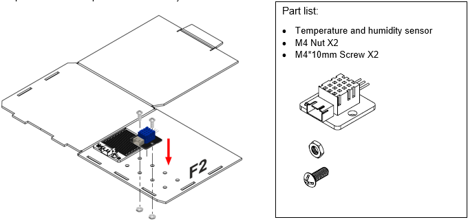
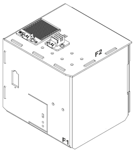
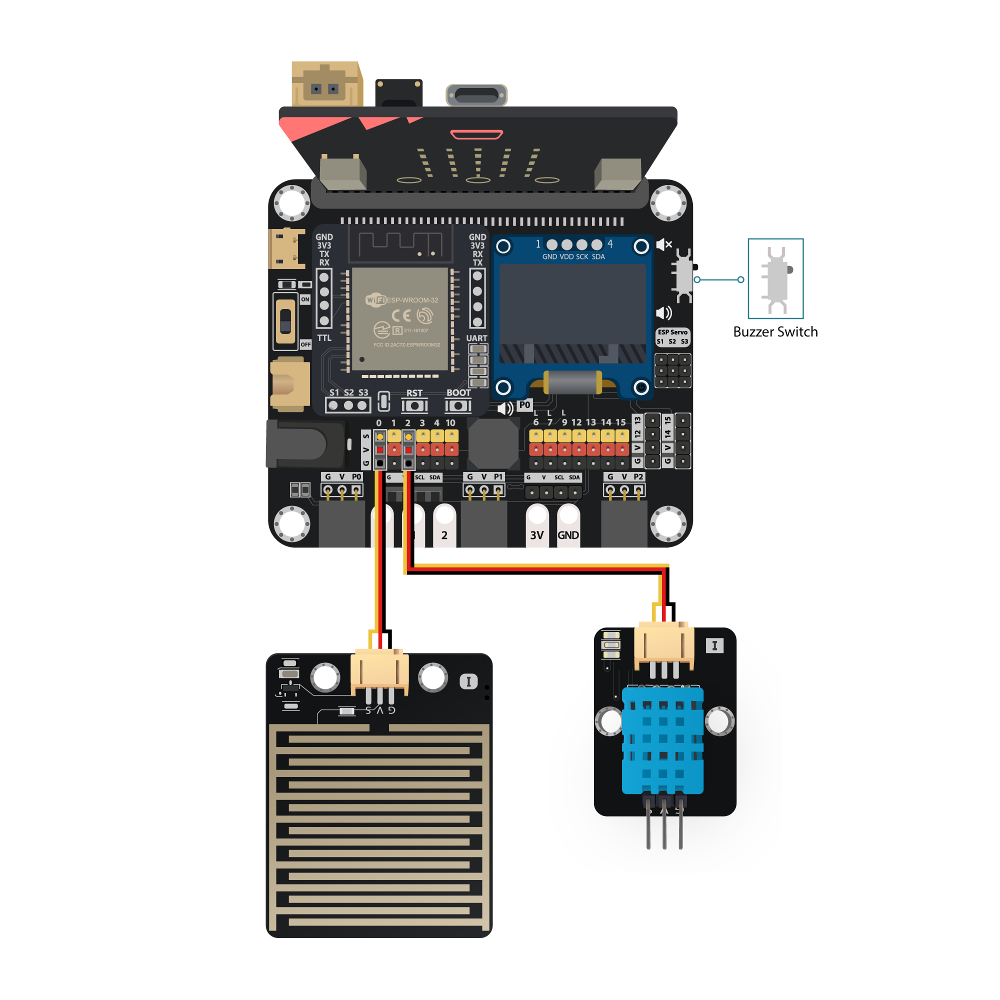
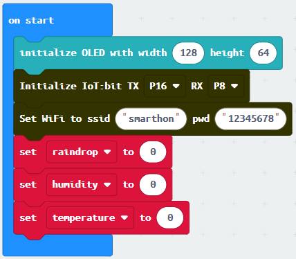
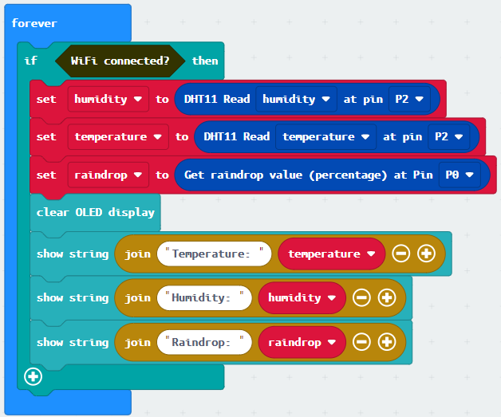
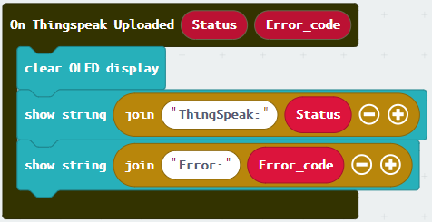
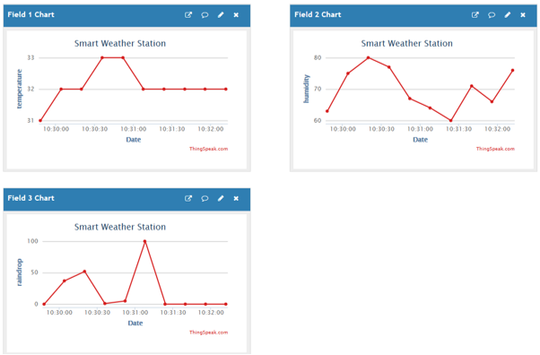

# IoT Case 06: Weather Station 

Level: 

## Goal

Make a weather station which gets the values from the raindrop sensor, temperature and humidity sensor. The data will be sent to IoT platform - ThingSpeak. 

## Background

What is Thingspeak? 

ThingSpeak is an IoT analytics platform service which provides instant visualizations of data posted by your devices to ThingSpeak. In this case, we will use this platform to update our data to plot instant graphs.  

Weather station operation 

Collecting temperature, humidity and raindrop consistently and uploading the data by using Thingspeak. This can help us to do analytical work more conveniently as we can refer to the automatically plotted graphs. 

## Part List

## Assembly step

 Step 1 

Attach the raindrop sensor to F2 model. 

 Step 2 

Attach the temperature and humidity sensor to F2 model.

 Step 3 

Put together all the cardboard parts (F1-F2).

 Step 4 

Assembly completed!

## Hardware connect

Connect the Raindrop Sensor to P0 port of IoT:bit 

Connect the Temperature and humidity Sensor to P2 port of IoT:bit 

## IoT (ThingSpeak)

* For more details, please refer to Chapter 1: Upload Data to ThingSpeak 

 Step 1 

Go to [https://thingspeak.com](https://thingspeak.com/), Choose Channels -> My Channels -> New Channel 

  
 Step 2 

Input Channel name, Field1 and Field2 , then click “Save Channel” 

* Channel name: Smart Weather Station
* Field 1: temperature
* Field 2: humidity
* Freld 3: raindrop

 Step 3 

Select your channel > “API Keys” ，copy the API key as follows: 

## Programming (MakeCode)

Step 1. Initialize OLED, IoT:bit and connect to WiFi 

* Snap `Initialize OLED with width:128, height: 64` to `on start`
* Snap `Initialize IoT:bit TX P16 RX P8` from `IoT:bit` to `on start`
* Snap `Set Wi-Fi to ssid pwd` from `IoT:bit`
* Enter your Wi-Fi name and password. Here we set `smarthon` as `SSID` and `12345678` as `password`
* Set variable `raindrop`, `humidity` and `temperature` to 0 from `variables`*  

Step 2. Show icon "tick" after WiFi connection 

* Snap `show icon` from `basic` to `On WiFi connected` and select icon `tick`

Step 3. Get temperature, humidity and raindrop values 

* Snap `if statement` to block `forever`
* If `WiFi is connected`
* Then, set `humidity` to `read humidity from DHT11 at Pin P2`
* Set `temperature` to `read temperature from DHT11` 
* Set `raindrop` to `get raindrop value (percentage) at Pin P0`

Step 4. Show values on OLED 

* Snap `clear OLED display` from `OLED` to avoid overlap
* Snap `show string` and show value of variables `Temperature`, `Humidity` and `Raindrop`

Step 5. Upload data to ThingSpeak 

* Snap `Send Thingspeak key...` inside the `if-statement`
* Fill in the `api key` from Thingspeak with temperature, humidity and raindrop value
* Snap `pause` to the loop to wait 15 second

Step 6. Show ThingSpeak upload status 

* Snap `show string` inside `On Thingspeak Uploaded`
* Draw the variable `Status` and `Error_code` to block `show string`

Full Solution 

MakeCode: [https://makecode.microbit.org/_TMyYxL8Re1du](https://makecode.microbit.org/_TMyYxL8Re1du) 

You could also download the program from the following website: 
<iframe src="https://makecode.microbit.org/#pub:_TMyYxL8Re1du" width="100%" height="500" frameborder="0"></iframe>

## Result

When micro:bit is connected to WiFi, it will check weather information (temperature, humidity from Temperature and humidity Sensor and raindrop value from raindrop sensor). Then, those data will be sent to ThingSpeak and pause for 15 seconds for another update. 

We can find three graphs on Thingspeak including temperature, humidity and raindrop (field1, field2, field3) respectively by collecting data using different sensors. 

## Think

Q1. How can we upload other module values (e.g. noise) to ThingSpeak? 

