# IoT Case 08: Automated Traffic Light

Level: 
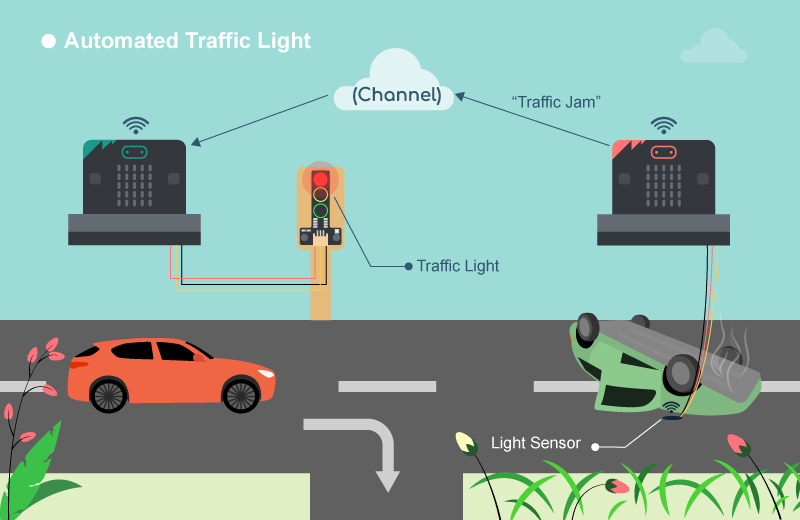

## Sender

### Goal

Make a sender to send signal to another micro:bit to show if there is traffic jam or not. 

### Background

How to send signal to another micro:bit?

Micro:bit (sender and receiver) are connected to the same channel so wifi message can be sent between the micro:bit. Such that when the sender micro:bit sends a Wi-Fi message “trafficjam” to receiver micro:bit. When receiver micro:bit receives a WiFi message “trafficjam”, the connected traffic light will turn red. 

Sender micro:bit operation

When the light value detected is too low, this would represent there is a traffic jam and and a ‘trafficjam’ wifi message to another microbit. When the light value detected is high, this would represent there is no traffic jam and send a “nojam” wifi message to another micro:bit. 

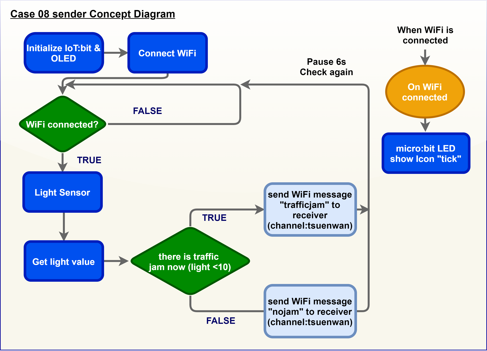

### Part List

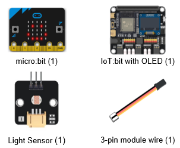

 
### Assembly step

N/A

### Hardware connect

Connect the Light Sensor to P0 port of IoT:bit 

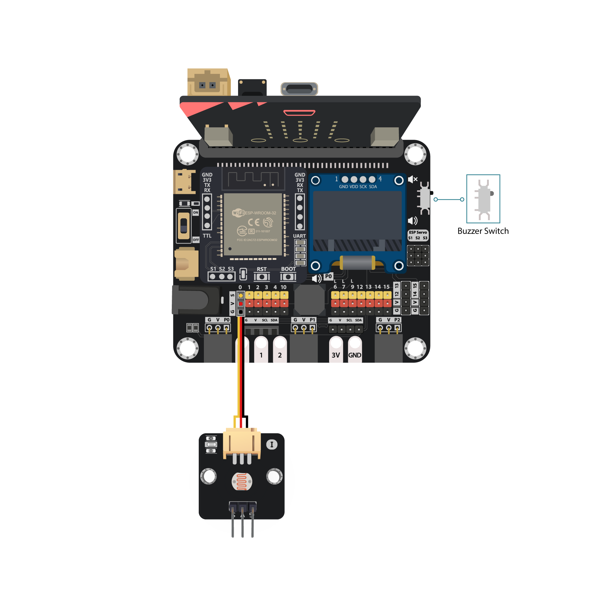

### Programming (MakeCode)

Step 1

Drag on start block from Basic. Drag Initialize IoT:bit at OLED from IoT:bit, set OLED height:64, width:128. Set WiFi to ssid “wifi_name” and pwd “WiFi_password”. 

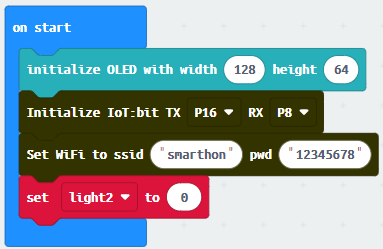

Step 2

Set light to 0 and set status and check status to “” from variable and text. 

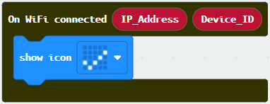

Step 3

Drag forever block from Basic. Snap if statement into forever. Set if WiFi is connected then. 

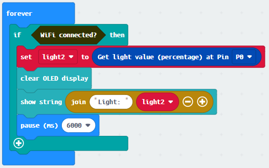

Step 4

Set light to get percentage value (percentage) at Pin P0 from variables and Smartcity and show number light from OLED. 

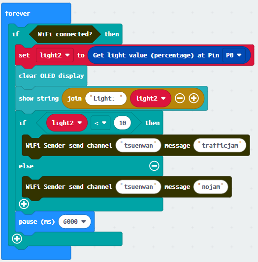

Step 5

Set if light < 50 then, set check_status to “trafficjam”. That’s say there is traffic jam on the road (i.e. light sensor value < 50 and therefore set check_status to “trafficjam”. 

Step 6

Else, set check_status to “nojam”. 

Step 7

If status ≠ check_status then, set status to check status and WiFi send message (status) in channel “traffic”. 

Step 8

Pause for 1000ms. 

Full Solution 

MakeCode: [https://makecode.microbit.org/_EroCeHYWbeiC](https://makecode.microbit.org/#pub:_EroCeHYWbeiC) 

You could also download the program from the following website: 
<iframe src="https://makecode.microbit.org/#pub:_EroCeHYWbeiC" width="100%" height="500" frameborder="0"></iframe>

### Result

Light sensor is used to detect if there are traffic jam. Once the light intensity is not low, it indicates that there is a traffic jam on the road. Wi-Fi message “nojam” will be sent to another micro:bit (receiver). 

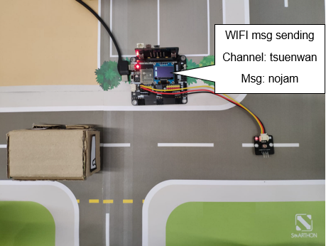

Once the light intensity is too low, it indicates that there is a traffic jam on the road. Wi-Fi message “trafficjam” will be sent to another micro:bit (receiver). 

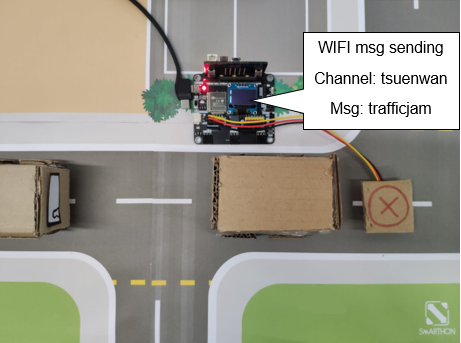

### Think

Q1. How can we use distance sensor to detect traffic status? 

## Receiver

### Goal

Make an auto-traffic LED Module by receiving signal from sender micro:bit. 

### Background

How to receive signal from another micro:bit?

Micro:bit (sender and receiver) are connected to the same channel so wifi message can be sent between the micro:bit. If receiver micro:bit receives a WiFi message “trafficjam” from sender, the connected traffic light will turn red. 

Receiver micro:bit operation

When a wifi message “trafficjam” is received, it means there is traffic jam forward. The traffic LED Module will turn red. When a wifi message “nojam” is received, it means there is no traffic jam forward. The traffic LED Module will turn green. By using smart traffic light, the problem of traffic jam can be reduced as automatic traffic control is used. 

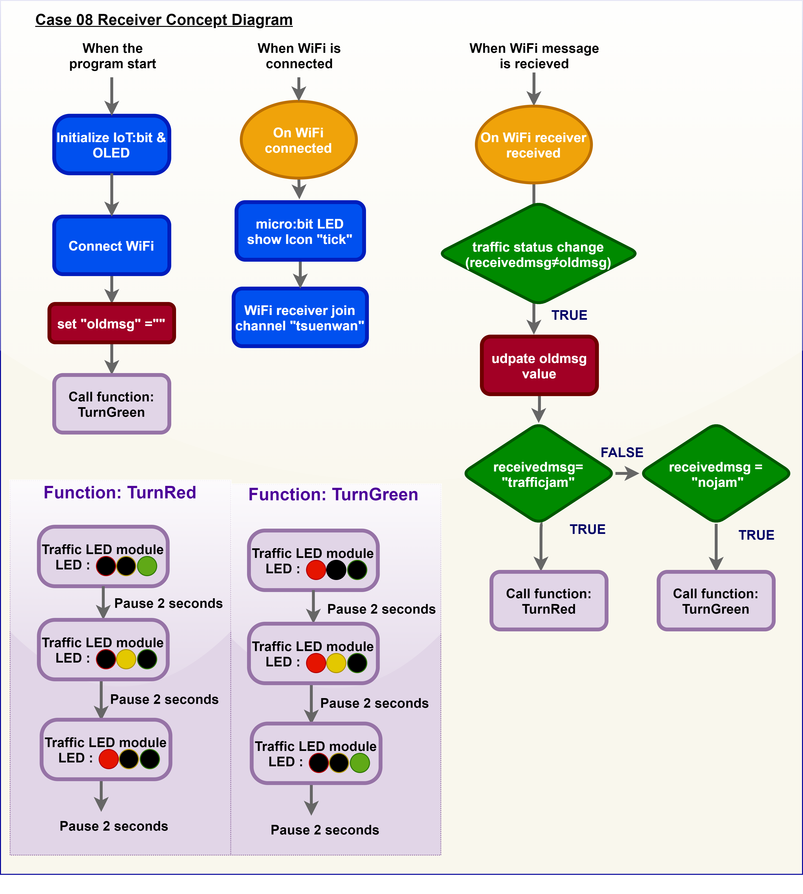

### Part List

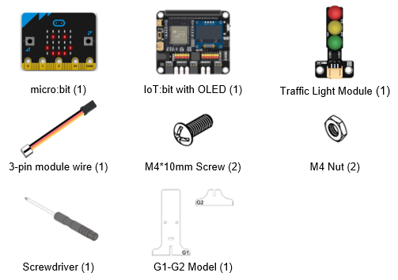

### Assembly step

Step 1

Attach the Traffic light Module to G1 model using M4 screw and nut. Put together all the cardboard parts (G1-G2) 

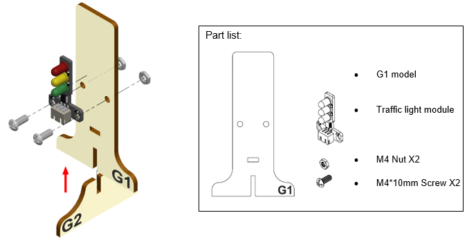

Step 2

Assembly completed! 

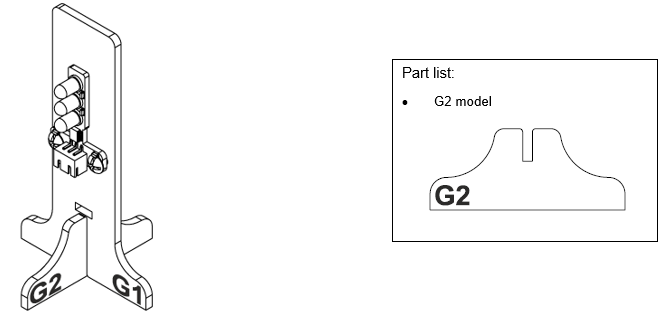

### Hardware connect

Connect the Traffic LED Module to P0 port of IoT:bit 

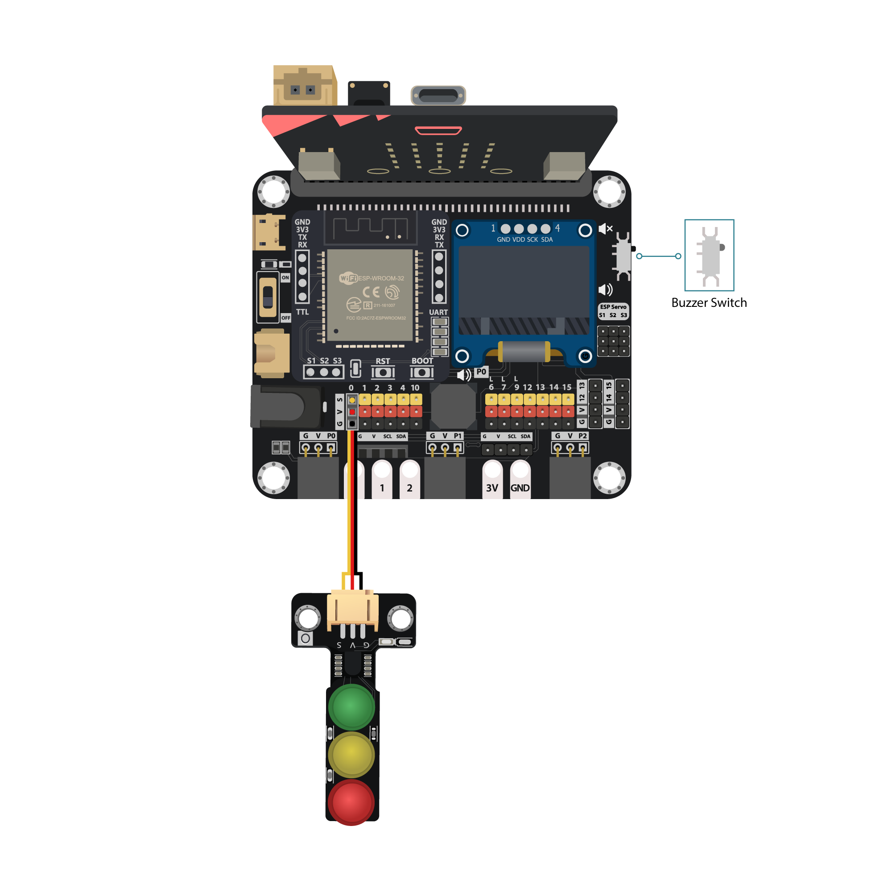

### Programming (MakeCode)

Step 1

Drag on start block from Basic. Drag Initialize IoT:bit at OLED from IoT:bit, set OLED height:64, width:128. Set WiFi to ssid “wifi_name” and pwd “WiFi_password”. 

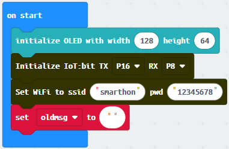

Step 2

On WiFi connected, WiFi start listening in channel ‘traffic’ from IoT:bit and IoT:bit – channel. 

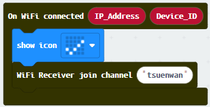

Step 3

Drag On WiFi received WiFiMessage from IoT:bit.  

If WiFiMessage = “trafficjam” then, call TurnRed. That’s say if the received message is traffic jam, call the traffic light to turn red. 

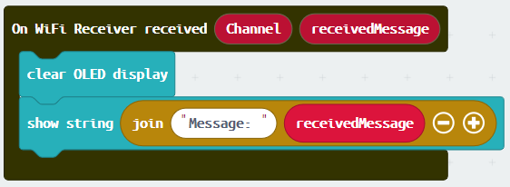

Step 4

Else if WiFiMessage = “nojam” then, call TurnGreen. That’s say if the received message is no traffic jam, call the traffic light to turn green. 

 Stet 5

Set up a new function (TurnRed). Control traffic light at P0 green on from SmartCity and pause for 2000ms from basic, then control traffic light at P0 yellow on and pause for 2000ms. Lastly, control traffic light at P0 red on and pause for 2000ms. 

Step 6

Set up a new function (TurnGreen). Control traffic light at P0 red on from SmartCity and pause for 2000ms from basic, then control traffic light at P0 red and yellow on and pause for 2000ms. Lastly, control traffic light at P0 green on and pause for 2000ms. 

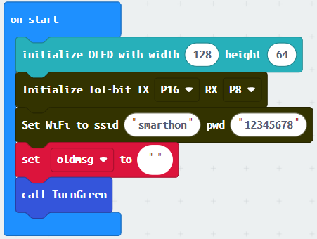

Full Solution 

MakeCode: [https://makecode.microbit.org/_hjoATDhYTMqd](https://makecode.microbit.org/#pub:_hjoATDhYTMqd) 

You could also download the program from the following website: 
<iframe src="https://makecode.microbit.org/#pub:_hjoATDhYTMqd" width="100%" height="500" frameborder="0"></iframe>

### Result

By receiving wifi message, traffic LED Module will turn to the corresponding colour automatically.
If there are no traffic jam ahead (detected by light sensor). Micro:bit (sender) will send wifi message “nojam” to the micro:bit (receiver). The traffic light will turn green.
If there are traffic jam ahead (detected by light sensor). Micro:bit (sender) will send wifi message “nojam” to the micro:bit (receiver). The traffic light will turn red.
 

### Think

Q1. How can we add sound effect to the traffic LED Module according to the corresponding color? 

