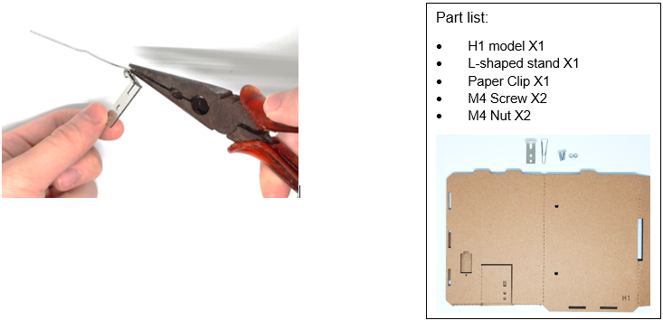
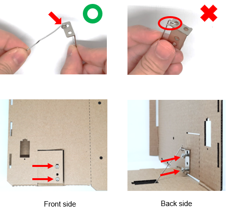
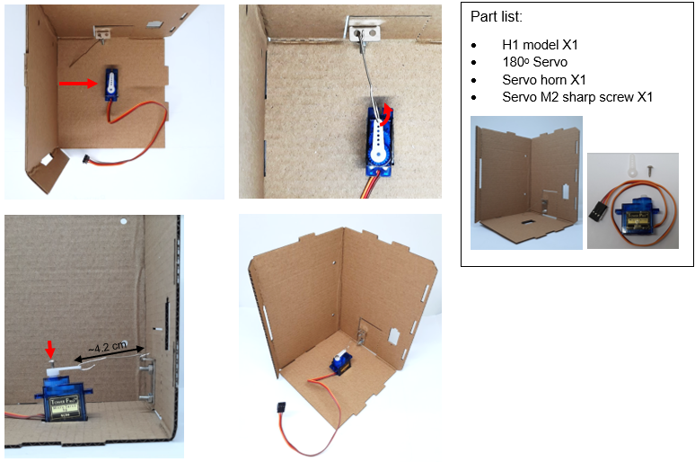
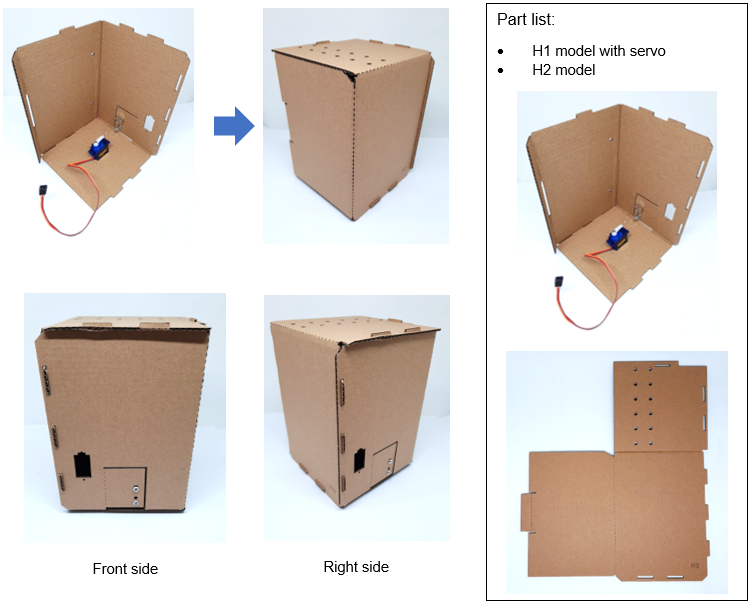
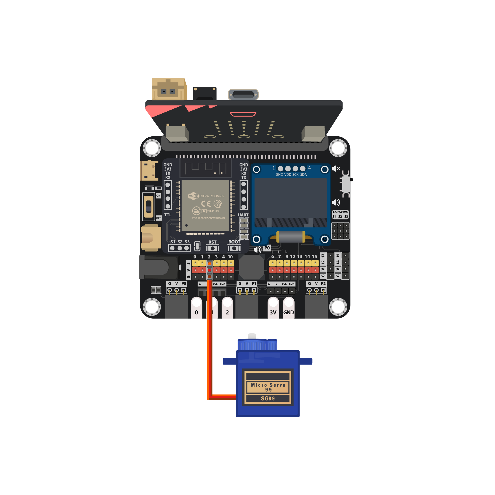
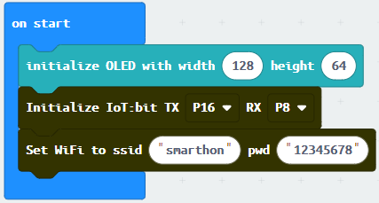
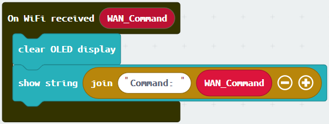
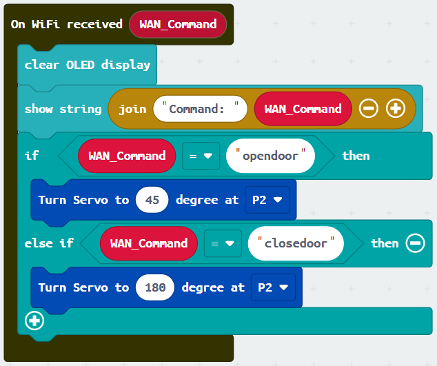
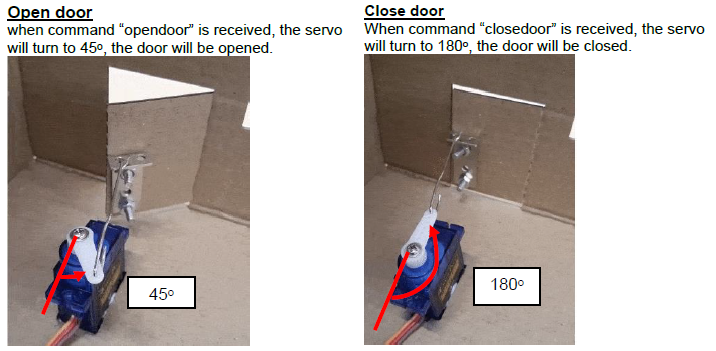

# IoT Case 09: Smart House door control 

Level: 

## Goal

Use app inventor to create an APP to control the door of the house.  

## Background

What is app inventor? 

App Inventor allows user to develop their own app for Android phones by simple programming and design work. 

Smart House door operation 

When the micro:bit receives the signal “opendoor” from the app, the 180o servo will turn for 180o to open the door. When the micro:bit receives the signal “closedoor” from the app, the 180o servo will turn back 180o to close the door. 

## Part List

<table><tr><td>
Electronics:
<ul display='inline-block'>

<li>micro:bit X1</li>
<li>Smarthon IoT:bit X1</li>
<li>USB Wire/Battery Holder </li>
&nbsp;&nbsp;1. 180ᵒ servo 
</ul>
</td></tr>
<tr>
<td>Model:
<ul>
<li>House Model H1-H2 X1</li>
<li>L-shaped stand X1</li>
<li>Paper Clip X1</li>
<li>M2 Screw x 10mm X2</li>
<li>M2 Nut X2</li>
<li>Servo M2 sharp screw X1</li>
</ul>
</td></tr>
<tr><td>Equipment:
<ul><li>ScrewDriver X1</li></ul></td></tr></table>

## Assembly step

Step 1 

Attach the L-shaped stand with paper clip to the model H1 

Step 2 

Straighten the paper clip and cut it to 6.5 cm 

Step 3 

Use pilers to fix the paper clip into the L-shaped stand 

Step 4 

Make a small hole to fix into the stand securely 

Step 5 

Attach the servo to the model H1 

Step 6 

Put together all the cardboard parts (H1-H2) 

 

## Hardware connect

Connect the 180ᵒ servo to P2 port of IoT:bit 

Micro:bit P2|Servo
-:-|-:-
S (yellow)|S (orange)
V (red)|V (red)
G (black)|G (brown)

## Programming (MakeCode)

Step 1 

Drag on start block from Basic. Drag Initialize IoT:bit at OLED from IoT:bit, set OLED height:64, width:128. Set WiFi to ssid “wifi_name” and pwd “WiFi_password”. 

Step 2 

Turn servo to 180 degree at P2 from Smartcity. 

Step 3 

Drag On WiFi connected and start WiFi remote control (WAN) from IoT:bit. 

Step 4 

Drag on WAN command received (WAN_Command) from IoT:bit.  

If WAN_Command = opendoor then, turn servo to 45 degree at P2 from Smartcity. 

Step 5 

Else if WAN_Command = closedoor then, turn servo to 180 degree at P2 from Smartcity. 

Full Solution 

MakeCode: [https://makecode.microbit.org/_L2V0LeAHo0hg](https://makecode.microbit.org/#pub:_L2V0LeAHo0hg) 

You could also download the program from the following website: 
<iframe src="https://makecode.microbit.org/#pub:_L2V0LeAHo0hg" width="100%" height="500" frameborder="0"></iframe>

 
## (IoT (App Inventor)

* For more details, please refer to “Chapter 3: Control your micro:bit by App Inventor 2”. 

Step 1 

Create the page with the components 

* On Designer:
* Drag the components from the left menu – we will need buttons to open or close the door and a textbox for input the Device ID number. 
* Also, add the invisible component “Web” under connectivity, we will need it for WAN connection.

Step 2 

Make the programming part
* On Blocks: 
* The WAN control command URL is: 
[http://control.smarthon.cc/publish?id=DeviceID&msg=ControlCommand](http://control.smarthon.cc/publish?id=DeviceID&msg=ControlCommand)

* When Button1 is clicked, it will direct to the URL with given device ID and command “opendoor”.

* When Button2 is clicked, it will direct to the URL with given device ID and command “closedoor”.

* Download the App in your phone to by .apk or scan QR code.

 
## Result 
Input your device ID number in the textbox, then click button “opendoor” to send command “opendoor”. Click button “Close Door” to send command “closedoor”. 

Micro:bit will wait for WAN command:  

 

With app inventor and micro:bit, you can control the door open/close by mobile app! 

## Think

Q1. How can we add password authentication to open the door? 

Q2. We can install the servo to different position in the house (tips: modify the turning angle of the servo) 

