# IoT Case 09: Smart House door control 

Level: 
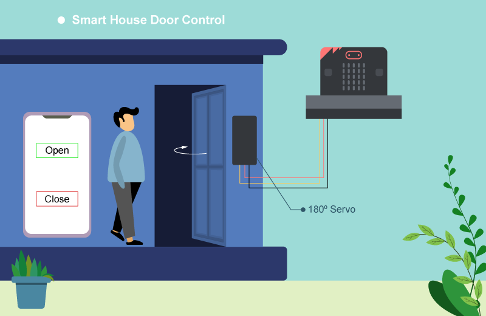

## Goal

Use app inventor to create an APP to control the door of the house.  

## Background

What is app inventor? 

App Inventor allows user to develop their own app for Android phones by simple programming and design work. 

Smart House door operation 

When the micro:bit receives the signal “opendoor” from the app, the 180o servo will turn for 180o to open the door. When the micro:bit receives the signal “closedoor” from the app, the 180o servo will turn back 180o to close the door. 

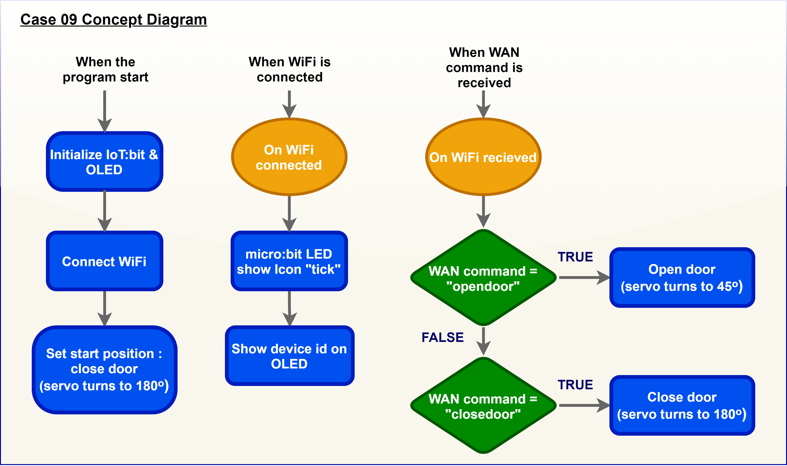

## Part List

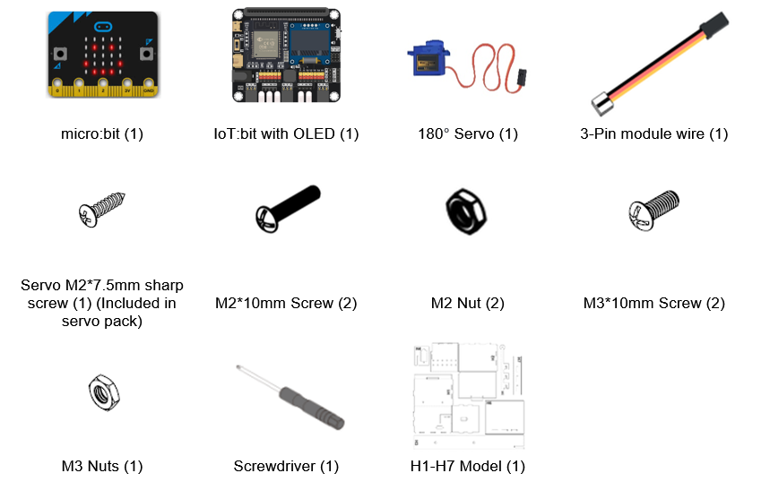

## Assembly step

Step 1 

Attach the L-shaped stand with M4 screws and nuts to the model H1. Make a small hole to fix into the stand securely. 

Step 2 

Attach the servo to the model H1. 

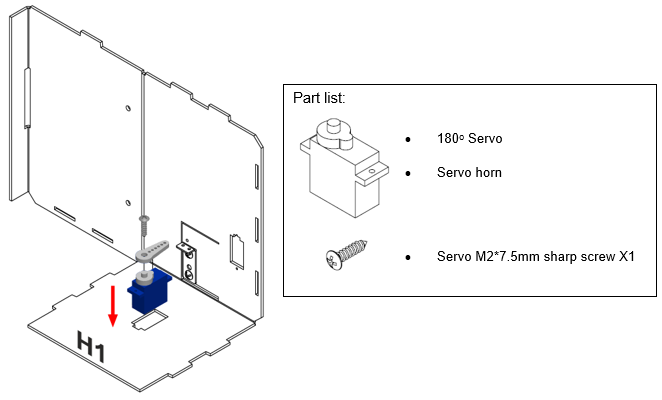

Step 3 

Straighten the paper clip and cut it to 6.5 cm. Use pilers to fix the paper clip into the L-shaped stand. 

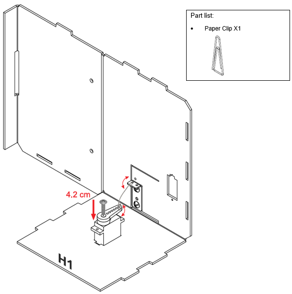

Step 4 

Put together all the cardboard parts (H1-H2) 

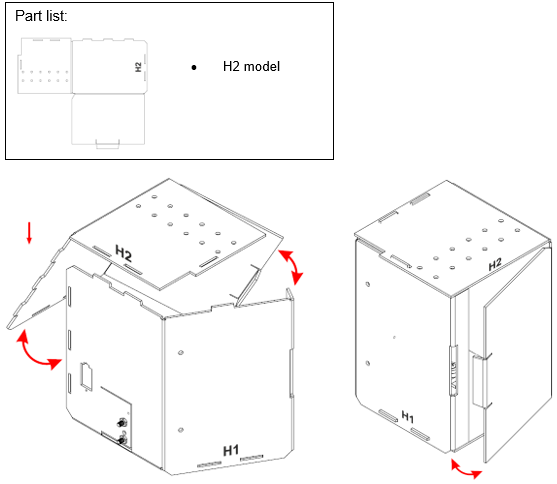

Step 5 

Assembly completed! 

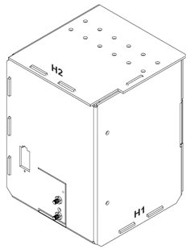

## Hardware connect

Connect the 180ᵒ servo to P2 port of IoT:bit 

Micro:bit P2|Servo
-:-|-:-
S (yellow)|S (orange)
V (red)|V (red)
G (black)|G (brown)

## Programming (MakeCode)

Step 1. Initialize OLED, IoT:bit and connect to WiFi
* Snap `Initialize OLED with width:128, height: 64` to `on start`
* Snap `Initialize IoT:bit TX P16 RX P8` from `IoT:bit` to `on start`
* Snap `Set Wi-Fi to ssid pwd` from `IoT:bit`
* Enter your Wi-Fi name and password. Here we set `smarthon` as `SSID` and `12345678` as `password`

Step 2. Set servo initial position 

* Snap `Turn Servo to … degree` from `SmartCity` > `Output`
* Turn servo to `180` degree at pin `P2` (the servo will control the door to be closed initially)
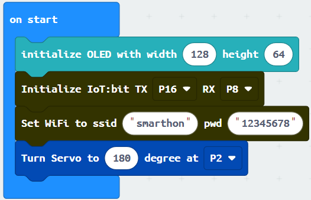

Step 3. Show icon “tick” after WiFi connection 

* Snap `show icon` from `basic` to `On WiFi connected` and select icon `tick`
* Draw the `Device ID` variable from `On WiFi connected` to the `show string` block placeholder
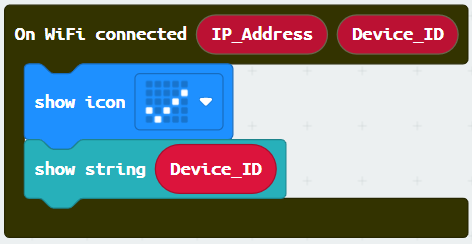

Step 4. Receive WAN command 

* Go to OLED
* Snap the` clear OLED display` to `On WiFi received` to avoid overlap
* Snap the `show string` to `On WiFi received`
* Draw the `WAN_Command` variable to show string placeholder

Step 5. Open/close door by WAN command 

* If Wan command `opendoor` is received, `turn servo to 45 degree at P2` (open door angle)
* If Wan command `closedoor` is received, `turn servo to 180 degree at P2` (close door angle)

Full Solution 

MakeCode: [https://makecode.microbit.org/_FKDKfDYj1Le1](https://makecode.microbit.org/#pub:_FKDKfDYj1Le1) 

You could also download the program from the following website: 
<iframe src="https://makecode.microbit.org/#pub:_FKDKfDYj1Le1" width="100%" height="500" frameborder="0"></iframe>

 
## IoT (App Inventor)

* For more details, please refer to “Chapter 3: Direct control micro:bit by App Inventor 2” 

Step 1 

Create the page with the components 

* On Designer:
* Drag the components from the left menu – we will need buttons to open or close the door and a textbox for input the Device ID number. 
* Also, add the invisible component “Web” under connectivity, we will need it for WAN connection.
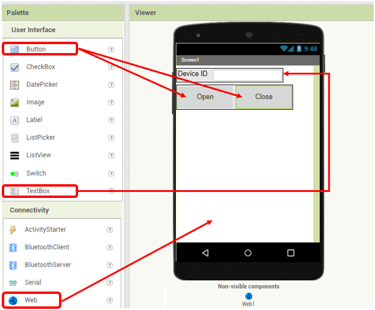

Step 2 

Make the programming part
* On Blocks: 
* The WAN control command URL is: 
[http://control.smarthon.cc/publish?id=DeviceID&msg=ControlCommand](http://control.smarthon.cc/publish?id=DeviceID&msg=ControlCommand)

* When Button1 is clicked, it will direct to the URL with given device ID and command “opendoor”.

* When Button2 is clicked, it will direct to the URL with given device ID and command “closedoor”.

* Download the App in your phone to by .apk or scan QR code.

 
## Result 
Input your device ID number in the textbox, then click button “opendoor” to send command “opendoor”. Click button “Close Door” to send command “closedoor”. 

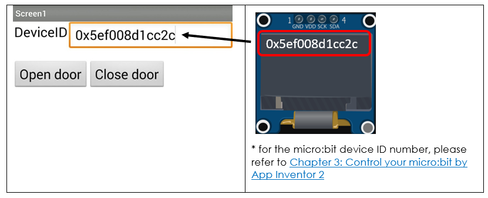

 

With app inventor and micro:bit, you can control the door open/close by mobile app! 

## Think

Q1. How can we add password authentication to open the door? 

Q2. We can install the servo to different position in the house (tips: modify the turning angle of the servo) 

