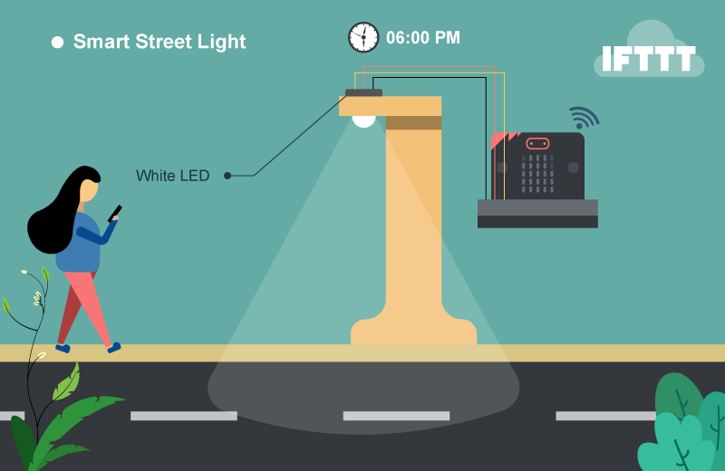
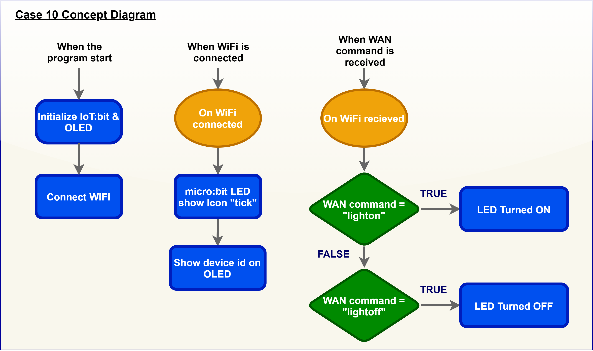
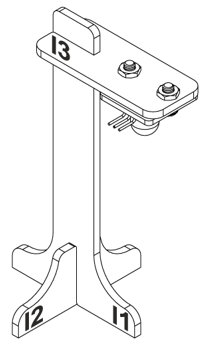
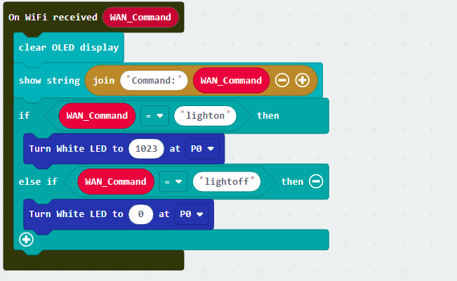
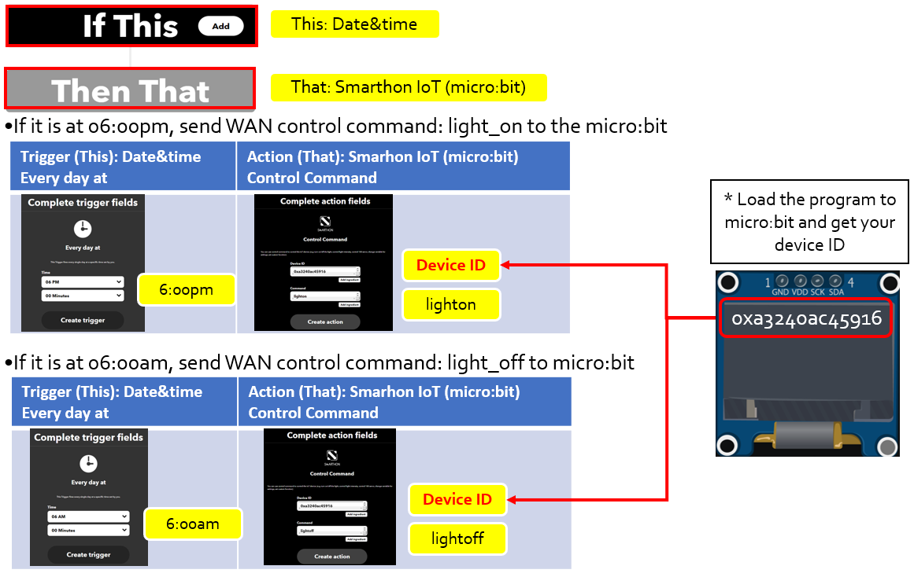

# IoT Case 10: Smart Street Light

Level: 

## Goal

Make a smart streetlight which can have a button to control on off. 

## Background

What is Smart Street Light? 

To improve the living stand of citizen and to save electricity, smart street light can be automatically turned on at night (eg.6pm) and turned off in the morning (eg.6am)  

Smart Streetlight operation 

When WAN commands are received from WAN (eg. IFTTT), micro:bit will get the command name. If the command name is “light_on”, the LED light will be turned on. If the command name is “light_off”, the LED light will be turned off. 

## Part List

## Assembly step

Step 1 

Attach the LED light to the model I2 with M4 screw and nuts. Put together all the cardboard parts (I1-I3) 

Step 2 

Assembly completed! 

## Hardware connect

Connect the white LED Light to P0 port of IoT:bit 

*Pull the buzzer switch 'up' to disconnect the buzzer in this execrise*

## Programming (MakeCode)

Step 1. Initialize OLED, IoT:bit and connect to WiFi 

* Snap `Initialize OLED with width:128, height: 64` to `on start`
* Snap `Initialize IoT:bit TX P16 RX P8` from `IoT:bit` to `on start`
* Snap `Set Wi-Fi to ssid pwd` from `IoT:bit`
* Enter your Wi-Fi name and password. Here we set `smarthon` as `SSID` and `12345678` as `password`

Step 2. Show icon “tick” after WiFi connection 

* Snap `show icon` from `basic` to `On WiFi connected` and select icon `tick`
* Draw the `Device ID` variable from `On WiFi connected` to the `show string` block placeholder

Step 3. Receive WAN command 

* Go to OLED
* Snap the` clear OLED display` to `On WiFi received` to avoid overlap
* Snap the `show string` to `On WiFi received`
* Draw the `WAN_Command` variable to show string placeholder

Step 4. Turn on/off LED by WAN command 

* Snap `if-condition`
* Set variable `WAN_Command` = `lighton` into `if-condition`
* `turn White LED …` from `SmartCity` > `Output`, turn white LED with intensity: 1023 at P0
* Set variable `WAN_Command` = `lightoff` into `else-if-condition` 
* Snap `turn White LED …` from `SmartCity` > `Output`, turn white LED with intensity: 0 at P0

Full Solution 

MakeCode: <a href="https://makecode.microbit.org/_6DuRvwD5PYpU" target="_blank">https://makecode.microbit.org/_6DuRvwD5PYpU</a>

## IoT (IFTTT)

* For the setting of IFTTT, please refer to “Chapter 4: Cloud Control micro:bit by IFTTT” 

Step 1. Create applet in IFTTT 

## Result

The micro:bit is controlled by IFTTT (trigger by date&time). The LED light will be turned on at 6pm and turned off at 6am every day. 

## Think

Q1. How to turn on the light automatically if the today’s weather is cloudy reported by IFTTT.
