# IoT Case 11: Roof garden clothes rack

Level: 
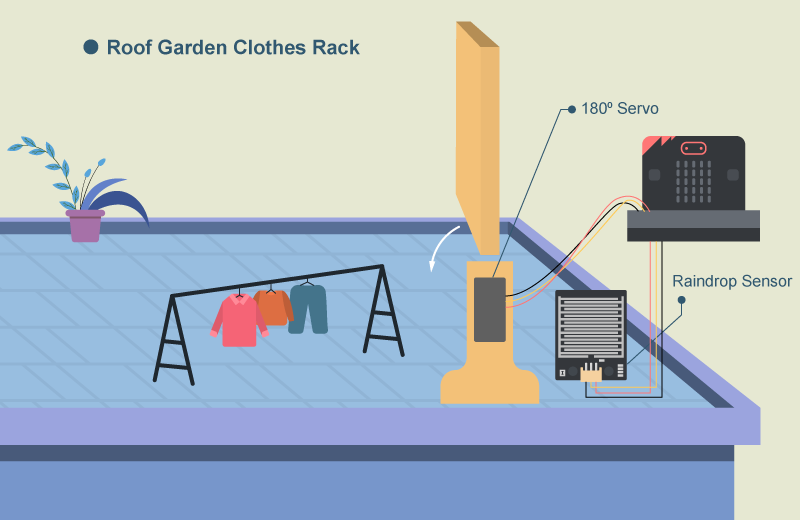

## Goal

Make a smart roof garden clothes rack, once the weather condition is changed, the rack can be opened/ closed automatically.

## Background

What is Roof garden clothes rack? 

People no long need to rush up to the roof when raining as the clothes rack can be closed automatically even when house owner is not at home. 

Roof garden clothes rack operation 

Micro:bit can receive WAN commands from WAN (eg. IFTTT), the the micro:bit will get the command name. If the command name is “Rain”, the servo will turn to 90ᵒ and the rack will be opened. If the command name is “Clear”, the servo will turn to 180ᵒ and the rack will be closed. 

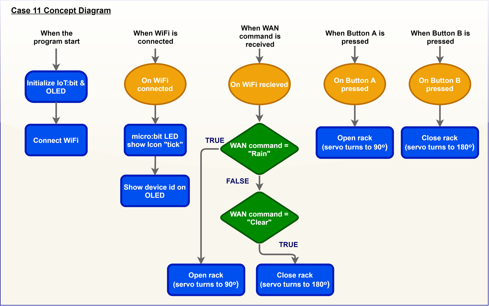

## Part List

 
## Assembly step

Step 1 

Step 1. Attach the raindrop sensor to the model H2 

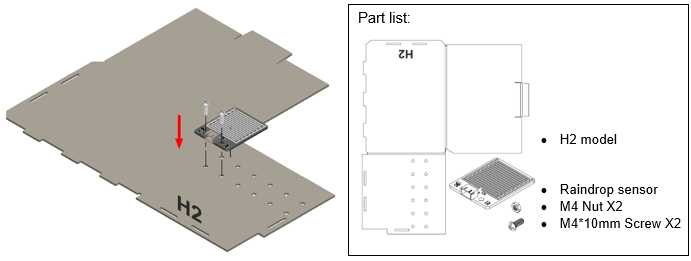

Step 2 

Step 2. Attach the long stand (H3) to the model H1 

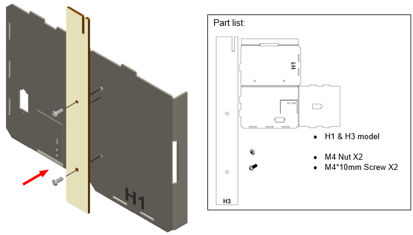

Step 3 

Step 3. Put together all the cardboard parts. 

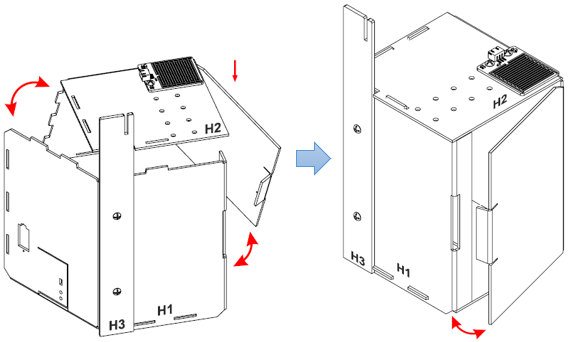

Step 4 

Step 4. Screw the cloth rack (H5) onto the 180ᵒ servo using M2 screws   

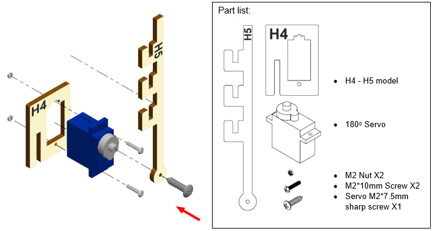

Step 5 

Step 5. Put together the models H4-H5 and H6-H7.  

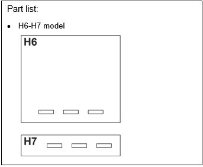

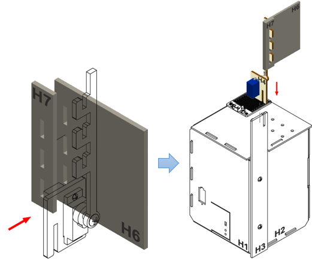

Step 6 

Step 6. Assembly completed! 

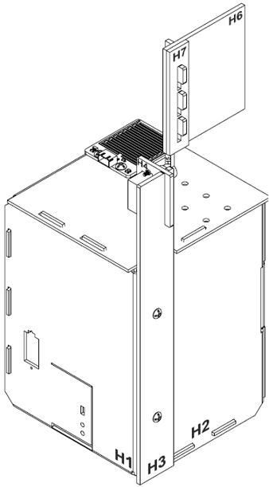

## Hardware connect

Connect the 180ᵒ Servo to P1 port of IoT:bit 

Micro:bit P1|Servo
:-: | :-: 
S (yellow) |S (orange)
V (red)	| V (red)
G (black) | G (brown)

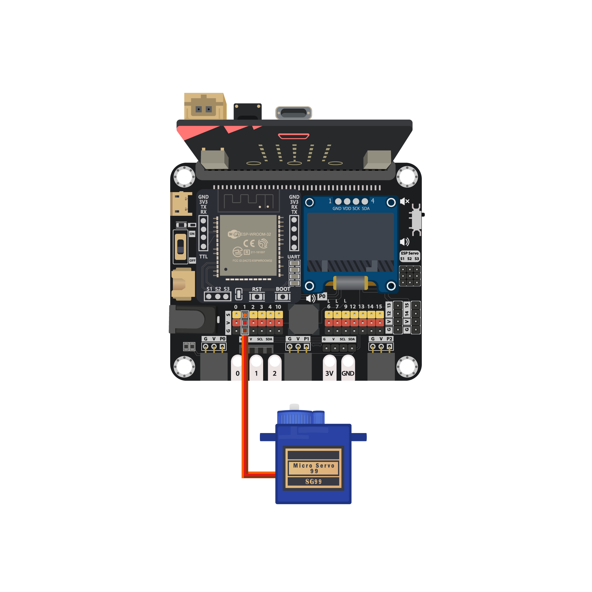

## Programming (MakeCode)

Step 1. Initialize OLED, IoT:bit and connect to WiFi 

* Snap `Initialize OLED with width:128, height: 64` to `on start`
* Snap `Initialize IoT:bit TX P16 RX P8` from `IoT:bit` to `on start`
* Snap `Set Wi-Fi to ssid pwd` from `IoT:bit`
* Enter your Wi-Fi name and password. Here we set `smarthon` as `SSID` and `12345678` as `password`

Step 2. Show icon “tick” after WiFi connection 

* Snap `show icon` from `basic` to `On WiFi connected` and select icon `tick`
* Draw the `Device ID` variable from `On WiFi connected` to the `show string` block placeholder

Step 3. Receive WAN command 

* Go to OLED
* Snap the `clear OLED display` to `On WiFi received` to avoid overlap
* Snap the `show string` to `On WiFi received`
* Draw the `WAN_Command` variable to show string placeholder

Step 4. Control rack open/close by WAN command 

* Snap `if-condition`
* Set variable `WAN_Command` = `Rain` into `if-condition`
* Snap `Turn Servo to … degree` from `SmartCity` > `Output`
* `Set Servo degree to 90 at P1` (control the servo to open the rack)
* Set variable `WAN_Command` = `Clear` into `else-if-condition`
* Snap `Turn Servo to … degree` from `SmartCity` > `Output`
* `Set Servo degree to 180 at P1` (control the servo to close the rack)
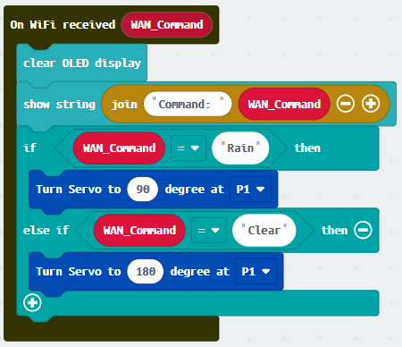

Step 5. Press A to open clothes rack 

* Snap `on button … pressed` from `Input`, set button `A`
* Snap `Turn Servo to…` from `SmartCity` > `Output`
* `Set servo to 90 degree at P1` (open clothes rack)

Step 6. Press B to close clothes rack 

* Snap `on button … pressed` from `Input`, set button `B`
* Snap `Turn Servo to…` from `SmartCity` > `Output`
* `Set servo to 180 degree at P1` (close clothes rack)

Full Solution 

MakeCode: [https://makecode.microbit.org/_4m94VyctJYbr](https://makecode.microbit.org/#pub:_4m94VyctJYbr) 

You could also download the program from the following website: 
<iframe src="https://makecode.microbit.org/#pub:_4m94VyctJYbr" width="100%" height="500" frameborder="0"></iframe>

## IoT (IFTTT)

* For the setting of IFTTT, please refer to “Chapter 4: Cloud Control micro:bit by IFTTT” 

Step 1. Create applet in IFTTT 

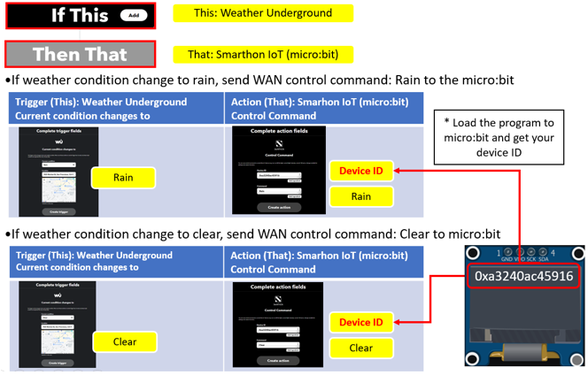

## Result

The micro:bit is controlled by IFTTT (trigger by weather open data). When the weather condition change to “Rain”, the cloth rack will be opened. When the weather condition change to “Clear”, the cloth rack will be closed. 

## Think

Q1. Can you control the clothes rack by other weather conditions? (e.g. sunlight) 

