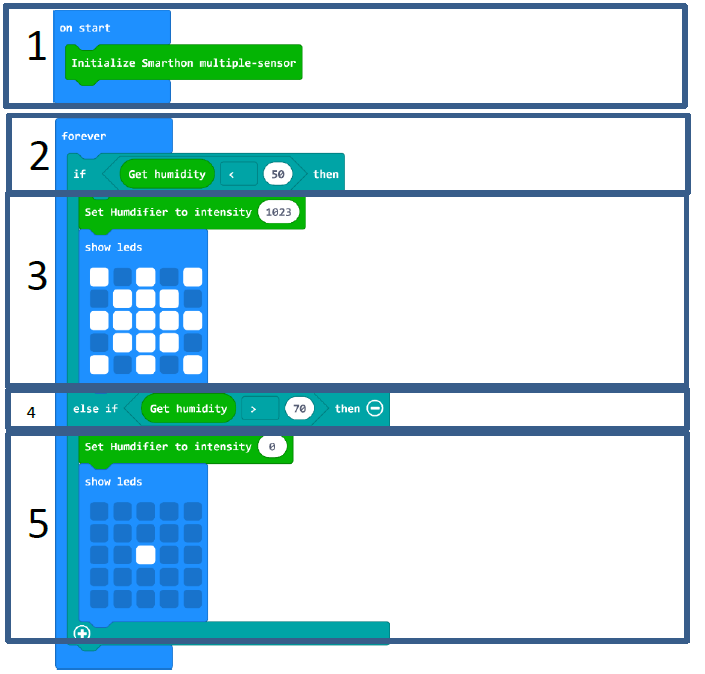
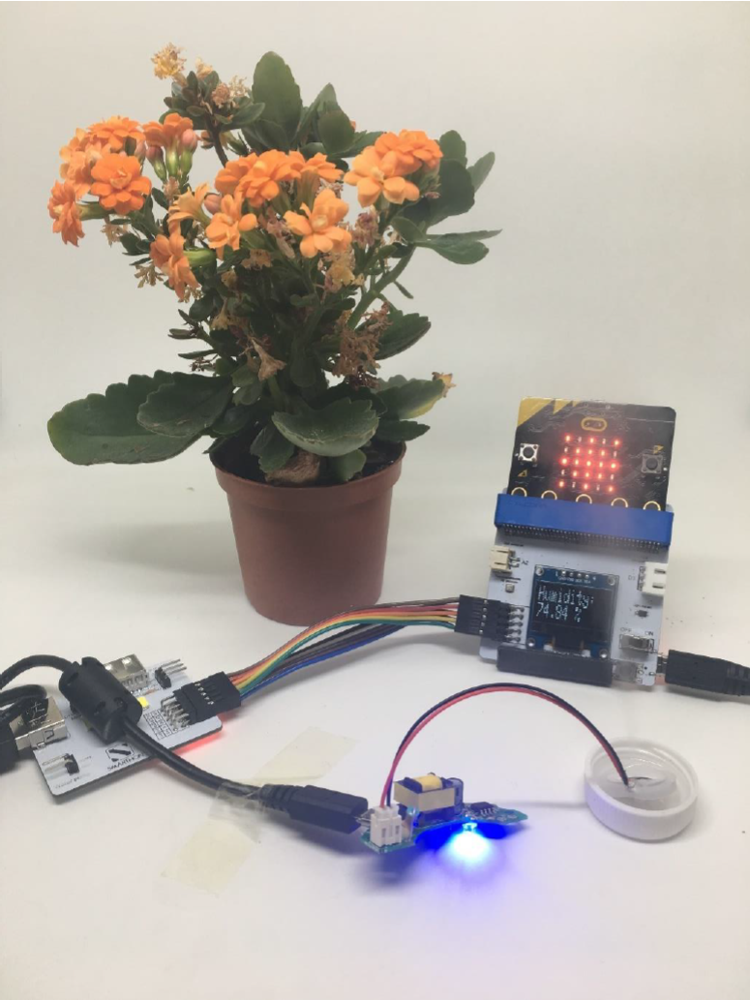

# Project 6: Automatic Humidity Control
Level: 

## Part List:

1. Humidity Sensor X1 (Placed on the Multiple Sensors)
2. Humidifier X1
3. Multiple Sensors for micro:bit X1
4. Multiple Actuators for micro:bit X1
5. Connecting Wire
6. micro:bit X1
7. USB Cable X2
8. A bottle of water X1

## Description:
In project 6, you can learn how to increase humidity level by a humidity sensor.

## Steps:
1. Basic (Add block on start) > Plant (Add block Initialize Smarthon multiple-sensor)
2. Basic (Add block forever) > Logic (Add block if…then…else, add 1 more if…then…else, delete else) > For 1st if : Logic (Add block 0 = 0, change “0” to Plant “Get humidity”; “=” to “<”; “0” to “50” )
3. For then: Plant-More (Add block Set Humidifier to intensity 0, change “0” to “1023” ) > Basic (Add block show leds)
4. For else if: Logic (Add block 0 = 0, change “0” to Plant “Get humidity”; “=” to “>”; “0” to “70” )
5. For then: Plant-More (Add block Set Humidifier to intensity 0) > Basic (Add block show leds)

## Hardware:

6. Connect Multiple Sensors and Multiple Actuators by connecting wire
7. Connect Humidifier module and USB Cable
8. Connect Humidifier & USB Cable to Humidifier (D4/P15) port of Multiple Actuators
9. **Download** the code and transfer to micro:bit
10. Plug the micro:bit into Multiple Sensors

## Experiment:
➢ Does humidifier affect plant transpiration rates?
➢ Does humidity level affect plant height?
➢ Does humidifier extend plant life during low soil moisture level?